---
tags:
  - investigation
  - clues-dsl
  - mermaid-princess
source:
  - "[[線索-Clues and Investigation.drawio.svg]]"
  - "[[線索-人魚公主真相與杜溫]]"
  - "[[Story/reference/敘詭整理]]"
  - "[[Story/reference/邏輯缺口與補丁]]"
  - "[[Setting/IU7/05_srune/原初大法術．星降神臨]]"
cssclasses:
  - graphviz-large-preview
---

# 人魚公主真相（DSL）

> [!NOTE] 寫法見 [[線索-DSL-寫法]]。
> 本篇是**底層設定總結**，不是事件調查鏈。
> 圖上重點：系統各部件的功能，以及「制度表象 ↔ 系統本質」的對應關係。

```clues
標題: 人魚公主真相｜系統部件與表象本質對應
方向: LR

# 系統架構
實體 海之主 : 開發星降神臨，用以控制星球防禦系統
實體 星降神臨 : 星球級系統；核心功能含基質收集、干擾粒子、位置回報與容器回收
實體 海之女神 : 系統管理終端的中繼載體
實體 珍珠 : 系統執行端；離開貝殼時會自動向特定對象釋放能量
實體 人魚公主 : 基質容器＋干擾粒子製造器；經身體改造與家庭抹除後包裝為「天降神使」
實體 長老 : 系統維護者；對外形象為輔佐並保護公主
實體 歌聲與歌曲 : 由阿拉拉創作、長老輸入系統；包裝成海之女神「給予」的神曲

# 功能與機制
實體 干擾開關 : 變身或使用珍珠時，系統暫停干擾
實體 位置回報 : 系統持續回報公主位置；表象上「失蹤即無力追查」
實體 星盡程序 : 容器報廢與回收；表象上「違規後的神聖處罰」
實體 干擾粒子 : 公主平常在散播，影響感知；變身後能量釋放遠超一般阿奎斯托

# 制度表象
實體 表象天降神使 : 制度宣稱：人魚公主是天降神使
實體 表象歌聲珍珠守護和平 : 制度宣稱：公主以歌聲與珍珠守護和平
實體 表象長老輔佐保護 : 制度宣稱：長老輔佐並保護公主
實體 表象失蹤無力追查 : 制度宣稱：公主失蹤是無力追查
實體 表象星盡神聖處罰 : 制度宣稱：星盡是違規後的神聖處罰
實體 表象歌曲由女神給予 : 制度宣稱：歌曲由海之女神「給予」

# 可觀察異常（指向改造本質）
證據 星羅懂得法術基本原理 : 印度洋王國禁止公主學習法術，星羅必然在其他地方學過
證據 星羅誕生時已是兒童 : 一般公主誕生時都是嬰兒
證據 星羅認知異於其他公主 : 通曉人類語言與社會，對印度洋王國生活印象模糊
證據 星羅與Kafziel的特殊連結 : 在Kafziel身上找到「哥哥」的感覺
證據 公主無法使用法術 : 王國教導如此，具體原因不明
證據 諾愛爾成功強行施放法術
證據 珍珠指向不受主觀認知影響 : 指向對象不受人魚公主主觀認知影響
證據 歌曲中存在流行曲 : 海之女神「給予」的歌曲裡有流行曲
證據 歌曲實際由阿拉拉創作 : 公主所唱的歌曲實際由阿拉拉創作

// ── 系統部件從屬 ──
海之主 -推導-> 星降神臨
星降神臨 -屬於-> 海之女神 | 珍珠 | 人魚公主 | 長老 | 歌聲與歌曲
人魚公主 -屬於-> 干擾粒子 | 干擾開關
星降神臨 -屬於-> 位置回報 | 星盡程序

// ── 表象 ↔ 本質（矛盾＝包裝與實質不符） ──
表象天降神使 -矛盾-> 人魚公主
表象歌聲珍珠守護和平 -矛盾-> 干擾開關
表象長老輔佐保護 -矛盾-> 長老
表象失蹤無力追查 -矛盾-> 位置回報
表象星盡神聖處罰 -矛盾-> 星盡程序
表象歌曲由女神給予 -矛盾-> 歌聲與歌曲

// ── 異常如何指向改造 ──
星羅懂得法術基本原理 | 星羅誕生時已是兒童 | 星羅認知異於其他公主 | 星羅與Kafziel的特殊連結 -支持-> 人魚公主
公主無法使用法術 | 諾愛爾成功強行施放法術 -支持-> 人魚公主
珍珠指向不受主觀認知影響 -支持-> 珍珠
歌曲中存在流行曲 | 歌曲實際由阿拉拉創作 -支持-> 歌聲與歌曲
```

```dot
// clues-auto 由上方 clues 區塊生成，請勿手改；重新執行 scripts/clues_to_graphviz.py
digraph clues {
  graph [
    rankdir="LR", bgcolor="#FFFFFF", newrank="true", compound="true",
    splines="spline", nodesep="0.30", ranksep="0.60", pad="0.15",
    fontname="Microsoft JhengHei, Noto Sans CJK TC, PingFang TC, sans-serif", fontsize="16", labelloc="t",
    label="人魚公主真相｜系統部件與表象本質對應"
  ];
  node [fontname="Microsoft JhengHei, Noto Sans CJK TC, PingFang TC, sans-serif", fontsize="9", fontcolor="#1F2937", margin="0.10,0.06"];
  edge [fontname="Microsoft JhengHei, Noto Sans CJK TC, PingFang TC, sans-serif", fontsize="8", fontcolor="#475569", arrowsize="0.65"];

  subgraph cluster_00 {
    label="制度表象"; color="#CBD5E1"; fillcolor="#FAFAFA";
    fontcolor="#1F2937"; fontsize="11"; style="filled,rounded";
    n012 [label="表象天降神使", shape="ellipse", style="filled", fillcolor="#DCFCE7", color="#16A34A", penwidth="2.0", tooltip="制度宣稱：人魚公主是天降神使"];
    n013 [label="表象歌聲珍珠守護和平", shape="ellipse", style="filled", fillcolor="#DCFCE7", color="#16A34A", penwidth="2.0", tooltip="制度宣稱：公主以歌聲與珍珠守護和平"];
    n014 [label="表象長老輔佐保護", shape="ellipse", style="filled", fillcolor="#DCFCE7", color="#16A34A", penwidth="2.0", tooltip="制度宣稱：長老輔佐並保護公主"];
    n015 [label="表象失蹤無力追查", shape="ellipse", style="filled", fillcolor="#DCFCE7", color="#16A34A", penwidth="2.0", tooltip="制度宣稱：公主失蹤是無力追查"];
    n016 [label="表象星盡神聖處罰", shape="ellipse", style="filled", fillcolor="#DCFCE7", color="#16A34A", penwidth="2.0", tooltip="制度宣稱：星盡是違規後的神聖處罰"];
    n017 [label="表象歌曲由女神給予", shape="ellipse", style="filled", fillcolor="#DCFCE7", color="#16A34A", penwidth="2.0", tooltip="制度宣稱：歌曲由海之女神「給予」"];
  }
  subgraph cluster_01 {
    label="功能與機制"; color="#CBD5E1"; fillcolor="#FAFAFA";
    fontcolor="#1F2937"; fontsize="11"; style="filled,rounded";
    n008 [label="干擾開關", shape="ellipse", style="filled", fillcolor="#DCFCE7", color="#16A34A", penwidth="2.0", tooltip="變身或使用珍珠時，系統暫停干擾"];
    n009 [label="位置回報", shape="ellipse", style="filled", fillcolor="#DCFCE7", color="#16A34A", penwidth="2.0", tooltip="系統持續回報公主位置；表象上「失蹤即無力追查」"];
    n010 [label="星盡程序", shape="ellipse", style="filled", fillcolor="#DCFCE7", color="#16A34A", penwidth="2.0", tooltip="容器報廢與回收；表象上「違規後的神聖處罰」"];
    n011 [label="干擾粒子", shape="ellipse", style="filled", fillcolor="#DCFCE7", color="#16A34A", penwidth="2.0", tooltip="公主平常在散播，影響感知；變身後能量釋放遠超一般阿奎斯托"];
  }
  subgraph cluster_02 {
    label="可觀察異常（指向改造本質）"; color="#CBD5E1"; fillcolor="#FAFAFA";
    fontcolor="#1F2937"; fontsize="11"; style="filled,rounded";
    n018 [label="星羅懂得法術基本原理", shape="note", style="filled", fillcolor="#DBEAFE", color="#2563EB", penwidth="2.0", tooltip="印度洋王國禁止公主學習法術，星羅必然在其他地方學過"];
    n019 [label="星羅誕生時已是兒童", shape="note", style="filled", fillcolor="#DBEAFE", color="#2563EB", penwidth="2.0", tooltip="一般公主誕生時都是嬰兒"];
    n020 [label="星羅認知異於其他公主", shape="note", style="filled", fillcolor="#DBEAFE", color="#2563EB", penwidth="2.0", tooltip="通曉人類語言與社會，對印度洋王國生活印象模糊"];
    n021 [label="星羅與Kafziel的特殊連結", shape="note", style="filled", fillcolor="#DBEAFE", color="#2563EB", penwidth="2.0", tooltip="在Kafziel身上找到「哥哥」的感覺"];
    n022 [label="公主無法使用法術", shape="note", style="filled", fillcolor="#DBEAFE", color="#2563EB", penwidth="2.0", tooltip="王國教導如此，具體原因不明"];
    n023 [label="諾愛爾成功強行施放法術", shape="note", style="filled", fillcolor="#DBEAFE", color="#2563EB", penwidth="2.0"];
    n024 [label="珍珠指向不受主觀認知影響", shape="note", style="filled", fillcolor="#DBEAFE", color="#2563EB", penwidth="2.0", tooltip="指向對象不受人魚公主主觀認知影響"];
    n025 [label="歌曲中存在流行曲", shape="note", style="filled", fillcolor="#DBEAFE", color="#2563EB", penwidth="2.0", tooltip="海之女神「給予」的歌曲裡有流行曲"];
    n026 [label="歌曲實際由阿拉拉創作", shape="note", style="filled", fillcolor="#DBEAFE", color="#2563EB", penwidth="2.0", tooltip="公主所唱的歌曲實際由阿拉拉創作"];
  }
  subgraph cluster_03 {
    label="系統架構"; color="#CBD5E1"; fillcolor="#FAFAFA";
    fontcolor="#1F2937"; fontsize="11"; style="filled,rounded";
    n001 [label="海之主", shape="ellipse", style="filled", fillcolor="#DCFCE7", color="#16A34A", penwidth="2.0", tooltip="開發星降神臨，用以控制星球防禦系統"];
    n002 [label="星降神臨", shape="ellipse", style="filled", fillcolor="#DCFCE7", color="#16A34A", penwidth="2.0", tooltip="星球級系統；核心功能含基質收集、干擾粒子、位置回報與容器回收"];
    n003 [label="海之女神", shape="ellipse", style="filled", fillcolor="#DCFCE7", color="#16A34A", penwidth="2.0", tooltip="系統管理終端的中繼載體"];
    n004 [label="珍珠", shape="ellipse", style="filled", fillcolor="#DCFCE7", color="#16A34A", penwidth="2.0", tooltip="系統執行端；離開貝殼時會自動向特定對象釋放能量"];
    n005 [label="人魚公主", shape="ellipse", style="filled", fillcolor="#DCFCE7", color="#16A34A", penwidth="2.0", tooltip="基質容器＋干擾粒子製造器；經身體改造與家庭抹除後包裝為「天降神使」"];
    n006 [label="長老", shape="ellipse", style="filled", fillcolor="#DCFCE7", color="#16A34A", penwidth="2.0", tooltip="系統維護者；對外形象為輔佐並保護公主"];
    n007 [label="歌聲與歌曲", shape="ellipse", style="filled", fillcolor="#DCFCE7", color="#16A34A", penwidth="2.0", tooltip="由阿拉拉創作、長老輸入系統；包裝成海之女神「給予」的神曲"];
  }

  n001 -> n002 [color="#1F2937", style="dashed"];
  n002 -> n003 [color="#94A3B8", style="dotted", arrowhead="none"];
  n002 -> n004 [color="#94A3B8", style="dotted", arrowhead="none"];
  n002 -> n005 [color="#94A3B8", style="dotted", arrowhead="none"];
  n002 -> n006 [color="#94A3B8", style="dotted", arrowhead="none"];
  n002 -> n007 [color="#94A3B8", style="dotted", arrowhead="none"];
  n005 -> n011 [color="#94A3B8", style="dotted", arrowhead="none"];
  n005 -> n008 [color="#94A3B8", style="dotted", arrowhead="none"];
  n002 -> n009 [color="#94A3B8", style="dotted", arrowhead="none"];
  n002 -> n010 [color="#94A3B8", style="dotted", arrowhead="none"];
  n012 -> n005 [color="#DC2626", arrowhead="tee", penwidth="1.6"];
  n013 -> n008 [color="#DC2626", arrowhead="tee", penwidth="1.6"];
  n014 -> n006 [color="#DC2626", arrowhead="tee", penwidth="1.6"];
  n015 -> n009 [color="#DC2626", arrowhead="tee", penwidth="1.6"];
  n016 -> n010 [color="#DC2626", arrowhead="tee", penwidth="1.6"];
  n017 -> n007 [color="#DC2626", arrowhead="tee", penwidth="1.6"];
  n018 -> n005 [color="#1F2937"];
  n019 -> n005 [color="#1F2937"];
  n020 -> n005 [color="#1F2937"];
  n021 -> n005 [color="#1F2937"];
  n022 -> n005 [color="#1F2937"];
  n023 -> n005 [color="#1F2937"];
  n024 -> n004 [color="#1F2937"];
  n025 -> n007 [color="#1F2937"];
  n026 -> n007 [color="#1F2937"];
}
```


