---
tags:
  - investigation
  - clues-dsl
  - mermaid-princess
source:
  - "[[線索-Clues and Investigation.drawio.svg]]"
  - "[[線索-人魚公主真相與杜溫]]"
  - "[[Story/reference/敘詭整理]]"
  - "[[Story/reference/邏輯缺口與補丁]]"
  - "[[Setting/IU7/05_srune/原初大法術．星降神臨]]"
cssclasses:
  - graphviz-large-preview
---

# 人魚公主真相（DSL）

> [!NOTE] 寫法
> 只需維護下方 clues 區塊，執行 `python scripts/clues_to_graphviz.py <本檔>` 即重生下方圖。
> - `# 群組`：cluster，`##` 為巢狀。
> - `類型 內容 = 別名 @時點 #狀態`：類型可用 證據／事件／實體／假設／未決／矛盾；別名、時點、狀態皆可省略。
> - `A -支持-> B | C`：關係可用 支持／導致／推導／矛盾／時序／屬於，省略即為「關係未定」的灰虛線。
> - 填色與形狀＝類型；邊框粗細與虛實＝狀態（已確認／預定／推論／補丁）。
>
> 「原圖推理」群組是原 SVG 藍色容器的 23 節點、23 連線（連線一律關係未定）。其餘群組取自 [[線索-人魚公主真相與杜溫]] 的設定層與缺口，並補上跨層對照。

```clues
標題: 人魚公主真相
輸出: svg

# 人魚公主本質
證據 星羅懂得法術基本原理 : 印度洋王國禁止公主學習法術，星羅必然是在其他地方學習法術原理
證據 星羅認知與其他公主不同 : 星羅會人類的語言，對人類社會的認識遠超海底世界，而且對印度洋王國的生活印象模糊
證據 星羅與Kafziel的特殊連結 : 星羅在Kafziel身上找到「哥哥」的感覺
證據 星羅誕生時已是兒童 : 一般公主誕生時都是嬰兒
證據 星羅非正常出生 : 前任公主主動放棄身份前所未有
推論 存在「成為公主前」的階段
推論 公主原本是普通人魚

證據 公主無法使用法術 : 王國教導，具體原因不明
證據 諾愛爾成功強行施放法術
推論 公主擁有法力系統

證據 公主的存在會影響感知
證據 變身後會釋放遠超一般阿奎斯托的能量
證據 珍珠離開貝殼時會自動向特定對象釋放能量

推論 珍珠判斷指釋放能量向對象 : 指向對象不受人魚公主主觀認知影響
推論 公主平常在干擾珍珠判斷
推論 變身影響能量釋放

推論 公主非自然產物
推論 公主經過改造

證據 海之女神「給予」的歌曲中存在流行曲
證據 公主所唱的歌曲實際由阿拉拉創作
推論 長老在背後控制

// 人魚公主本質
星羅懂得法術基本原理 | 星羅誕生時已是兒童 | 星羅認知與其他公主不同 | 星羅與Kafziel的特殊連結 -支持-> 存在「成為公主前」的階段 -推導-> 公主原本是普通人魚 -推導-> 公主經過改造
星羅非正常出生 -矛盾-> 存在「成為公主前」的階段

公主無法使用法術 -矛盾-> 公主擁有法力系統
諾愛爾成功強行施放法術 -支持-> 公主擁有法力系統 -推導-> 公主原本是普通人魚

公主的存在會影響感知 | 變身後會釋放遠超一般阿奎斯托的能量 | 珍珠離開貝殼時會自動向特定對象釋放能量 -支持-> 公主非自然產物 -推導-> 公主經過改造

海之女神「給予」的歌曲中存在流行曲 | 公主所唱的歌曲實際由阿拉拉創作 -支持-> 長老在背後控制

# 真相
海之主開發星降神臨控制星球防禦系統
海之女神 = 系統管理終端載體
珍珠 = 系統執行端
人魚公主 = 基質容器+干擾粒子製造器
公主以歌聲與珍珠守護和平 | 變身/使用珍珠 = 干擾開關
星盡是違規後的神聖處罰 | 星盡 = 容器報廢與回收程序
人魚公主是天降神使 | 系統改造人魚身體、抹殺家庭並包裝為神性
長老輔佐並保護公主 | 長老是系統維護者
公主失蹤是無力追查 | 系統持續回報公主位置
```

```dot
// clues-auto 由上方 clues 區塊生成，請勿手改；重新執行 scripts/clues_to_graphviz.py
// 稽核：第 112 行：關係「不足以解釋」不在預設表中，僅作文字標籤
// 稽核：第 114 行：關係「可能相關」不在預設表中，僅作文字標籤
// 稽核：第 115 行：關係「是否相關未定」不在預設表中，僅作文字標籤
// 稽核：第 116 行：關係「影響上游判定」不在預設表中，僅作文字標籤
digraph clues {
  graph [
    rankdir="TB", bgcolor="#FFFFFF", newrank="true", compound="true",
    splines="spline", nodesep="0.30", ranksep="0.60", pad="0.15",
    fontname="Microsoft JhengHei, Noto Sans CJK TC, PingFang TC, sans-serif", fontsize="16", labelloc="t",
    label="人魚公主真相｜原圖推理、制度表象、全知設定與缺口"
  ];
  node [fontname="Microsoft JhengHei, Noto Sans CJK TC, PingFang TC, sans-serif", fontsize="9", fontcolor="#1F2937", margin="0.10,0.06"];
  edge [fontname="Microsoft JhengHei, Noto Sans CJK TC, PingFang TC, sans-serif", fontsize="8", fontcolor="#475569", arrowsize="0.65"];

  subgraph cluster_00 {
    label="全知設定"; color="#CBD5E1"; fillcolor="#FAFAFA";
    fontcolor="#1F2937"; fontsize="11"; style="filled,rounded";
    n029 [label="海之主開發星降神臨", shape="box", style="filled,rounded", fillcolor="#FFEDD5", color="#EA580C", penwidth="2.0"];
    n030 [label="星降神臨是星球級系統", shape="ellipse", style="filled", fillcolor="#DCFCE7", color="#16A34A", penwidth="2.0"];
    n031 [label="人魚是海之主改造的執行系統載\n體", shape="ellipse", style="filled", fillcolor="#DCFCE7", color="#16A34A", penwidth="2.0"];
    n032 [label="人魚公主＝儲存基質＋散播干擾\n粒子＋控制執行端的改造容器", shape="ellipse", style="filled", fillcolor="#DCFCE7", color="#16A34A", penwidth="2.0"];
    n033 [label="珍珠＝執行端", shape="ellipse", style="filled", fillcolor="#DCFCE7", color="#16A34A", penwidth="2.0"];
    n034 [label="海之女神＝管理終端的中繼機器", shape="ellipse", style="filled", fillcolor="#DCFCE7", color="#16A34A", penwidth="2.0"];
    n035 [label="公主使用珍珠時系統暫停干擾", shape="box", style="filled,rounded", fillcolor="#FFEDD5", color="#EA580C", penwidth="2.0"];
    n036 [label="系統持續回報公主位置", shape="box", style="filled,rounded", fillcolor="#FFEDD5", color="#EA580C", penwidth="2.0"];
    n037 [label="現代長老維護並神聖化制度，但\n不是原始設計者", shape="box", style="filled,rounded", fillcolor="#FFEDD5", color="#EA580C", penwidth="2.0"];
    n038 [label="身體改造、家庭抹除、無法施法\n被包裝成神使天生特徵", shape="box", style="filled,rounded", fillcolor="#FFEDD5", color="#EA580C", penwidth="2.0"];
    n039 [label="阿拉拉創作新歌，由長老輸入系\n統", shape="box", style="filled,rounded", fillcolor="#FFEDD5", color="#EA580C", penwidth="2.0"];
    n040 [label="形成「歌聲必勝」與神力表象", shape="box", style="filled,rounded", fillcolor="#FFEDD5", color="#EA580C", penwidth="2.0"];
    n041 [label="星盡＝容器報廢與回收程序", shape="box", style="filled,rounded", fillcolor="#FFEDD5", color="#EA580C", penwidth="2.0"];
    n042 [label="回收珍珠與身體融合的法術結構", shape="box", style="filled,rounded", fillcolor="#FFEDD5", color="#EA580C", penwidth="2.0"];
    n043 [label="容器死亡", shape="box", style="filled,rounded", fillcolor="#FFEDD5", color="#EA580C", penwidth="2.0"];
    n044 [label="相關記憶可被抹除", shape="box", style="filled,rounded", fillcolor="#FFEDD5", color="#EA580C", penwidth="2.0"];
    n045 [label="以繼承者取代", shape="box", style="filled,rounded", fillcolor="#FFEDD5", color="#EA580C", penwidth="2.0"];
    n046 [label="星羅在人類社會長大，人魚公主\n並非自然誕生", shape="note", style="filled", fillcolor="#DBEAFE", color="#2563EB", penwidth="2.0"];
    n047 [label="沙羅情緒崩潰是近因，系統連接\n異常把失控放大為滅國", shape="box", style="filled,rounded", fillcolor="#FFEDD5", color="#EA580C", penwidth="2.0"];
  }
  subgraph cluster_01 {
    label="制度表象／角色認知"; color="#CBD5E1"; fillcolor="#FAFAFA";
    fontcolor="#1F2937"; fontsize="11"; style="filled,rounded";
    n024 [label="女神選出天生神使", shape="box", style="filled,dashed", fillcolor="#EDE9FE", color="#7C3AED", penwidth="1.2"];
    n025 [label="公主以歌聲與珍珠守護和平", shape="box", style="filled,dashed", fillcolor="#EDE9FE", color="#7C3AED", penwidth="1.2"];
    n026 [label="長老輔佐並保護公主", shape="box", style="filled,dashed", fillcolor="#EDE9FE", color="#7C3AED", penwidth="1.2"];
    n027 [label="公主失蹤是無力追查", shape="box", style="filled,dashed", fillcolor="#EDE9FE", color="#7C3AED", penwidth="1.2"];
    n028 [label="星盡是違規後的神聖處罰", shape="box", style="filled,dashed", fillcolor="#EDE9FE", color="#7C3AED", penwidth="1.2"];
  }
  subgraph cluster_02 {
    label="原圖推理"; color="#CBD5E1"; fillcolor="#FAFAFA";
    fontcolor="#1F2937"; fontsize="11"; style="filled,rounded";
    n001 [label="星羅懂得法術的基本原理，但印\n度洋王國禁止人魚公主學習法術", shape="note", style="filled", fillcolor="#DBEAFE", color="#2563EB", penwidth="2.0"];
    n002 [label="存在「成為人魚公主前」的階段", shape="box", style="filled,dashed", fillcolor="#EDE9FE", color="#7C3AED", penwidth="1.2"];
    n003 [label="人魚公主原本是普通人魚", shape="box", style="filled,dashed", fillcolor="#EDE9FE", color="#7C3AED", penwidth="1.2"];
    n004 [label="人魚公主會影響感知", shape="note", style="filled", fillcolor="#DBEAFE", color="#2563EB", penwidth="2.0"];
    n005 [label="變身後人魚公主會大量釋放能量", shape="note", style="filled", fillcolor="#DBEAFE", color="#2563EB", penwidth="2.0"];
    n006 [label="珍珠釋放的能量具有指向性，但\n指向對象不受人魚公主主觀認知\n影響", shape="box", style="filled,dashed", fillcolor="#EDE9FE", color="#7C3AED", penwidth="1.2"];
    n007 [label="人魚公主非自然產物", shape="box", style="filled,dashed", fillcolor="#EDE9FE", color="#7C3AED", penwidth="1.2"];
    n008 [label="人魚公主經過改造", shape="box", style="filled,dashed", fillcolor="#EDE9FE", color="#7C3AED", penwidth="1.2"];
    n009 [label="人魚公主無法使用法術，具體原\n因不明", shape="note", style="filled", fillcolor="#DBEAFE", color="#2563EB", penwidth="2.0"];
    n010 [label="諾愛爾成功強行施放法術", shape="note", style="filled", fillcolor="#DBEAFE", color="#2563EB", penwidth="2.0"];
    n011 [label="人魚公主擁有法力系統", shape="box", style="filled,dashed", fillcolor="#EDE9FE", color="#7C3AED", penwidth="1.2"];
    n012 [label="人魚公主是某種開關", shape="box", style="filled,dashed", fillcolor="#EDE9FE", color="#7C3AED", penwidth="1.2"];
    n013 [label="一般海之住民沒有如此龐大的法\n力量", shape="box", style="filled,dashed", fillcolor="#EDE9FE", color="#7C3AED", penwidth="1.2"];
    n014 [label="星羅誕生時已是兒童，但其他人\n誕生時都是嬰兒", shape="note", style="filled", fillcolor="#DBEAFE", color="#2563EB", penwidth="2.0"];
    n015 [label="星羅在里昂身上找到「哥哥」的\n感覺", shape="note", style="filled", fillcolor="#DBEAFE", color="#2563EB", penwidth="2.0"];
    n016 [label="判斷指向對象、釋放能量的是珍\n珠", shape="box", style="filled,dashed", fillcolor="#EDE9FE", color="#7C3AED", penwidth="1.2"];
    n017 [label="人魚公主平常在干擾珍珠判斷", shape="box", style="filled,dashed", fillcolor="#EDE9FE", color="#7C3AED", penwidth="1.2"];
    n018 [label="珍珠離開貝殼時會自動向特定對\n象釋放能量", shape="note", style="filled", fillcolor="#DBEAFE", color="#2563EB", penwidth="2.0"];
    n019 [label="星羅會人類的語言，對人類社會\n的認識遠超海底世界，而且對印\n度洋王國的生活印象模糊", shape="note", style="filled", fillcolor="#DBEAFE", color="#2563EB", penwidth="2.0"];
    n020 [label="海之女神「給予」的歌曲中存在\n流行曲", shape="note", style="filled", fillcolor="#DBEAFE", color="#2563EB", penwidth="2.0"];
    n021 [label="長老在背後控制", shape="box", style="filled,dashed", fillcolor="#EDE9FE", color="#7C3AED", penwidth="1.2"];
    n022 [label="變身影響能量釋放", shape="box", style="filled,dashed", fillcolor="#EDE9FE", color="#7C3AED", penwidth="1.2"];
    n023 [label="人魚公主所唱的歌曲實際由阿拉\n拉創作", shape="note", style="filled", fillcolor="#DBEAFE", color="#2563EB", penwidth="2.0"];
  }
  subgraph cluster_03 {
    label="邏輯缺口"; color="#CBD5E1"; fillcolor="#FAFAFA";
    fontcolor="#1F2937"; fontsize="11"; style="filled,rounded";
    n048 [label="終端機、弗拉基米爾、米迦勒事\n先知道星羅誕生日期及地點", shape="octagon", style="filled,dashed", fillcolor="#F1F5F9", color="#64748B", penwidth="1.2"];
    n049 [label="常藍內部實例只能解釋既有公主\n的陸地行蹤", shape="octagon", style="filled,dashed", fillcolor="#F1F5F9", color="#64748B", penwidth="1.2"];
    n050 [label="烏蘇拉協助綁架星羅並干擾追蹤\n，但誕生情報來源未明", shape="octagon", style="filled,dashed", fillcolor="#F1F5F9", color="#64748B", penwidth="1.2"];
    n051 [label="星羅誕生情報鏈未閉合", shape="octagon", style="filled", fillcolor="#F1F5F9", color="#64748B", penwidth="2.6"];
    n052 [label="4月5至6日 VPTS\n攔截與米迦勒襲擊是否同源", shape="octagon", style="filled", fillcolor="#F1F5F9", color="#64748B", penwidth="2.6"];
  }

  n017 -> n008 [color="#94A3B8", style="dashed"];
  n015 -> n003 [color="#94A3B8", style="dashed"];
  n003 -> n007 [color="#94A3B8", style="dashed"];
  n002 -> n003 [color="#94A3B8", style="dashed"];
  n004 -> n005 [color="#94A3B8", style="dashed"];
  n005 -> n006 [color="#94A3B8", style="dashed"];
  n005 -> n022 [color="#94A3B8", style="dashed"];
  n006 -> n016 [color="#94A3B8", style="dashed"];
  n007 -> n008 [color="#94A3B8", style="dashed"];
  n009 -> n011 [color="#94A3B8", style="dashed"];
  n010 -> n011 [color="#94A3B8", style="dashed"];
  n011 -> n003 [color="#94A3B8", style="dashed"];
  n001 -> n011 [color="#94A3B8", style="dashed"];
  n001 -> n002 [color="#94A3B8", style="dashed"];
  n013 -> n008 [color="#94A3B8", style="dashed"];
  n014 -> n002 [color="#94A3B8", style="dashed"];
  n016 -> n017 [color="#94A3B8", style="dashed"];
  n016 -> n012 [color="#94A3B8", style="dashed"];
  n018 -> n016 [color="#94A3B8", style="dashed"];
  n018 -> n017 [color="#94A3B8", style="dashed"];
  n019 -> n002 [color="#94A3B8", style="dashed"];
  n020 -> n021 [color="#94A3B8", style="dashed"];
  n022 -> n012 [color="#94A3B8", style="dashed"];
  n023 -> n021 [color="#94A3B8", style="dashed"];
  n029 -> n030 [color="#EA580C"];
  n029 -> n031 [color="#EA580C"];
  n030 -> n032 [color="#EA580C"];
  n030 -> n033 [color="#EA580C"];
  n030 -> n034 [color="#EA580C"];
  n030 -> n036 [color="#EA580C"];
  n031 -> n032 [color="#EA580C"];
  n032 -> n035 [color="#EA580C"];
  n033 -> n035 [color="#EA580C"];
  n035 -> n040 [color="#EA580C"];
  n037 -> n038 [color="#EA580C"];
  n039 -> n040 [color="#EA580C"];
  n041 -> n042 [color="#EA580C"];
  n041 -> n044 [color="#EA580C"];
  n041 -> n045 [color="#EA580C"];
  n042 -> n043 [color="#EA580C"];
  n038 -> n024 [color="#EA580C"];
  n040 -> n025 [color="#EA580C"];
  n037 -> n026 [color="#EA580C"];
  n036 -> n027 [color="#DC2626", arrowhead="tee", penwidth="1.6"];
  n041 -> n028 [color="#DC2626", arrowhead="tee", penwidth="1.6"];
  n046 -> n007 [color="#1F2937"];
  n046 -> n019 [color="#1F2937"];
  n032 -> n008 [color="#1F2937"];
  n032 -> n017 [color="#1F2937"];
  n033 -> n016 [color="#1F2937"];
  n037 -> n021 [color="#1F2937"];
  n039 -> n023 [color="#1F2937"];
  n049 -> n051 [color="#94A3B8", style="dashed", label="不足以解釋"];
  n048 -> n051 [color="#94A3B8", style="dashed"];
  n050 -> n051 [color="#94A3B8", style="dashed", label="可能相關"];
  n036 -> n051 [color="#94A3B8", style="dashed", label="是否相關未定"];
  n051 -> n052 [color="#94A3B8", style="dashed", label="影響上游判定"];
}
```


