---
tags:
  - investigation
  - clues-dsl
cssclasses:
  - graphviz-large-preview
---

# 南極考察與鳥人文明

> [!NOTE] 寫法
> 只需維護下方 ```clues 區塊，執行 `python scripts/clues_to_graphviz.py <本檔>` 即重生下方圖。
> - `# 群組`：cluster，`##` 為巢狀。
> - `類型 內容 = 別名 @時點 #狀態`：類型可用 證據／事件／實體／假設／未決／矛盾；別名、時點、狀態皆可省略。
> - `A -支持-> B | C`：關係可用 支持／導致／推導／矛盾／時序／屬於，省略即為「關係未定」的灰虛線。
> - 填色與形狀＝類型；邊框粗細與虛實＝狀態（已確認／預定／推論／補丁）。

```clues
標題: 南極考察與鳥人文明
// 由 draw.io SVG 匯出；未分類 = 原圖非圖例顏色，請自行改類型

未分類 研究將生物改造成MS
未分類 星降神臨的核心功能是改造生物
未分類 MS資料

# 南極考察點
未分類 航海日誌
未分類 地圖
未分類 南極一山洞深處的神殿遺跡
未分類 恐懼使人瘋狂
未分類 未知語言
未分類 製造出信使實行計劃
未分類 器具、建築設計不適合人型生物使用
未分類 種族因不明原因步向衰落，族人研究復興種族之法
未分類 張睿稱神殿大門處於關閉狀態
未分類 天城博敏中止考察，回到美國完成論文後與化石先後下落不明
未分類 傳家寶
未分類 警告石碑
未分類 星降神臨長期收集基質
未分類 以奴隸之DNA進行製造容器實驗
未分類 捨棄肉體保留靈魂，將來轉移至新容器
未分類 信使是鳥人原生樣貌
未分類 米迦勒：將奴隸DNA植入美嘉留產生
未分類 壁畫
未分類 完整化石不足半米高
未分類 信使是王的複製品
未分類 人頭鳥身，其中一隻有光環
未分類 光環是特殊象徵
未分類 美嘉留擁有彭達拉薩血統
未分類 現代人類會對DNA產生排斥
未分類 帶有古代人類血統的人不會排斥DNA，但僅能重現人格，且人格無法控制宿主，反而會受美嘉留影響
未分類 出現意外，裝置變成怪物
未分類 正本失蹤，副本只有抵達前的部分，抵達後（以未知語言寫成）的部分被撕走
未分類 看懂的人想要隱瞞
未分類 美嘉留與米迦勒氣息相似
未分類 米迦勒出現時美嘉留衰弱
未分類 大門打開，信使與怪物被喚醒，澤井陽基控制信使、天城博敏
未分類 突然出現帶走美嘉留，不久後美嘉留被送回家
未分類 不信邪的船員打開大門，船員與怪物戰鬥，暫時停止其行動後脫逃
未分類 澤井陽基解封
未分類 依靠美嘉留的力量顯現
未分類 考察隊離開後有人進入神殿
未分類 大門以人類的力氣無法推開
未分類 米迦勒空間裡的城堡
未分類 米迦勒與鳥人一族有關
未分類 澤井陽基
未分類 在南極考察後失蹤
未分類 官方認定考察成果造假
未分類 海之住民不會自稱海之住民
未分類 米迦勒的自稱是現代人告訴他的
未分類 有人喚醒/復活米迦勒
未分類 使用法術

# 孫天烺
未分類 投資南極考察

# 海之住民化石再現
未分類 LB奉命搶奪化石
未分類 化石對米迦勒有用/不利
未分類 斯普魯恩斯在人魚公主擊敗水妖後回收化石
未分類 深海之星派斯普魯恩斯確認化石真實性，鑑定報告證明化石確屬海之住民，需回收以保密海之住民存在
未分類 斯普魯恩斯追上水妖並短暫交手，因人魚公主出現而收手
未分類 刻意讓人魚公主解決
未分類 塞雷亞有保密義務
未分類 美嘉收到信件，在海斗陪同下參觀展覽
未分類 斯普魯恩斯無法提供詳細訊息予非成員，要求塞雷亞向深海之星提交查詢申請
未分類 斯普魯恩斯對米迦勒事件態度冷漠
未分類 深海之星知道人魚公主的真相
未分類 化石已回收封存，應是內部人員賣至黑市
未分類 化石來自南極，可能伴有遺跡，與米迦勒身份相關


器具、建築設計不適合人型生物使用 -> 信使是鳥人原生樣貌
人頭鳥身，其中一隻有光環 -> 信使是鳥人原生樣貌
突然出現帶走美嘉留，不久後美嘉留被送回家 -> 米迦勒：將奴隸DNA植入美嘉留產生
米迦勒出現時美嘉留衰弱 -> 米迦勒：將奴隸DNA植入美嘉留產生
有人喚醒/復活米迦勒 -> 米迦勒：將奴隸DNA植入美嘉留產生
星降神臨的核心功能是改造生物 -> 研究將生物改造成MS
MS資料 -> 研究將生物改造成MS
航海日誌 -> 正本失蹤，副本只有抵達前的部分，抵達後（以未知語言寫成）的部分被撕走
航海日誌 -> 南極一山洞深處的神殿遺跡
地圖 -> 南極一山洞深處的神殿遺跡
未知語言 -> 恐懼使人瘋狂
航海日誌 -> 未知語言
恐懼使人瘋狂 -> 製造出信使實行計劃
南極一山洞深處的神殿遺跡 -> 器具、建築設計不適合人型生物使用
種族因不明原因步向衰落，族人研究復興種族之法 -> 捨棄肉體保留靈魂，將來轉移至新容器
恐懼使人瘋狂 -> 種族因不明原因步向衰落，族人研究復興種族之法
張睿稱神殿大門處於關閉狀態 -> 考察隊離開後有人進入神殿
南極一山洞深處的神殿遺跡 -> 張睿稱神殿大門處於關閉狀態
官方認定考察成果造假 -> 突然出現帶走美嘉留，不久後美嘉留被送回家
大門打開，信使與怪物被喚醒，澤井陽基控制信使、天城博敏 -> 天城博敏中止考察，回到美國完成論文後與化石先後下落不明
傳家寶 -> 航海日誌
傳家寶 -> 地圖
警告石碑 -> 製造出信使實行計劃
南極一山洞深處的神殿遺跡 -> 警告石碑
星降神臨長期收集基質 -> 種族因不明原因步向衰落，族人研究復興種族之法
捨棄肉體保留靈魂，將來轉移至新容器 -> 出現意外，裝置變成怪物
捨棄肉體保留靈魂，將來轉移至新容器 -> 以奴隸之DNA進行製造容器實驗
壁畫 -> 米迦勒空間裡的城堡
南極一山洞深處的神殿遺跡 -> 壁畫
完整化石不足半米高 -> 信使是鳥人原生樣貌
壁畫 -> 人頭鳥身，其中一隻有光環
人頭鳥身，其中一隻有光環 -> 光環是特殊象徵
光環是特殊象徵 -> 信使是王的複製品
以奴隸之DNA進行製造容器實驗 -> 現代人類會對DNA產生排斥
帶有古代人類血統的人不會排斥DNA，但僅能重現人格，且人格無法控制宿主，反而會受美嘉留影響 -> 依靠美嘉留的力量顯現
以奴隸之DNA進行製造容器實驗 -> 帶有古代人類血統的人不會排斥DNA，但僅能重現人格，且人格無法控制宿主，反而會受美嘉留影響
正本失蹤，副本只有抵達前的部分，抵達後（以未知語言寫成）的部分被撕走 -> 看懂的人想要隱瞞
看懂的人想要隱瞞 -> 澤井陽基
美嘉留與米迦勒氣息相似 -> 米迦勒：將奴隸DNA植入美嘉留產生
製造出信使實行計劃 -> 大門打開，信使與怪物被喚醒，澤井陽基控制信使、天城博敏
出現意外，裝置變成怪物 -> 不信邪的船員打開大門，船員與怪物戰鬥，暫時停止其行動後脫逃
不信邪的船員打開大門，船員與怪物戰鬥，暫時停止其行動後脫逃 -> 澤井陽基解封
依靠美嘉留的力量顯現 -> 米迦勒出現時美嘉留衰弱
考察隊離開後有人進入神殿 -> 使用法術
大門以人類的力氣無法推開 -> 使用法術
米迦勒空間裡的城堡 -> 米迦勒與鳥人一族有關
澤井陽基 -> 在南極考察後失蹤
天城博敏中止考察，回到美國完成論文後與化石先後下落不明 -> 官方認定考察成果造假
海之住民不會自稱海之住民 -> 米迦勒的自稱是現代人告訴他的
米迦勒的自稱是現代人告訴他的 -> 有人喚醒/復活米迦勒
LB奉命搶奪化石 -> 化石對米迦勒有用/不利
斯普魯恩斯在人魚公主擊敗水妖後回收化石 -> 化石已回收封存，應是內部人員賣至黑市
斯普魯恩斯在人魚公主擊敗水妖後回收化石 -> 深海之星派斯普魯恩斯確認化石真實性，鑑定報告證明化石確屬海之住民，需回收以保密海之住民存在
斯普魯恩斯追上水妖並短暫交手，因人魚公主出現而收手 -> 刻意讓人魚公主解決
斯普魯恩斯追上水妖並短暫交手，因人魚公主出現而收手 -> 斯普魯恩斯在人魚公主擊敗水妖後回收化石
刻意讓人魚公主解決 -> 深海之星知道人魚公主的真相
深海之星派斯普魯恩斯確認化石真實性，鑑定報告證明化石確屬海之住民，需回收以保密海之住民存在 -> 塞雷亞有保密義務
斯普魯恩斯無法提供詳細訊息予非成員，要求塞雷亞向深海之星提交查詢申請 -> 斯普魯恩斯對米迦勒事件態度冷漠
斯普魯恩斯對米迦勒事件態度冷漠 -> 深海之星知道人魚公主的真相

// 跨主題接口：需要時把對方寫成「未決 XXX（見 [[另一篇]]）」再連線
// 接口: 斯普魯恩斯在人魚公主擊敗水妖後回收化石 -> 南極考察造假事件　（「南極考察造假事件」在本主題之外）
// 原圖連線中另有 240 條因端點缺失或不在本子集而未匯出
```

```dot
// clues-auto 由上方 clues 區塊生成，請勿手改；重新執行 scripts/clues_to_graphviz.py
digraph clues {
  graph [
    rankdir="TB", bgcolor="#FFFFFF", newrank="true", compound="true",
    splines="spline", nodesep="0.30", ranksep="0.60", pad="0.15",
    fontname="Microsoft JhengHei, Noto Sans CJK TC, PingFang TC, sans-serif", fontsize="16", labelloc="t",
    label="南極考察與鳥人文明"
  ];
  node [fontname="Microsoft JhengHei, Noto Sans CJK TC, PingFang TC, sans-serif", fontsize="9", fontcolor="#1F2937", margin="0.10,0.06"];
  edge [fontname="Microsoft JhengHei, Noto Sans CJK TC, PingFang TC, sans-serif", fontsize="8", fontcolor="#475569", arrowsize="0.65"];

  n001 [label="研究將生物改造成MS", shape="box", style="filled,dashed", fillcolor="#FFFFFF", color="#94A3B8", penwidth="1.2"];
  n002 [label="星降神臨的核心功能是改造生物", shape="box", style="filled,dashed", fillcolor="#FFFFFF", color="#94A3B8", penwidth="1.2"];
  n003 [label="MS資料", shape="box", style="filled,dashed", fillcolor="#FFFFFF", color="#94A3B8", penwidth="1.2"];
  subgraph cluster_01 {
    label="南極考察點"; color="#CBD5E1"; fillcolor="#FAFAFA";
    fontcolor="#1F2937"; fontsize="11"; style="filled,rounded";
    n004 [label="航海日誌", shape="box", style="filled,dashed", fillcolor="#FFFFFF", color="#94A3B8", penwidth="1.2"];
    n005 [label="地圖", shape="box", style="filled,dashed", fillcolor="#FFFFFF", color="#94A3B8", penwidth="1.2"];
    n006 [label="南極一山洞深處的神殿遺跡", shape="box", style="filled,dashed", fillcolor="#FFFFFF", color="#94A3B8", penwidth="1.2"];
    n007 [label="恐懼使人瘋狂", shape="box", style="filled,dashed", fillcolor="#FFFFFF", color="#94A3B8", penwidth="1.2"];
    n008 [label="未知語言", shape="box", style="filled,dashed", fillcolor="#FFFFFF", color="#94A3B8", penwidth="1.2"];
    n009 [label="製造出信使實行計劃", shape="box", style="filled,dashed", fillcolor="#FFFFFF", color="#94A3B8", penwidth="1.2"];
    n010 [label="器具、建築設計不適合人型生物\n使用", shape="box", style="filled,dashed", fillcolor="#FFFFFF", color="#94A3B8", penwidth="1.2"];
    n011 [label="種族因不明原因步向衰落，族人\n研究復興種族之法", shape="box", style="filled,dashed", fillcolor="#FFFFFF", color="#94A3B8", penwidth="1.2"];
    n012 [label="張睿稱神殿大門處於關閉狀態", shape="box", style="filled,dashed", fillcolor="#FFFFFF", color="#94A3B8", penwidth="1.2"];
    n013 [label="天城博敏中止考察，回到美國完\n成論文後與化石先後下落不明", shape="box", style="filled,dashed", fillcolor="#FFFFFF", color="#94A3B8", penwidth="1.2"];
    n014 [label="傳家寶", shape="box", style="filled,dashed", fillcolor="#FFFFFF", color="#94A3B8", penwidth="1.2"];
    n015 [label="警告石碑", shape="box", style="filled,dashed", fillcolor="#FFFFFF", color="#94A3B8", penwidth="1.2"];
    n016 [label="星降神臨長期收集基質", shape="box", style="filled,dashed", fillcolor="#FFFFFF", color="#94A3B8", penwidth="1.2"];
    n017 [label="以奴隸之DNA進行製造容器實\n驗", shape="box", style="filled,dashed", fillcolor="#FFFFFF", color="#94A3B8", penwidth="1.2"];
    n018 [label="捨棄肉體保留靈魂，將來轉移至\n新容器", shape="box", style="filled,dashed", fillcolor="#FFFFFF", color="#94A3B8", penwidth="1.2"];
    n019 [label="信使是鳥人原生樣貌", shape="box", style="filled,dashed", fillcolor="#FFFFFF", color="#94A3B8", penwidth="1.2"];
    n020 [label="米迦勒：將奴隸DNA植入美嘉\n留產生", shape="box", style="filled,dashed", fillcolor="#FFFFFF", color="#94A3B8", penwidth="1.2"];
    n021 [label="壁畫", shape="box", style="filled,dashed", fillcolor="#FFFFFF", color="#94A3B8", penwidth="1.2"];
    n022 [label="完整化石不足半米高", shape="box", style="filled,dashed", fillcolor="#FFFFFF", color="#94A3B8", penwidth="1.2"];
    n023 [label="信使是王的複製品", shape="box", style="filled,dashed", fillcolor="#FFFFFF", color="#94A3B8", penwidth="1.2"];
    n024 [label="人頭鳥身，其中一隻有光環", shape="box", style="filled,dashed", fillcolor="#FFFFFF", color="#94A3B8", penwidth="1.2"];
    n025 [label="光環是特殊象徵", shape="box", style="filled,dashed", fillcolor="#FFFFFF", color="#94A3B8", penwidth="1.2"];
    n026 [label="美嘉留擁有彭達拉薩血統", shape="box", style="filled,dashed", fillcolor="#FFFFFF", color="#94A3B8", penwidth="1.2"];
    n027 [label="現代人類會對DNA產生排斥", shape="box", style="filled,dashed", fillcolor="#FFFFFF", color="#94A3B8", penwidth="1.2"];
    n028 [label="帶有古代人類血統的人不會排斥\nDNA，但僅能重現人格，且人\n格無法控制宿主，反而會受美嘉\n留影響", shape="box", style="filled,dashed", fillcolor="#FFFFFF", color="#94A3B8", penwidth="1.2"];
    n029 [label="出現意外，裝置變成怪物", shape="box", style="filled,dashed", fillcolor="#FFFFFF", color="#94A3B8", penwidth="1.2"];
    n030 [label="正本失蹤，副本只有抵達前的部\n分，抵達後（以未知語言寫成）\n的部分被撕走", shape="box", style="filled,dashed", fillcolor="#FFFFFF", color="#94A3B8", penwidth="1.2"];
    n031 [label="看懂的人想要隱瞞", shape="box", style="filled,dashed", fillcolor="#FFFFFF", color="#94A3B8", penwidth="1.2"];
    n032 [label="美嘉留與米迦勒氣息相似", shape="box", style="filled,dashed", fillcolor="#FFFFFF", color="#94A3B8", penwidth="1.2"];
    n033 [label="米迦勒出現時美嘉留衰弱", shape="box", style="filled,dashed", fillcolor="#FFFFFF", color="#94A3B8", penwidth="1.2"];
    n034 [label="大門打開，信使與怪物被喚醒，\n澤井陽基控制信使、天城博敏", shape="box", style="filled,dashed", fillcolor="#FFFFFF", color="#94A3B8", penwidth="1.2"];
    n035 [label="突然出現帶走美嘉留，不久後美\n嘉留被送回家", shape="box", style="filled,dashed", fillcolor="#FFFFFF", color="#94A3B8", penwidth="1.2"];
    n036 [label="不信邪的船員打開大門，船員與\n怪物戰鬥，暫時停止其行動後脫\n逃", shape="box", style="filled,dashed", fillcolor="#FFFFFF", color="#94A3B8", penwidth="1.2"];
    n037 [label="澤井陽基解封", shape="box", style="filled,dashed", fillcolor="#FFFFFF", color="#94A3B8", penwidth="1.2"];
    n038 [label="依靠美嘉留的力量顯現", shape="box", style="filled,dashed", fillcolor="#FFFFFF", color="#94A3B8", penwidth="1.2"];
    n039 [label="考察隊離開後有人進入神殿", shape="box", style="filled,dashed", fillcolor="#FFFFFF", color="#94A3B8", penwidth="1.2"];
    n040 [label="大門以人類的力氣無法推開", shape="box", style="filled,dashed", fillcolor="#FFFFFF", color="#94A3B8", penwidth="1.2"];
    n041 [label="米迦勒空間裡的城堡", shape="box", style="filled,dashed", fillcolor="#FFFFFF", color="#94A3B8", penwidth="1.2"];
    n042 [label="米迦勒與鳥人一族有關", shape="box", style="filled,dashed", fillcolor="#FFFFFF", color="#94A3B8", penwidth="1.2"];
    n043 [label="澤井陽基", shape="box", style="filled,dashed", fillcolor="#FFFFFF", color="#94A3B8", penwidth="1.2"];
    n044 [label="在南極考察後失蹤", shape="box", style="filled,dashed", fillcolor="#FFFFFF", color="#94A3B8", penwidth="1.2"];
    n045 [label="官方認定考察成果造假", shape="box", style="filled,dashed", fillcolor="#FFFFFF", color="#94A3B8", penwidth="1.2"];
    n046 [label="海之住民不會自稱海之住民", shape="box", style="filled,dashed", fillcolor="#FFFFFF", color="#94A3B8", penwidth="1.2"];
    n047 [label="米迦勒的自稱是現代人告訴他的", shape="box", style="filled,dashed", fillcolor="#FFFFFF", color="#94A3B8", penwidth="1.2"];
    n048 [label="有人喚醒/復活米迦勒", shape="box", style="filled,dashed", fillcolor="#FFFFFF", color="#94A3B8", penwidth="1.2"];
    n049 [label="使用法術", shape="box", style="filled,dashed", fillcolor="#FFFFFF", color="#94A3B8", penwidth="1.2"];
  }
  subgraph cluster_02 {
    label="孫天烺"; color="#CBD5E1"; fillcolor="#FAFAFA";
    fontcolor="#1F2937"; fontsize="11"; style="filled,rounded";
    n050 [label="投資南極考察", shape="box", style="filled,dashed", fillcolor="#FFFFFF", color="#94A3B8", penwidth="1.2"];
  }
  subgraph cluster_03 {
    label="海之住民化石再現"; color="#CBD5E1"; fillcolor="#FAFAFA";
    fontcolor="#1F2937"; fontsize="11"; style="filled,rounded";
    n051 [label="LB奉命搶奪化石", shape="box", style="filled,dashed", fillcolor="#FFFFFF", color="#94A3B8", penwidth="1.2"];
    n052 [label="化石對米迦勒有用/不利", shape="box", style="filled,dashed", fillcolor="#FFFFFF", color="#94A3B8", penwidth="1.2"];
    n053 [label="斯普魯恩斯在人魚公主擊敗水妖\n後回收化石", shape="box", style="filled,dashed", fillcolor="#FFFFFF", color="#94A3B8", penwidth="1.2"];
    n054 [label="深海之星派斯普魯恩斯確認化石\n真實性，鑑定報告證明化石確屬\n海之住民，需回收以保密海之住\n民存在", shape="box", style="filled,dashed", fillcolor="#FFFFFF", color="#94A3B8", penwidth="1.2"];
    n055 [label="斯普魯恩斯追上水妖並短暫交手\n，因人魚公主出現而收手", shape="box", style="filled,dashed", fillcolor="#FFFFFF", color="#94A3B8", penwidth="1.2"];
    n056 [label="刻意讓人魚公主解決", shape="box", style="filled,dashed", fillcolor="#FFFFFF", color="#94A3B8", penwidth="1.2"];
    n057 [label="塞雷亞有保密義務", shape="box", style="filled,dashed", fillcolor="#FFFFFF", color="#94A3B8", penwidth="1.2"];
    n058 [label="美嘉收到信件，在海斗陪同下參\n觀展覽", shape="box", style="filled,dashed", fillcolor="#FFFFFF", color="#94A3B8", penwidth="1.2"];
    n059 [label="斯普魯恩斯無法提供詳細訊息予\n非成員，要求塞雷亞向深海之星\n提交查詢申請", shape="box", style="filled,dashed", fillcolor="#FFFFFF", color="#94A3B8", penwidth="1.2"];
    n060 [label="斯普魯恩斯對米迦勒事件態度冷\n漠", shape="box", style="filled,dashed", fillcolor="#FFFFFF", color="#94A3B8", penwidth="1.2"];
    n061 [label="深海之星知道人魚公主的真相", shape="box", style="filled,dashed", fillcolor="#FFFFFF", color="#94A3B8", penwidth="1.2"];
    n062 [label="化石已回收封存，應是內部人員\n賣至黑市", shape="box", style="filled,dashed", fillcolor="#FFFFFF", color="#94A3B8", penwidth="1.2"];
    n063 [label="化石來自南極，可能伴有遺跡，\n與米迦勒身份相關", shape="box", style="filled,dashed", fillcolor="#FFFFFF", color="#94A3B8", penwidth="1.2"];
  }

  n010 -> n019 [color="#94A3B8", style="dashed"];
  n024 -> n019 [color="#94A3B8", style="dashed"];
  n035 -> n020 [color="#94A3B8", style="dashed"];
  n033 -> n020 [color="#94A3B8", style="dashed"];
  n048 -> n020 [color="#94A3B8", style="dashed"];
  n002 -> n001 [color="#94A3B8", style="dashed"];
  n003 -> n001 [color="#94A3B8", style="dashed"];
  n004 -> n030 [color="#94A3B8", style="dashed"];
  n004 -> n006 [color="#94A3B8", style="dashed"];
  n005 -> n006 [color="#94A3B8", style="dashed"];
  n008 -> n007 [color="#94A3B8", style="dashed"];
  n004 -> n008 [color="#94A3B8", style="dashed"];
  n007 -> n009 [color="#94A3B8", style="dashed"];
  n006 -> n010 [color="#94A3B8", style="dashed"];
  n011 -> n018 [color="#94A3B8", style="dashed"];
  n007 -> n011 [color="#94A3B8", style="dashed"];
  n012 -> n039 [color="#94A3B8", style="dashed"];
  n006 -> n012 [color="#94A3B8", style="dashed"];
  n045 -> n035 [color="#94A3B8", style="dashed"];
  n034 -> n013 [color="#94A3B8", style="dashed"];
  n014 -> n004 [color="#94A3B8", style="dashed"];
  n014 -> n005 [color="#94A3B8", style="dashed"];
  n015 -> n009 [color="#94A3B8", style="dashed"];
  n006 -> n015 [color="#94A3B8", style="dashed"];
  n016 -> n011 [color="#94A3B8", style="dashed"];
  n018 -> n029 [color="#94A3B8", style="dashed"];
  n018 -> n017 [color="#94A3B8", style="dashed"];
  n021 -> n041 [color="#94A3B8", style="dashed"];
  n006 -> n021 [color="#94A3B8", style="dashed"];
  n022 -> n019 [color="#94A3B8", style="dashed"];
  n021 -> n024 [color="#94A3B8", style="dashed"];
  n024 -> n025 [color="#94A3B8", style="dashed"];
  n025 -> n023 [color="#94A3B8", style="dashed"];
  n017 -> n027 [color="#94A3B8", style="dashed"];
  n028 -> n038 [color="#94A3B8", style="dashed"];
  n017 -> n028 [color="#94A3B8", style="dashed"];
  n030 -> n031 [color="#94A3B8", style="dashed"];
  n031 -> n043 [color="#94A3B8", style="dashed"];
  n032 -> n020 [color="#94A3B8", style="dashed"];
  n009 -> n034 [color="#94A3B8", style="dashed"];
  n029 -> n036 [color="#94A3B8", style="dashed"];
  n036 -> n037 [color="#94A3B8", style="dashed"];
  n038 -> n033 [color="#94A3B8", style="dashed"];
  n039 -> n049 [color="#94A3B8", style="dashed"];
  n040 -> n049 [color="#94A3B8", style="dashed"];
  n041 -> n042 [color="#94A3B8", style="dashed"];
  n043 -> n044 [color="#94A3B8", style="dashed"];
  n013 -> n045 [color="#94A3B8", style="dashed"];
  n046 -> n047 [color="#94A3B8", style="dashed"];
  n047 -> n048 [color="#94A3B8", style="dashed"];
  n051 -> n052 [color="#94A3B8", style="dashed"];
  n053 -> n062 [color="#94A3B8", style="dashed"];
  n053 -> n054 [color="#94A3B8", style="dashed"];
  n055 -> n056 [color="#94A3B8", style="dashed"];
  n055 -> n053 [color="#94A3B8", style="dashed"];
  n056 -> n061 [color="#94A3B8", style="dashed"];
  n054 -> n057 [color="#94A3B8", style="dashed"];
  n059 -> n060 [color="#94A3B8", style="dashed"];
  n060 -> n061 [color="#94A3B8", style="dashed"];
}
```


