---
tags:
  - investigation
  - clues-dsl
cssclasses:
  - graphviz-large-preview
---

# 張睿案

> [!NOTE] 寫法
> 只需維護下方 ```clues 區塊，執行 `python scripts/clues_to_graphviz.py <本檔>` 即重生下方圖。
> - `# 群組`：cluster，`##` 為巢狀。
> - `類型 內容 = 別名 @時點 #狀態`：類型可用 證據／事件／實體／假設／未決／矛盾；別名、時點、狀態皆可省略。
> - `A -支持-> B | C`：關係可用 支持／導致／推導／矛盾／時序／屬於，省略即為「關係未定」的灰虛線。
> - 填色與形狀＝類型；邊框粗細與虛實＝狀態（已確認／預定／推論／補丁）。

```clues
標題: 張睿案
// 由 draw.io SVG 匯出；未分類 = 原圖非圖例顏色，請自行改類型

未分類 秘書是當年送天城美嘉留回家的人
未分類 天城博敏、張睿曾在同一研究所工作
未分類 天城博敏曾帶天城美嘉留前往研究所治療
未分類 天城博敏本答應完成收尾工作就回家，但再次失去聯絡
未分類 研究可能與海之住民、化石有關
未分類 澤井陽基是天城博敏的引薦人
未分類 真秘書向警察透露曾有人想約見張睿，詢問考察造假事件
未分類 事先安排與張睿身材接近的人接應，在擠迫的地鐵上貼著站，與張睿交換裝有文件的公事包

# 張睿秘書
未分類 IN聯絡研究團隊成員表示希望見面，第一次全部遭拒
未分類 第二次聯絡時張睿的秘書回覆可以約見
未分類 刻意模仿真秘書說話方式，令情報人員未有察覺接聽者不同
未分類 會面時假秘書旁聽
未分類 第一次不答應是因為張睿正在外公幹
未分類 實際上張睿請假與假秘書到法國旅遊
未分類 暗中調查
未分類 秘書是張睿的出軌對象
未分類 選擇有人拜訪時幽會不合理
未分類 假秘書甚少露臉，張睿亦不曾場向他人提及，所以張睿身邊的人都不知其存在
未分類 真秘書的說法是張睿當時放假與妻子外遊，妻子的說法是張睿外出公幹，兩人都沒有和張睿出國
未分類 監視張睿、誤導調查

# 張睿被殺
未分類 會面後數天，張睿接到電話後匆忙離開辦公室，讓秘書通知學生有急事不上課，同日在小巷被槍殺
未分類 因財物消失初步判定為隨機劫殺
未分類 現場附近人跡罕至，沒有目擊者
未分類 張睿與某人相約見面，之後遭殺害，兇手偽裝成隨機劫殺
未分類 報案人為路過的流浪漢
未分類 案發時三人已離境
未分類 張睿是情報人員，懷疑自己被跟蹤
未分類 空的公文包，文件實際已交出，張睿是在偽裝準備交收
未分類 約見方出現在小巷滅口
未分類 消失的領帶夾
未分類 張睿稱是妻子所送
未分類 妻子不認得該領帶夾
未分類 假秘書所送
未分類 GPS監控
未分類 反追蹤
未分類 引導他們調查教授之死
未分類 警察懷疑可能受過相關訓練的道爾，但因其身份而謹慎處理
未分類 兇手是假秘書
未分類 約見方並未出現在小巷，兇手另有其人
未分類 張睿死前與單一號碼多次通話，通話結束的時間點為張睿下車換線或換交通工具前
未分類 死亡時間在掛上電話後一段時間
未分類 約見者有張睿私人電話，不會經秘書聯絡
未分類 約見方受過反偵察訓練

## 接載張睿的司機
未分類 張睿下車後沒有馬上走進巷子，而是在路邊接電話
未分類 落客後至少15分鐘才聽到聲響，但出於怕麻煩未有回頭查看


天城博敏、張睿曾在同一研究所工作 -> 天城博敏曾帶天城美嘉留前往研究所治療
天城博敏、張睿曾在同一研究所工作 -> 澤井陽基是天城博敏的引薦人
天城博敏曾帶天城美嘉留前往研究所治療 -> 天城博敏本答應完成收尾工作就回家，但再次失去聯絡
天城博敏曾帶天城美嘉留前往研究所治療 -> 研究可能與海之住民、化石有關
天城博敏曾帶天城美嘉留前往研究所治療 -> 秘書是當年送天城美嘉留回家的人
會面後數天，張睿接到電話後匆忙離開辦公室，讓秘書通知學生有急事不上課，同日在小巷被槍殺 -> 因財物消失初步判定為隨機劫殺
因財物消失初步判定為隨機劫殺 -> 張睿與某人相約見面，之後遭殺害，兇手偽裝成隨機劫殺
張睿與某人相約見面，之後遭殺害，兇手偽裝成隨機劫殺 -> 消失的領帶夾
案發時三人已離境 -> 引導他們調查教授之死
張睿是情報人員，懷疑自己被跟蹤 -> 約見方並未出現在小巷，兇手另有其人
空的公文包，文件實際已交出，張睿是在偽裝準備交收 -> 張睿是情報人員，懷疑自己被跟蹤
張睿與某人相約見面，之後遭殺害，兇手偽裝成隨機劫殺 -> 空的公文包，文件實際已交出，張睿是在偽裝準備交收
空的公文包，文件實際已交出，張睿是在偽裝準備交收 -> 約見方並未出現在小巷，兇手另有其人
約見者有張睿私人電話，不會經秘書聯絡 -> 張睿是情報人員，懷疑自己被跟蹤
約見方受過反偵察訓練 -> 張睿是情報人員，懷疑自己被跟蹤
消失的領帶夾 -> 張睿稱是妻子所送
張睿稱是妻子所送 -> 假秘書所送
妻子不認得該領帶夾 -> 假秘書所送
約見方受過反偵察訓練 -> 警察懷疑可能受過相關訓練的道爾，但因其身份而謹慎處理
張睿下車後沒有馬上走進巷子，而是在路邊接電話 -> 張睿死前與單一號碼多次通話，通話結束的時間點為張睿下車換線或換交通工具前
張睿死前與單一號碼多次通話，通話結束的時間點為張睿下車換線或換交通工具前 -> 約見方受過反偵察訓練
張睿死前與單一號碼多次通話，通話結束的時間點為張睿下車換線或換交通工具前 -> 約見者有張睿私人電話，不會經秘書聯絡
張睿下車後沒有馬上走進巷子，而是在路邊接電話 -> 死亡時間在掛上電話後一段時間
落客後至少15分鐘才聽到聲響，但出於怕麻煩未有回頭查看 -> 死亡時間在掛上電話後一段時間
會面後數天，張睿接到電話後匆忙離開辦公室，讓秘書通知學生有急事不上課，同日在小巷被槍殺 -> 真秘書向警察透露曾有人想約見張睿，詢問考察造假事件
IN聯絡研究團隊成員表示希望見面，第一次全部遭拒 -> 第二次聯絡時張睿的秘書回覆可以約見
第二次聯絡時張睿的秘書回覆可以約見 -> 刻意模仿真秘書說話方式，令情報人員未有察覺接聽者不同
會面時假秘書旁聽 -> 監視張睿、誤導調查
第二次聯絡時張睿的秘書回覆可以約見 -> 第一次不答應是因為張睿正在外公幹
秘書是張睿的出軌對象 -> 假秘書甚少露臉，張睿亦不曾場向他人提及，所以張睿身邊的人都不知其存在
假秘書甚少露臉，張睿亦不曾場向他人提及，所以張睿身邊的人都不知其存在 -> 選擇有人拜訪時幽會不合理
第一次不答應是因為張睿正在外公幹 -> 實際上張睿請假與假秘書到法國旅遊
實際上張睿請假與假秘書到法國旅遊 -> 暗中調查
實際上張睿請假與假秘書到法國旅遊 -> 秘書是張睿的出軌對象
真秘書的說法是張睿當時放假與妻子外遊，妻子的說法是張睿外出公幹，兩人都沒有和張睿出國 -> 實際上張睿請假與假秘書到法國旅遊
選擇有人拜訪時幽會不合理 -> 監視張睿、誤導調查
第二次聯絡時張睿的秘書回覆可以約見 -> 引導他們調查教授之死
真秘書向警察透露曾有人想約見張睿，詢問考察造假事件 -> 引導他們調查教授之死

// 跨主題接口：需要時把對方寫成「未決 XXX（見 [[另一篇]]）」再連線
// 接口: 現場附近人跡罕至，沒有目擊者 -> 接載張睿的司機　（「接載張睿的司機」在本主題之外）
// 原圖連線中另有 261 條因端點缺失或不在本子集而未匯出
```

```dot
// clues-auto 由上方 clues 區塊生成，請勿手改；重新執行 scripts/clues_to_graphviz.py
digraph clues {
  graph [
    rankdir="TB", bgcolor="#FFFFFF", newrank="true", compound="true",
    splines="spline", nodesep="0.30", ranksep="0.60", pad="0.15",
    fontname="Microsoft JhengHei, Noto Sans CJK TC, PingFang TC, sans-serif", fontsize="16", labelloc="t",
    label="張睿案"
  ];
  node [fontname="Microsoft JhengHei, Noto Sans CJK TC, PingFang TC, sans-serif", fontsize="9", fontcolor="#1F2937", margin="0.10,0.06"];
  edge [fontname="Microsoft JhengHei, Noto Sans CJK TC, PingFang TC, sans-serif", fontsize="8", fontcolor="#475569", arrowsize="0.65"];

  n001 [label="秘書是當年送天城美嘉留回家的\n人", shape="box", style="filled,dashed", fillcolor="#FFFFFF", color="#94A3B8", penwidth="1.2"];
  n002 [label="天城博敏、張睿曾在同一研究所\n工作", shape="box", style="filled,dashed", fillcolor="#FFFFFF", color="#94A3B8", penwidth="1.2"];
  n003 [label="天城博敏曾帶天城美嘉留前往研\n究所治療", shape="box", style="filled,dashed", fillcolor="#FFFFFF", color="#94A3B8", penwidth="1.2"];
  n004 [label="天城博敏本答應完成收尾工作就\n回家，但再次失去聯絡", shape="box", style="filled,dashed", fillcolor="#FFFFFF", color="#94A3B8", penwidth="1.2"];
  n005 [label="研究可能與海之住民、化石有關", shape="box", style="filled,dashed", fillcolor="#FFFFFF", color="#94A3B8", penwidth="1.2"];
  n006 [label="澤井陽基是天城博敏的引薦人", shape="box", style="filled,dashed", fillcolor="#FFFFFF", color="#94A3B8", penwidth="1.2"];
  n007 [label="真秘書向警察透露曾有人想約見\n張睿，詢問考察造假事件", shape="box", style="filled,dashed", fillcolor="#FFFFFF", color="#94A3B8", penwidth="1.2"];
  n008 [label="事先安排與張睿身材接近的人接\n應，在擠迫的地鐵上貼著站，與\n張睿交換裝有文件的公事包", shape="box", style="filled,dashed", fillcolor="#FFFFFF", color="#94A3B8", penwidth="1.2"];
  subgraph cluster_01 {
    label="張睿秘書"; color="#CBD5E1"; fillcolor="#FAFAFA";
    fontcolor="#1F2937"; fontsize="11"; style="filled,rounded";
    n009 [label="IN聯絡研究團隊成員表示希望\n見面，第一次全部遭拒", shape="box", style="filled,dashed", fillcolor="#FFFFFF", color="#94A3B8", penwidth="1.2"];
    n010 [label="第二次聯絡時張睿的秘書回覆可\n以約見", shape="box", style="filled,dashed", fillcolor="#FFFFFF", color="#94A3B8", penwidth="1.2"];
    n011 [label="刻意模仿真秘書說話方式，令情\n報人員未有察覺接聽者不同", shape="box", style="filled,dashed", fillcolor="#FFFFFF", color="#94A3B8", penwidth="1.2"];
    n012 [label="會面時假秘書旁聽", shape="box", style="filled,dashed", fillcolor="#FFFFFF", color="#94A3B8", penwidth="1.2"];
    n013 [label="第一次不答應是因為張睿正在外\n公幹", shape="box", style="filled,dashed", fillcolor="#FFFFFF", color="#94A3B8", penwidth="1.2"];
    n014 [label="實際上張睿請假與假秘書到法國\n旅遊", shape="box", style="filled,dashed", fillcolor="#FFFFFF", color="#94A3B8", penwidth="1.2"];
    n015 [label="暗中調查", shape="box", style="filled,dashed", fillcolor="#FFFFFF", color="#94A3B8", penwidth="1.2"];
    n016 [label="秘書是張睿的出軌對象", shape="box", style="filled,dashed", fillcolor="#FFFFFF", color="#94A3B8", penwidth="1.2"];
    n017 [label="選擇有人拜訪時幽會不合理", shape="box", style="filled,dashed", fillcolor="#FFFFFF", color="#94A3B8", penwidth="1.2"];
    n018 [label="假秘書甚少露臉，張睿亦不曾場\n向他人提及，所以張睿身邊的人\n都不知其存在", shape="box", style="filled,dashed", fillcolor="#FFFFFF", color="#94A3B8", penwidth="1.2"];
    n019 [label="真秘書的說法是張睿當時放假與\n妻子外遊，妻子的說法是張睿外\n出公幹，兩人都沒有和張睿出國", shape="box", style="filled,dashed", fillcolor="#FFFFFF", color="#94A3B8", penwidth="1.2"];
    n020 [label="監視張睿、誤導調查", shape="box", style="filled,dashed", fillcolor="#FFFFFF", color="#94A3B8", penwidth="1.2"];
  }
  subgraph cluster_02 {
    label="張睿被殺"; color="#CBD5E1"; fillcolor="#FAFAFA";
    fontcolor="#1F2937"; fontsize="11"; style="filled,rounded";
    n021 [label="會面後數天，張睿接到電話後匆\n忙離開辦公室，讓秘書通知學生\n有急事不上課，同日在小巷被槍\n殺", shape="box", style="filled,dashed", fillcolor="#FFFFFF", color="#94A3B8", penwidth="1.2"];
    n022 [label="因財物消失初步判定為隨機劫殺", shape="box", style="filled,dashed", fillcolor="#FFFFFF", color="#94A3B8", penwidth="1.2"];
    n023 [label="現場附近人跡罕至，沒有目擊者", shape="box", style="filled,dashed", fillcolor="#FFFFFF", color="#94A3B8", penwidth="1.2"];
    n024 [label="張睿與某人相約見面，之後遭殺\n害，兇手偽裝成隨機劫殺", shape="box", style="filled,dashed", fillcolor="#FFFFFF", color="#94A3B8", penwidth="1.2"];
    n025 [label="報案人為路過的流浪漢", shape="box", style="filled,dashed", fillcolor="#FFFFFF", color="#94A3B8", penwidth="1.2"];
    n026 [label="案發時三人已離境", shape="box", style="filled,dashed", fillcolor="#FFFFFF", color="#94A3B8", penwidth="1.2"];
    n027 [label="張睿是情報人員，懷疑自己被跟\n蹤", shape="box", style="filled,dashed", fillcolor="#FFFFFF", color="#94A3B8", penwidth="1.2"];
    n028 [label="空的公文包，文件實際已交出，\n張睿是在偽裝準備交收", shape="box", style="filled,dashed", fillcolor="#FFFFFF", color="#94A3B8", penwidth="1.2"];
    n029 [label="約見方出現在小巷滅口", shape="box", style="filled,dashed", fillcolor="#FFFFFF", color="#94A3B8", penwidth="1.2"];
    n030 [label="消失的領帶夾", shape="box", style="filled,dashed", fillcolor="#FFFFFF", color="#94A3B8", penwidth="1.2"];
    n031 [label="張睿稱是妻子所送", shape="box", style="filled,dashed", fillcolor="#FFFFFF", color="#94A3B8", penwidth="1.2"];
    n032 [label="妻子不認得該領帶夾", shape="box", style="filled,dashed", fillcolor="#FFFFFF", color="#94A3B8", penwidth="1.2"];
    n033 [label="假秘書所送", shape="box", style="filled,dashed", fillcolor="#FFFFFF", color="#94A3B8", penwidth="1.2"];
    n034 [label="GPS監控", shape="box", style="filled,dashed", fillcolor="#FFFFFF", color="#94A3B8", penwidth="1.2"];
    n035 [label="反追蹤", shape="box", style="filled,dashed", fillcolor="#FFFFFF", color="#94A3B8", penwidth="1.2"];
    n036 [label="引導他們調查教授之死", shape="box", style="filled,dashed", fillcolor="#FFFFFF", color="#94A3B8", penwidth="1.2"];
    n037 [label="警察懷疑可能受過相關訓練的道\n爾，但因其身份而謹慎處理", shape="box", style="filled,dashed", fillcolor="#FFFFFF", color="#94A3B8", penwidth="1.2"];
    n038 [label="兇手是假秘書", shape="box", style="filled,dashed", fillcolor="#FFFFFF", color="#94A3B8", penwidth="1.2"];
    n039 [label="約見方並未出現在小巷，兇手另\n有其人", shape="box", style="filled,dashed", fillcolor="#FFFFFF", color="#94A3B8", penwidth="1.2"];
    n040 [label="張睿死前與單一號碼多次通話，\n通話結束的時間點為張睿下車換\n線或換交通工具前", shape="box", style="filled,dashed", fillcolor="#FFFFFF", color="#94A3B8", penwidth="1.2"];
    n041 [label="死亡時間在掛上電話後一段時間", shape="box", style="filled,dashed", fillcolor="#FFFFFF", color="#94A3B8", penwidth="1.2"];
    n042 [label="約見者有張睿私人電話，不會經\n秘書聯絡", shape="box", style="filled,dashed", fillcolor="#FFFFFF", color="#94A3B8", penwidth="1.2"];
    n043 [label="約見方受過反偵察訓練", shape="box", style="filled,dashed", fillcolor="#FFFFFF", color="#94A3B8", penwidth="1.2"];
    subgraph cluster_03 {
      label="接載張睿的司機"; color="#CBD5E1"; fillcolor="#FAFAFA";
      fontcolor="#1F2937"; fontsize="11"; style="filled,rounded";
      n044 [label="張睿下車後沒有馬上走進巷子，\n而是在路邊接電話", shape="box", style="filled,dashed", fillcolor="#FFFFFF", color="#94A3B8", penwidth="1.2"];
      n045 [label="落客後至少15分鐘才聽到聲響\n，但出於怕麻煩未有回頭查看", shape="box", style="filled,dashed", fillcolor="#FFFFFF", color="#94A3B8", penwidth="1.2"];
    }
  }

  n002 -> n003 [color="#94A3B8", style="dashed"];
  n002 -> n006 [color="#94A3B8", style="dashed"];
  n003 -> n004 [color="#94A3B8", style="dashed"];
  n003 -> n005 [color="#94A3B8", style="dashed"];
  n003 -> n001 [color="#94A3B8", style="dashed"];
  n021 -> n022 [color="#94A3B8", style="dashed"];
  n022 -> n024 [color="#94A3B8", style="dashed"];
  n024 -> n030 [color="#94A3B8", style="dashed"];
  n026 -> n036 [color="#94A3B8", style="dashed"];
  n027 -> n039 [color="#94A3B8", style="dashed"];
  n028 -> n027 [color="#94A3B8", style="dashed"];
  n024 -> n028 [color="#94A3B8", style="dashed"];
  n028 -> n039 [color="#94A3B8", style="dashed"];
  n042 -> n027 [color="#94A3B8", style="dashed"];
  n043 -> n027 [color="#94A3B8", style="dashed"];
  n030 -> n031 [color="#94A3B8", style="dashed"];
  n031 -> n033 [color="#94A3B8", style="dashed"];
  n032 -> n033 [color="#94A3B8", style="dashed"];
  n043 -> n037 [color="#94A3B8", style="dashed"];
  n044 -> n040 [color="#94A3B8", style="dashed"];
  n040 -> n043 [color="#94A3B8", style="dashed"];
  n040 -> n042 [color="#94A3B8", style="dashed"];
  n044 -> n041 [color="#94A3B8", style="dashed"];
  n045 -> n041 [color="#94A3B8", style="dashed"];
  n021 -> n007 [color="#94A3B8", style="dashed"];
  n009 -> n010 [color="#94A3B8", style="dashed"];
  n010 -> n011 [color="#94A3B8", style="dashed"];
  n012 -> n020 [color="#94A3B8", style="dashed"];
  n010 -> n013 [color="#94A3B8", style="dashed"];
  n016 -> n018 [color="#94A3B8", style="dashed"];
  n018 -> n017 [color="#94A3B8", style="dashed"];
  n013 -> n014 [color="#94A3B8", style="dashed"];
  n014 -> n015 [color="#94A3B8", style="dashed"];
  n014 -> n016 [color="#94A3B8", style="dashed"];
  n019 -> n014 [color="#94A3B8", style="dashed"];
  n017 -> n020 [color="#94A3B8", style="dashed"];
  n010 -> n036 [color="#94A3B8", style="dashed"];
  n007 -> n036 [color="#94A3B8", style="dashed"];
}
```


