---
tags:
  - investigation
  - clues-dsl
  - reform-faction
source:
  - "[[線索-Clues and Investigation.drawio.svg]]"
  - "[[線索-改革派對付保守派策略]]"
cssclasses:
  - graphviz-large-preview
---

# 改革派對付保守派策略（DSL）

> [!NOTE] 寫法
> 只需維護下方 clues 區塊，執行 `python scripts/clues_to_graphviz.py <本檔>` 即重生下方圖。
> - `# 群組`：cluster，`##` 為巢狀。
> - `類型 內容 = 別名 @時點 #狀態`：類型可用 證據／事件／實體／假設／未決／矛盾；別名、時點、狀態皆可省略。
> - `A -支持-> B | C`：關係可用 支持／導致／推導／矛盾／時序／屬於，省略即為「關係未定」的灰虛線。
> - 填色與形狀＝類型；邊框粗細與虛實＝狀態（已確認／預定／推論／補丁）。
>
> 節點與連線來自原 SVG 的 34 節點、35 連線；分類沿用 [[線索-改革派對付保守派策略]] 的判定，群組是依連線結構加的閱讀輔助。原圖箭頭無文字，因此連線一律保留為「關係未定」。

```clues
標題: 改革派對付保守派策略｜由目標逆推

# 目標與觸發
假設 星降神臨崩壞 = 崩壞
事件 諾愛爾、可伶被處以星盡 = 星盡 #推論
假設 削弱星降神臨力量 = 削弱
事件 水妖不斷襲擊人魚公主，使干擾反覆解除 = 水妖襲擊 #推論
假設 康士坦絲的不滿與懷疑達至峰值 = 不滿峰值

# 阿德萊德支線
證據 星盡需要五位大長老 = 五長老
假設 迫阿德萊德下台 = 迫下台
假設 康士坦絲對阿德萊德產生不滿 = 對阿不滿
事件 塞雷亞策劃送兩人到陸地，阿德萊德以管不住諾愛爾解釋 = 送陸地
證據 阿德萊德叛變證據 = 叛變證據

# 公主脫離控制
假設 認為人魚公主脫離控制 = 脫離控制
證據 人魚公主違抗命令 = 違抗
假設 人魚公主對長老有所懷疑 = 懷疑長老
假設 暗示人魚公主的真相 = 暗示真相
證據 可伶未有按時報告 = 未報告
事件 烏蘇拉截下報告 = 截報告

# 接觸人類與彭達拉薩人
證據 人魚公主與人類、彭達拉薩人過於親近 = 過於親近
假設 達姬放任人魚公主與他們接觸 = 達姬放任
事件 與諾愛爾、可伶一同行動 = 一同行動
實體 彭達拉薩族介入者 = 介入者

# 海底危機與陸地集結
證據 長時間留在陸地 = 留陸地
假設 海底不安全，需要留在陸地 = 海底不安全
矛盾 只有埃爾確有能力與動機製造這樣的危機 = 只有埃爾確
事件 埃爾確解封，海都襲擊人魚王國 = 海都襲擊
事件 米迦勒襲擊人魚公主 = 米迦勒襲擊
假設 營造必須仰賴北太平洋王國的局面 = 仰賴北太平洋
假設 迫使人魚公主在陸地集結，貿然分開回到王國反而危險 = 陸地集結
事件 VPTS企圖綁架 = VPTS綁架
假設 需要有人阻止VPTS成功 = 阻止VPTS
未決 魅影小隊將逃亡的人魚公主帶到陸地 = 魅影帶到陸地

# 對克洛德的懷疑
假設 對克洛德懷疑加劇，想收回控制權 = 懷疑克洛德
假設 懷疑與海都事件有關 = 疑海都
假設 水妖掌握人魚公主行蹤 = 水妖知行蹤
事件 星羅誕生時水妖與彭達拉薩人出現 = 星羅誕生

// 外部接口：此節點屬總圖另一條調查鏈
未決 沙羅找到並解封埃爾確 = 沙羅解封

崩壞 -> 星盡 | 削弱
星盡 -> 不滿峰值 | 五長老
削弱 -> 水妖襲擊

五長老 -> 迫下台
迫下台 -> 對阿不滿 | 叛變證據
對阿不滿 -> 送陸地

不滿峰值 -> 過於親近 | 懷疑克洛德 | 留陸地 | 脫離控制
過於親近 -> 達姬放任 | 介入者
達姬放任 -> 一同行動

懷疑克洛德 -> 疑海都
疑海都 -> 水妖知行蹤
水妖知行蹤 -> 星羅誕生
星羅誕生 -> 介入者

留陸地 -> 海底不安全 | 仰賴北太平洋
海底不安全 -> 只有埃爾確 | 米迦勒襲擊
只有埃爾確 -> 海都襲擊
仰賴北太平洋 -> 陸地集結
陸地集結 -> VPTS綁架 | 魅影帶到陸地
VPTS綁架 -> 阻止VPTS
阻止VPTS -> 介入者

脫離控制 -> 未報告 | 違抗
未報告 -> 截報告
違抗 -> 懷疑長老
懷疑長老 -> 暗示真相

疑海都 -> 沙羅解封
// 原圖另有一條指向「魅影帶到陸地」但來源缺失的連線，未匯入
```

```dot
// clues-auto 由上方 clues 區塊生成，請勿手改；重新執行 scripts/clues_to_graphviz.py
digraph clues {
  graph [
    rankdir="TB", bgcolor="#FFFFFF", newrank="true", compound="true",
    splines="spline", nodesep="0.30", ranksep="0.60", pad="0.15",
    fontname="Microsoft JhengHei, Noto Sans CJK TC, PingFang TC, sans-serif", fontsize="16", labelloc="t",
    label="改革派對付保守派策略｜由目標逆推"
  ];
  node [fontname="Microsoft JhengHei, Noto Sans CJK TC, PingFang TC, sans-serif", fontsize="9", fontcolor="#1F2937", margin="0.10,0.06"];
  edge [fontname="Microsoft JhengHei, Noto Sans CJK TC, PingFang TC, sans-serif", fontsize="8", fontcolor="#475569", arrowsize="0.65"];

  subgraph cluster_00 {
    label="公主脫離控制"; color="#CBD5E1"; fillcolor="#FAFAFA";
    fontcolor="#1F2937"; fontsize="11"; style="filled,rounded";
    n011 [label="認為人魚公主脫離控制", shape="box", style="filled,dashed", fillcolor="#EDE9FE", color="#7C3AED", penwidth="1.2"];
    n012 [label="人魚公主違抗命令", shape="note", style="filled", fillcolor="#DBEAFE", color="#2563EB", penwidth="2.0"];
    n013 [label="人魚公主對長老有所懷疑", shape="box", style="filled,dashed", fillcolor="#EDE9FE", color="#7C3AED", penwidth="1.2"];
    n014 [label="暗示人魚公主的真相", shape="box", style="filled,dashed", fillcolor="#EDE9FE", color="#7C3AED", penwidth="1.2"];
    n015 [label="可伶未有按時報告", shape="note", style="filled", fillcolor="#DBEAFE", color="#2563EB", penwidth="2.0"];
    n016 [label="烏蘇拉截下報告", shape="box", style="filled,rounded", fillcolor="#FFEDD5", color="#EA580C", penwidth="2.0"];
  }
  subgraph cluster_01 {
    label="對克洛德的懷疑"; color="#CBD5E1"; fillcolor="#FAFAFA";
    fontcolor="#1F2937"; fontsize="11"; style="filled,rounded";
    n031 [label="對克洛德懷疑加劇，想收回控制\n權", shape="box", style="filled,dashed", fillcolor="#EDE9FE", color="#7C3AED", penwidth="1.2"];
    n032 [label="懷疑與海都事件有關", shape="box", style="filled,dashed", fillcolor="#EDE9FE", color="#7C3AED", penwidth="1.2"];
    n033 [label="水妖掌握人魚公主行蹤", shape="box", style="filled,dashed", fillcolor="#EDE9FE", color="#7C3AED", penwidth="1.2"];
    n034 [label="星羅誕生時水妖與彭達拉薩人出\n現", shape="box", style="filled,rounded", fillcolor="#FFEDD5", color="#EA580C", penwidth="2.0"];
    n035 [label="沙羅找到並解封埃爾確", shape="octagon", style="filled,dashed", fillcolor="#F1F5F9", color="#64748B", penwidth="1.2"];
  }
  subgraph cluster_02 {
    label="接觸人類與彭達拉薩人"; color="#CBD5E1"; fillcolor="#FAFAFA";
    fontcolor="#1F2937"; fontsize="11"; style="filled,rounded";
    n017 [label="人魚公主與人類、彭達拉薩人過\n於親近", shape="note", style="filled", fillcolor="#DBEAFE", color="#2563EB", penwidth="2.0"];
    n018 [label="達姬放任人魚公主與他們接觸", shape="box", style="filled,dashed", fillcolor="#EDE9FE", color="#7C3AED", penwidth="1.2"];
    n019 [label="與諾愛爾、可伶一同行動", shape="box", style="filled,rounded", fillcolor="#FFEDD5", color="#EA580C", penwidth="2.0"];
    n020 [label="彭達拉薩族介入者", shape="ellipse", style="filled", fillcolor="#DCFCE7", color="#16A34A", penwidth="2.0"];
  }
  subgraph cluster_03 {
    label="海底危機與陸地集結"; color="#CBD5E1"; fillcolor="#FAFAFA";
    fontcolor="#1F2937"; fontsize="11"; style="filled,rounded";
    n021 [label="長時間留在陸地", shape="note", style="filled", fillcolor="#DBEAFE", color="#2563EB", penwidth="2.0"];
    n022 [label="海底不安全，需要留在陸地", shape="box", style="filled,dashed", fillcolor="#EDE9FE", color="#7C3AED", penwidth="1.2"];
    n023 [label="只有埃爾確有能力與動機製造這\n樣的危機", shape="box", style="filled", fillcolor="#FEE2E2", color="#DC2626", penwidth="2.6"];
    n024 [label="埃爾確解封，海都襲擊人魚王國", shape="box", style="filled,rounded", fillcolor="#FFEDD5", color="#EA580C", penwidth="2.0"];
    n025 [label="米迦勒襲擊人魚公主", shape="box", style="filled,rounded", fillcolor="#FFEDD5", color="#EA580C", penwidth="2.0"];
    n026 [label="營造必須仰賴北太平洋王國的局\n面", shape="box", style="filled,dashed", fillcolor="#EDE9FE", color="#7C3AED", penwidth="1.2"];
    n027 [label="迫使人魚公主在陸地集結，貿然\n分開回到王國反而危險", shape="box", style="filled,dashed", fillcolor="#EDE9FE", color="#7C3AED", penwidth="1.2"];
    n028 [label="VPTS企圖綁架", shape="box", style="filled,rounded", fillcolor="#FFEDD5", color="#EA580C", penwidth="2.0"];
    n029 [label="需要有人阻止VPTS成功", shape="box", style="filled,dashed", fillcolor="#EDE9FE", color="#7C3AED", penwidth="1.2"];
    n030 [label="魅影小隊將逃亡的人魚公主帶到\n陸地", shape="octagon", style="filled,dashed", fillcolor="#F1F5F9", color="#64748B", penwidth="1.2"];
  }
  subgraph cluster_04 {
    label="目標與觸發"; color="#CBD5E1"; fillcolor="#FAFAFA";
    fontcolor="#1F2937"; fontsize="11"; style="filled,rounded";
    n001 [label="星降神臨崩壞", shape="box", style="filled,dashed", fillcolor="#EDE9FE", color="#7C3AED", penwidth="1.2"];
    n002 [label="諾愛爾、可伶被處以星盡", shape="box", style="filled,rounded,dashed", fillcolor="#FFEDD5", color="#EA580C", penwidth="1.2"];
    n003 [label="削弱星降神臨力量", shape="box", style="filled,dashed", fillcolor="#EDE9FE", color="#7C3AED", penwidth="1.2"];
    n004 [label="水妖不斷襲擊人魚公主，使干擾\n反覆解除", shape="box", style="filled,rounded,dashed", fillcolor="#FFEDD5", color="#EA580C", penwidth="1.2"];
    n005 [label="康士坦絲的不滿與懷疑達至峰值", shape="box", style="filled,dashed", fillcolor="#EDE9FE", color="#7C3AED", penwidth="1.2"];
  }
  subgraph cluster_05 {
    label="阿德萊德支線"; color="#CBD5E1"; fillcolor="#FAFAFA";
    fontcolor="#1F2937"; fontsize="11"; style="filled,rounded";
    n006 [label="星盡需要五位大長老", shape="note", style="filled", fillcolor="#DBEAFE", color="#2563EB", penwidth="2.0"];
    n007 [label="迫阿德萊德下台", shape="box", style="filled,dashed", fillcolor="#EDE9FE", color="#7C3AED", penwidth="1.2"];
    n008 [label="康士坦絲對阿德萊德產生不滿", shape="box", style="filled,dashed", fillcolor="#EDE9FE", color="#7C3AED", penwidth="1.2"];
    n009 [label="塞雷亞策劃送兩人到陸地，阿德\n萊德以管不住諾愛爾解釋", shape="box", style="filled,rounded", fillcolor="#FFEDD5", color="#EA580C", penwidth="2.0"];
    n010 [label="阿德萊德叛變證據", shape="note", style="filled", fillcolor="#DBEAFE", color="#2563EB", penwidth="2.0"];
  }

  n001 -> n002 [color="#94A3B8", style="dashed"];
  n001 -> n003 [color="#94A3B8", style="dashed"];
  n002 -> n005 [color="#94A3B8", style="dashed"];
  n002 -> n006 [color="#94A3B8", style="dashed"];
  n003 -> n004 [color="#94A3B8", style="dashed"];
  n006 -> n007 [color="#94A3B8", style="dashed"];
  n007 -> n008 [color="#94A3B8", style="dashed"];
  n007 -> n010 [color="#94A3B8", style="dashed"];
  n008 -> n009 [color="#94A3B8", style="dashed"];
  n005 -> n017 [color="#94A3B8", style="dashed"];
  n005 -> n031 [color="#94A3B8", style="dashed"];
  n005 -> n021 [color="#94A3B8", style="dashed"];
  n005 -> n011 [color="#94A3B8", style="dashed"];
  n017 -> n018 [color="#94A3B8", style="dashed"];
  n017 -> n020 [color="#94A3B8", style="dashed"];
  n018 -> n019 [color="#94A3B8", style="dashed"];
  n031 -> n032 [color="#94A3B8", style="dashed"];
  n032 -> n033 [color="#94A3B8", style="dashed"];
  n033 -> n034 [color="#94A3B8", style="dashed"];
  n034 -> n020 [color="#94A3B8", style="dashed"];
  n021 -> n022 [color="#94A3B8", style="dashed"];
  n021 -> n026 [color="#94A3B8", style="dashed"];
  n022 -> n023 [color="#94A3B8", style="dashed"];
  n022 -> n025 [color="#94A3B8", style="dashed"];
  n023 -> n024 [color="#94A3B8", style="dashed"];
  n026 -> n027 [color="#94A3B8", style="dashed"];
  n027 -> n028 [color="#94A3B8", style="dashed"];
  n027 -> n030 [color="#94A3B8", style="dashed"];
  n028 -> n029 [color="#94A3B8", style="dashed"];
  n029 -> n020 [color="#94A3B8", style="dashed"];
  n011 -> n015 [color="#94A3B8", style="dashed"];
  n011 -> n012 [color="#94A3B8", style="dashed"];
  n015 -> n016 [color="#94A3B8", style="dashed"];
  n012 -> n013 [color="#94A3B8", style="dashed"];
  n013 -> n014 [color="#94A3B8", style="dashed"];
  n032 -> n035 [color="#94A3B8", style="dashed"];
}
```


