---
tags:
  - investigation
  - clues-dsl
cssclasses:
  - graphviz-large-preview
---

# 沙羅與海都事件

> [!NOTE] 寫法
> 只需維護下方 ```clues 區塊，執行 `python scripts/clues_to_graphviz.py <本檔>` 即重生下方圖。
> - `# 群組`：cluster，`##` 為巢狀。
> - `類型 內容 = 別名 @時點 #狀態`：類型可用 證據／事件／實體／假設／未決／矛盾；別名、時點、狀態皆可省略。
> - `A -支持-> B | C`：關係可用 支持／導致／推導／矛盾／時序／屬於，省略即為「關係未定」的灰虛線。
> - 填色與形狀＝類型；邊框粗細與虛實＝狀態（已確認／預定／推論／補丁）。

```clues
標題: 沙羅與海都事件
// 由 draw.io SVG 匯出；未分類 = 原圖非圖例顏色，請自行改類型

未分類 沙羅記起自已被迪莉亞處以星盡
未分類 信使暗示沙羅已死過一次
未分類 塞雷亞、達姬懷疑沙羅是冒牌貨
未分類 現任人魚公主死亡後新任公主才能誕生
未分類 沙羅找到並解封埃爾確
未分類 法力失控導致的爆炸使長老團陷入混亂，未能追回沙羅
未分類 北太平洋王國在海都事件沒有大得益
未分類 無法確定海都襲擊北太平洋王國是否克洛德自編自導
未分類 證明自衛力量的重要性，衛隊得以明正言順存在
未分類 印度洋是保守派的勢力範圍，且未發現被克洛德滲透的跡象
未分類 內戰對北太平洋沒有好處
未分類 動機不明確
未分類 SWI不確定露芝亞如何前往印度洋、不知道是「沙羅」讓她去
未分類 SWI與「沙羅」並非同伴
未分類 「沙羅」是長老的傀儡

# 印度洋王國廢墟
未分類 印度洋公主誕生
未分類 廢墟下與米迦勒身上術式相同的修正力
未分類 米迦勒與施術者有關，V與兩者關係不明
未分類 米迦勒襲擊
未分類 為游騎士（彭達拉薩人）介入提供契機
未分類 米迦勒與V都知道印度洋公主將於何時誕生
未分類 露芝亞高調出現
未分類 遇知目標抵達
未分類 海洋生物無法靠近
未分類 空間的篩選邏輯

## 防禦法術
未分類 只剩下保護誓約之泉的部分仍在運作
未分類 能量供給充足
未分類 集成了環境能量收集


沙羅記起自已被迪莉亞處以星盡 -> 現任人魚公主死亡後新任公主才能誕生
信使暗示沙羅已死過一次 -> 沙羅記起自已被迪莉亞處以星盡
塞雷亞、達姬懷疑沙羅是冒牌貨 -> 現任人魚公主死亡後新任公主才能誕生
塞雷亞、達姬懷疑沙羅是冒牌貨 -> SWI與「沙羅」並非同伴
法力失控導致的爆炸使長老團陷入混亂，未能追回沙羅 -> 沙羅找到並解封埃爾確
北太平洋王國在海都事件沒有大得益 -> 動機不明確
無法確定海都襲擊北太平洋王國是否克洛德自編自導 -> 證明自衛力量的重要性，衛隊得以明正言順存在
內戰對北太平洋沒有好處 -> 北太平洋王國在海都事件沒有大得益
印度洋是保守派的勢力範圍，且未發現被克洛德滲透的跡象 -> 沙羅找到並解封埃爾確
證明自衛力量的重要性，衛隊得以明正言順存在 -> 內戰對北太平洋沒有好處
SWI不確定露芝亞如何前往印度洋、不知道是「沙羅」讓她去 -> SWI與「沙羅」並非同伴
SWI與「沙羅」並非同伴 -> 「沙羅」是長老的傀儡
印度洋公主誕生 -> 米迦勒與V都知道印度洋公主將於何時誕生
廢墟下與米迦勒身上術式相同的修正力 -> 米迦勒與施術者有關，V與兩者關係不明
米迦勒襲擊 -> 為游騎士（彭達拉薩人）介入提供契機
只剩下保護誓約之泉的部分仍在運作 -> 能量供給充足
能量供給充足 -> 集成了環境能量收集
米迦勒襲擊 -> 米迦勒與V都知道印度洋公主將於何時誕生
露芝亞高調出現 -> 遇知目標抵達

// 跨主題接口：需要時把對方寫成「未決 XXX（見 [[另一篇]]）」再連線
// 接口: 懷疑與海都事件有關 -> 沙羅找到並解封埃爾確　（「懷疑與海都事件有關」在本主題之外）
// 接口: 時間 -> 印度洋公主誕生　（「時間」在本主題之外）
// 接口: 米迦勒與V都知道印度洋公主將於何時誕生 -> V有途徑獲得人魚機密　（「V有途徑獲得人魚機密」在本主題之外）
// 接口: 為游騎士（彭達拉薩人）介入提供契機 -> 彭達拉薩人的存在十分敏感，會激化人魚內部矛盾　（「彭達拉薩人的存在十分敏感，會激化人魚內部矛盾」在本主題之外）
// 接口: 米迦勒襲擊 -> 米迦勒　（「米迦勒」在本主題之外）
// 原圖連線中另有 276 條因端點缺失或不在本子集而未匯出
```

```dot
// clues-auto 由上方 clues 區塊生成，請勿手改；重新執行 scripts/clues_to_graphviz.py
digraph clues {
  graph [
    rankdir="TB", bgcolor="#FFFFFF", newrank="true", compound="true",
    splines="spline", nodesep="0.30", ranksep="0.60", pad="0.15",
    fontname="Microsoft JhengHei, Noto Sans CJK TC, PingFang TC, sans-serif", fontsize="16", labelloc="t",
    label="沙羅與海都事件"
  ];
  node [fontname="Microsoft JhengHei, Noto Sans CJK TC, PingFang TC, sans-serif", fontsize="9", fontcolor="#1F2937", margin="0.10,0.06"];
  edge [fontname="Microsoft JhengHei, Noto Sans CJK TC, PingFang TC, sans-serif", fontsize="8", fontcolor="#475569", arrowsize="0.65"];

  n001 [label="沙羅記起自已被迪莉亞處以星盡", shape="box", style="filled,dashed", fillcolor="#FFFFFF", color="#94A3B8", penwidth="1.2"];
  n002 [label="信使暗示沙羅已死過一次", shape="box", style="filled,dashed", fillcolor="#FFFFFF", color="#94A3B8", penwidth="1.2"];
  n003 [label="塞雷亞、達姬懷疑沙羅是冒牌貨", shape="box", style="filled,dashed", fillcolor="#FFFFFF", color="#94A3B8", penwidth="1.2"];
  n004 [label="現任人魚公主死亡後新任公主才\n能誕生", shape="box", style="filled,dashed", fillcolor="#FFFFFF", color="#94A3B8", penwidth="1.2"];
  n005 [label="沙羅找到並解封埃爾確", shape="box", style="filled,dashed", fillcolor="#FFFFFF", color="#94A3B8", penwidth="1.2"];
  n006 [label="法力失控導致的爆炸使長老團陷\n入混亂，未能追回沙羅", shape="box", style="filled,dashed", fillcolor="#FFFFFF", color="#94A3B8", penwidth="1.2"];
  n007 [label="北太平洋王國在海都事件沒有大\n得益", shape="box", style="filled,dashed", fillcolor="#FFFFFF", color="#94A3B8", penwidth="1.2"];
  n008 [label="無法確定海都襲擊北太平洋王國\n是否克洛德自編自導", shape="box", style="filled,dashed", fillcolor="#FFFFFF", color="#94A3B8", penwidth="1.2"];
  n009 [label="證明自衛力量的重要性，衛隊得\n以明正言順存在", shape="box", style="filled,dashed", fillcolor="#FFFFFF", color="#94A3B8", penwidth="1.2"];
  n010 [label="印度洋是保守派的勢力範圍，且\n未發現被克洛德滲透的跡象", shape="box", style="filled,dashed", fillcolor="#FFFFFF", color="#94A3B8", penwidth="1.2"];
  n011 [label="內戰對北太平洋沒有好處", shape="box", style="filled,dashed", fillcolor="#FFFFFF", color="#94A3B8", penwidth="1.2"];
  n012 [label="動機不明確", shape="box", style="filled,dashed", fillcolor="#FFFFFF", color="#94A3B8", penwidth="1.2"];
  n013 [label="SWI不確定露芝亞如何前往印\n度洋、不知道是「沙羅」讓她去", shape="box", style="filled,dashed", fillcolor="#FFFFFF", color="#94A3B8", penwidth="1.2"];
  n014 [label="SWI與「沙羅」並非同伴", shape="box", style="filled,dashed", fillcolor="#FFFFFF", color="#94A3B8", penwidth="1.2"];
  n015 [label="「沙羅」是長老的傀儡", shape="box", style="filled,dashed", fillcolor="#FFFFFF", color="#94A3B8", penwidth="1.2"];
  subgraph cluster_01 {
    label="印度洋王國廢墟"; color="#CBD5E1"; fillcolor="#FAFAFA";
    fontcolor="#1F2937"; fontsize="11"; style="filled,rounded";
    n016 [label="印度洋公主誕生", shape="box", style="filled,dashed", fillcolor="#FFFFFF", color="#94A3B8", penwidth="1.2"];
    n017 [label="廢墟下與米迦勒身上術式相同的\n修正力", shape="box", style="filled,dashed", fillcolor="#FFFFFF", color="#94A3B8", penwidth="1.2"];
    n018 [label="米迦勒與施術者有關，V與兩者\n關係不明", shape="box", style="filled,dashed", fillcolor="#FFFFFF", color="#94A3B8", penwidth="1.2"];
    n019 [label="米迦勒襲擊", shape="box", style="filled,dashed", fillcolor="#FFFFFF", color="#94A3B8", penwidth="1.2"];
    n020 [label="為游騎士（彭達拉薩人）介入提\n供契機", shape="box", style="filled,dashed", fillcolor="#FFFFFF", color="#94A3B8", penwidth="1.2"];
    n021 [label="米迦勒與V都知道印度洋公主將\n於何時誕生", shape="box", style="filled,dashed", fillcolor="#FFFFFF", color="#94A3B8", penwidth="1.2"];
    n022 [label="露芝亞高調出現", shape="box", style="filled,dashed", fillcolor="#FFFFFF", color="#94A3B8", penwidth="1.2"];
    n023 [label="遇知目標抵達", shape="box", style="filled,dashed", fillcolor="#FFFFFF", color="#94A3B8", penwidth="1.2"];
    n024 [label="海洋生物無法靠近", shape="box", style="filled,dashed", fillcolor="#FFFFFF", color="#94A3B8", penwidth="1.2"];
    n025 [label="空間的篩選邏輯", shape="box", style="filled,dashed", fillcolor="#FFFFFF", color="#94A3B8", penwidth="1.2"];
    subgraph cluster_02 {
      label="防禦法術"; color="#CBD5E1"; fillcolor="#FAFAFA";
      fontcolor="#1F2937"; fontsize="11"; style="filled,rounded";
      n026 [label="只剩下保護誓約之泉的部分仍在\n運作", shape="box", style="filled,dashed", fillcolor="#FFFFFF", color="#94A3B8", penwidth="1.2"];
      n027 [label="能量供給充足", shape="box", style="filled,dashed", fillcolor="#FFFFFF", color="#94A3B8", penwidth="1.2"];
      n028 [label="集成了環境能量收集", shape="box", style="filled,dashed", fillcolor="#FFFFFF", color="#94A3B8", penwidth="1.2"];
    }
  }

  n001 -> n004 [color="#94A3B8", style="dashed"];
  n002 -> n001 [color="#94A3B8", style="dashed"];
  n003 -> n004 [color="#94A3B8", style="dashed"];
  n003 -> n014 [color="#94A3B8", style="dashed"];
  n006 -> n005 [color="#94A3B8", style="dashed"];
  n007 -> n012 [color="#94A3B8", style="dashed"];
  n008 -> n009 [color="#94A3B8", style="dashed"];
  n011 -> n007 [color="#94A3B8", style="dashed"];
  n010 -> n005 [color="#94A3B8", style="dashed"];
  n009 -> n011 [color="#94A3B8", style="dashed"];
  n013 -> n014 [color="#94A3B8", style="dashed"];
  n014 -> n015 [color="#94A3B8", style="dashed"];
  n016 -> n021 [color="#94A3B8", style="dashed"];
  n017 -> n018 [color="#94A3B8", style="dashed"];
  n019 -> n020 [color="#94A3B8", style="dashed"];
  n026 -> n027 [color="#94A3B8", style="dashed"];
  n027 -> n028 [color="#94A3B8", style="dashed"];
  n019 -> n021 [color="#94A3B8", style="dashed"];
  n022 -> n023 [color="#94A3B8", style="dashed"];
}
```


