---
tags:
  - investigation
  - clues-dsl
cssclasses:
  - graphviz-large-preview
---

# 研究所與考察造假

> [!NOTE] 寫法
> 只需維護下方 ```clues 區塊，執行 `python scripts/clues_to_graphviz.py <本檔>` 即重生下方圖。
> - `# 群組`：cluster，`##` 為巢狀。
> - `類型 內容 = 別名 @時點 #狀態`：類型可用 證據／事件／實體／假設／未決／矛盾；別名、時點、狀態皆可省略。
> - `A -支持-> B | C`：關係可用 支持／導致／推導／矛盾／時序／屬於，省略即為「關係未定」的灰虛線。
> - 填色與形狀＝類型；邊框粗細與虛實＝狀態（已確認／預定／推論／補丁）。

```clues
標題: 研究所與考察造假
// 由 draw.io SVG 匯出；未分類 = 原圖非圖例顏色，請自行改類型

未分類 廢棄研究所重新啟用
未分類 找回文件
未分類 實驗參與者轉移文件
未分類 美喜留記憶中父親帶自己去治療的地方
未分類 放任遠古生物及文明研究所進行研究
未分類 深海之星支持研究所運作
未分類 奧德斯欺騙天城博敏其女之病無法治療

# 傭兵襲擊
未分類 屍體有VPTS的識別章
未分類 事前沒有發現VPTS在附近活動的跡象
未分類 長期監視著研究所周邊活動

# 南極考察造假事件
未分類 奧德斯．法哈利
未分類 資料十年未更新，聯繫方式已失效
未分類 斯普魯恩斯為保密盜去化石並用媒體炒作為學術詐騙
未分類 考察所得化石確屬海之住民
未分類 法哈利為彭達拉薩人
未分類 神殿附近有一塊內容未解明的石板

# 廢棄研究所
未分類 有彈殼、榴彈碎片
未分類 曾發生激烈戰鬥
未分類 不只是帶走研究資料
未分類 從事生物研究
未分類 地點極為偏僻
未分類 發生多人死傷也無人發現
未分類 研究所與外界幾近隔絕，所有人起居飲食全在研究所內

# 遠古生物及文明研究所
未分類 研究古代生物存在文明的可能性
未分類 張睿離職時暗中帶走有關廢棄研究所的文件調查

## 化石
未分類 人頭鳥身，高約30CM
未分類 發現於南極一處山洞的神殿外
未分類 已滅絕的海之住民
未分類 生活於八十至一百萬年前
未分類 基質稀薄期，海之住民大滅絕

## 天城博敏
未分類 妻子是彭達拉薩人，祖上是深海之星成員
未分類 透過深海之星聯繫上其他彭達拉薩成員
未分類 女兒天城美嘉留患有先天性疾病
未分類 化石被盜後下落不明

## 張睿
未分類 天城博敏大學同事
未分類 事件平息後離職，之後轉至私人研究機構，五年前回到大學任職

## 澤井陽基
未分類 天城博敏找來的古代語顧問，協助破譯航海日誌
未分類 考察後失聯
未分類 最清楚日誌內容

## 衣著
未分類 至少有研究員、保全、外來人員三種


實驗參與者轉移文件 -> 廢棄研究所重新啟用
天城博敏找來的古代語顧問，協助破譯航海日誌 -> 最清楚日誌內容
奧德斯．法哈利 -> 資料十年未更新，聯繫方式已失效
奧德斯．法哈利 -> 天城博敏找來的古代語顧問，協助破譯航海日誌
妻子是彭達拉薩人，祖上是深海之星成員 -> 透過深海之星聯繫上其他彭達拉薩成員
斯普魯恩斯為保密盜去化石並用媒體炒作為學術詐騙 -> 考察所得化石確屬海之住民
透過深海之星聯繫上其他彭達拉薩成員 -> 奧德斯．法哈利
人頭鳥身，高約30CM -> 已滅絕的海之住民
生活於八十至一百萬年前 -> 基質稀薄期，海之住民大滅絕
基質稀薄期，海之住民大滅絕 -> 已滅絕的海之住民
考察所得化石確屬海之住民 -> 已滅絕的海之住民
奧德斯．法哈利 -> 法哈利為彭達拉薩人
有彈殼、榴彈碎片 -> 曾發生激烈戰鬥
地點極為偏僻 -> 發生多人死傷也無人發現

// 跨主題接口：需要時把對方寫成「未決 XXX（見 [[另一篇]]）」再連線
// 接口: 奧德斯．法哈利 -> 孫天烺　（「孫天烺」在本主題之外）
// 接口: 事件平息後離職，之後轉至私人研究機構，五年前回到大學任職 -> 遠古生物及文明研究所　（「遠古生物及文明研究所」在本主題之外）
// 接口: 化石被盜後下落不明 -> 遠古生物及文明研究所　（「遠古生物及文明研究所」在本主題之外）
// 原圖連線中另有 283 條因端點缺失或不在本子集而未匯出
```

```dot
// clues-auto 由上方 clues 區塊生成，請勿手改；重新執行 scripts/clues_to_graphviz.py
digraph clues {
  graph [
    rankdir="TB", bgcolor="#FFFFFF", newrank="true", compound="true",
    splines="spline", nodesep="0.30", ranksep="0.60", pad="0.15",
    fontname="Microsoft JhengHei, Noto Sans CJK TC, PingFang TC, sans-serif", fontsize="16", labelloc="t",
    label="研究所與考察造假"
  ];
  node [fontname="Microsoft JhengHei, Noto Sans CJK TC, PingFang TC, sans-serif", fontsize="9", fontcolor="#1F2937", margin="0.10,0.06"];
  edge [fontname="Microsoft JhengHei, Noto Sans CJK TC, PingFang TC, sans-serif", fontsize="8", fontcolor="#475569", arrowsize="0.65"];

  n001 [label="廢棄研究所重新啟用", shape="box", style="filled,dashed", fillcolor="#FFFFFF", color="#94A3B8", penwidth="1.2"];
  n002 [label="找回文件", shape="box", style="filled,dashed", fillcolor="#FFFFFF", color="#94A3B8", penwidth="1.2"];
  n003 [label="實驗參與者轉移文件", shape="box", style="filled,dashed", fillcolor="#FFFFFF", color="#94A3B8", penwidth="1.2"];
  n004 [label="美喜留記憶中父親帶自己去治療\n的地方", shape="box", style="filled,dashed", fillcolor="#FFFFFF", color="#94A3B8", penwidth="1.2"];
  n005 [label="放任遠古生物及文明研究所進行\n研究", shape="box", style="filled,dashed", fillcolor="#FFFFFF", color="#94A3B8", penwidth="1.2"];
  n006 [label="深海之星支持研究所運作", shape="box", style="filled,dashed", fillcolor="#FFFFFF", color="#94A3B8", penwidth="1.2"];
  n007 [label="奧德斯欺騙天城博敏其女之病無\n法治療", shape="box", style="filled,dashed", fillcolor="#FFFFFF", color="#94A3B8", penwidth="1.2"];
  subgraph cluster_01 {
    label="傭兵襲擊"; color="#CBD5E1"; fillcolor="#FAFAFA";
    fontcolor="#1F2937"; fontsize="11"; style="filled,rounded";
    n008 [label="屍體有VPTS的識別章", shape="box", style="filled,dashed", fillcolor="#FFFFFF", color="#94A3B8", penwidth="1.2"];
    n009 [label="事前沒有發現VPTS在附近活\n動的跡象", shape="box", style="filled,dashed", fillcolor="#FFFFFF", color="#94A3B8", penwidth="1.2"];
    n010 [label="長期監視著研究所周邊活動", shape="box", style="filled,dashed", fillcolor="#FFFFFF", color="#94A3B8", penwidth="1.2"];
  }
  subgraph cluster_02 {
    label="南極考察造假事件"; color="#CBD5E1"; fillcolor="#FAFAFA";
    fontcolor="#1F2937"; fontsize="11"; style="filled,rounded";
    n011 [label="奧德斯．法哈利", shape="box", style="filled,dashed", fillcolor="#FFFFFF", color="#94A3B8", penwidth="1.2"];
    n012 [label="資料十年未更新，聯繫方式已失\n效", shape="box", style="filled,dashed", fillcolor="#FFFFFF", color="#94A3B8", penwidth="1.2"];
    n013 [label="斯普魯恩斯為保密盜去化石並用\n媒體炒作為學術詐騙", shape="box", style="filled,dashed", fillcolor="#FFFFFF", color="#94A3B8", penwidth="1.2"];
    n014 [label="考察所得化石確屬海之住民", shape="box", style="filled,dashed", fillcolor="#FFFFFF", color="#94A3B8", penwidth="1.2"];
    n015 [label="法哈利為彭達拉薩人", shape="box", style="filled,dashed", fillcolor="#FFFFFF", color="#94A3B8", penwidth="1.2"];
    n016 [label="神殿附近有一塊內容未解明的石\n板", shape="box", style="filled,dashed", fillcolor="#FFFFFF", color="#94A3B8", penwidth="1.2"];
  }
  subgraph cluster_03 {
    label="廢棄研究所"; color="#CBD5E1"; fillcolor="#FAFAFA";
    fontcolor="#1F2937"; fontsize="11"; style="filled,rounded";
    n017 [label="有彈殼、榴彈碎片", shape="box", style="filled,dashed", fillcolor="#FFFFFF", color="#94A3B8", penwidth="1.2"];
    n018 [label="曾發生激烈戰鬥", shape="box", style="filled,dashed", fillcolor="#FFFFFF", color="#94A3B8", penwidth="1.2"];
    n019 [label="不只是帶走研究資料", shape="box", style="filled,dashed", fillcolor="#FFFFFF", color="#94A3B8", penwidth="1.2"];
    n020 [label="從事生物研究", shape="box", style="filled,dashed", fillcolor="#FFFFFF", color="#94A3B8", penwidth="1.2"];
    n021 [label="地點極為偏僻", shape="box", style="filled,dashed", fillcolor="#FFFFFF", color="#94A3B8", penwidth="1.2"];
    n022 [label="發生多人死傷也無人發現", shape="box", style="filled,dashed", fillcolor="#FFFFFF", color="#94A3B8", penwidth="1.2"];
    n023 [label="研究所與外界幾近隔絕，所有人\n起居飲食全在研究所內", shape="box", style="filled,dashed", fillcolor="#FFFFFF", color="#94A3B8", penwidth="1.2"];
  }
  subgraph cluster_04 {
    label="遠古生物及文明研究所"; color="#CBD5E1"; fillcolor="#FAFAFA";
    fontcolor="#1F2937"; fontsize="11"; style="filled,rounded";
    n024 [label="研究古代生物存在文明的可能性", shape="box", style="filled,dashed", fillcolor="#FFFFFF", color="#94A3B8", penwidth="1.2"];
    n025 [label="張睿離職時暗中帶走有關廢棄研\n究所的文件調查", shape="box", style="filled,dashed", fillcolor="#FFFFFF", color="#94A3B8", penwidth="1.2"];
    subgraph cluster_05 {
      label="化石"; color="#CBD5E1"; fillcolor="#FAFAFA";
      fontcolor="#1F2937"; fontsize="11"; style="filled,rounded";
      n026 [label="人頭鳥身，高約30CM", shape="box", style="filled,dashed", fillcolor="#FFFFFF", color="#94A3B8", penwidth="1.2"];
      n027 [label="發現於南極一處山洞的神殿外", shape="box", style="filled,dashed", fillcolor="#FFFFFF", color="#94A3B8", penwidth="1.2"];
      n028 [label="已滅絕的海之住民", shape="box", style="filled,dashed", fillcolor="#FFFFFF", color="#94A3B8", penwidth="1.2"];
      n029 [label="生活於八十至一百萬年前", shape="box", style="filled,dashed", fillcolor="#FFFFFF", color="#94A3B8", penwidth="1.2"];
      n030 [label="基質稀薄期，海之住民大滅絕", shape="box", style="filled,dashed", fillcolor="#FFFFFF", color="#94A3B8", penwidth="1.2"];
    }
    subgraph cluster_06 {
      label="天城博敏"; color="#CBD5E1"; fillcolor="#FAFAFA";
      fontcolor="#1F2937"; fontsize="11"; style="filled,rounded";
      n031 [label="妻子是彭達拉薩人，祖上是深海\n之星成員", shape="box", style="filled,dashed", fillcolor="#FFFFFF", color="#94A3B8", penwidth="1.2"];
      n032 [label="透過深海之星聯繫上其他彭達拉\n薩成員", shape="box", style="filled,dashed", fillcolor="#FFFFFF", color="#94A3B8", penwidth="1.2"];
      n033 [label="女兒天城美嘉留患有先天性疾病", shape="box", style="filled,dashed", fillcolor="#FFFFFF", color="#94A3B8", penwidth="1.2"];
      n034 [label="化石被盜後下落不明", shape="box", style="filled,dashed", fillcolor="#FFFFFF", color="#94A3B8", penwidth="1.2"];
    }
    subgraph cluster_07 {
      label="張睿"; color="#CBD5E1"; fillcolor="#FAFAFA";
      fontcolor="#1F2937"; fontsize="11"; style="filled,rounded";
      n035 [label="天城博敏大學同事", shape="box", style="filled,dashed", fillcolor="#FFFFFF", color="#94A3B8", penwidth="1.2"];
      n036 [label="事件平息後離職，之後轉至私人\n研究機構，五年前回到大學任職", shape="box", style="filled,dashed", fillcolor="#FFFFFF", color="#94A3B8", penwidth="1.2"];
    }
    subgraph cluster_08 {
      label="澤井陽基"; color="#CBD5E1"; fillcolor="#FAFAFA";
      fontcolor="#1F2937"; fontsize="11"; style="filled,rounded";
      n037 [label="天城博敏找來的古代語顧問，協\n助破譯航海日誌", shape="box", style="filled,dashed", fillcolor="#FFFFFF", color="#94A3B8", penwidth="1.2"];
      n038 [label="考察後失聯", shape="box", style="filled,dashed", fillcolor="#FFFFFF", color="#94A3B8", penwidth="1.2"];
      n039 [label="最清楚日誌內容", shape="box", style="filled,dashed", fillcolor="#FFFFFF", color="#94A3B8", penwidth="1.2"];
    }
    subgraph cluster_09 {
      label="衣著"; color="#CBD5E1"; fillcolor="#FAFAFA";
      fontcolor="#1F2937"; fontsize="11"; style="filled,rounded";
      n040 [label="至少有研究員、保全、外來人員\n三種", shape="box", style="filled,dashed", fillcolor="#FFFFFF", color="#94A3B8", penwidth="1.2"];
    }
  }

  n003 -> n001 [color="#94A3B8", style="dashed"];
  n037 -> n039 [color="#94A3B8", style="dashed"];
  n011 -> n012 [color="#94A3B8", style="dashed"];
  n011 -> n037 [color="#94A3B8", style="dashed"];
  n031 -> n032 [color="#94A3B8", style="dashed"];
  n013 -> n014 [color="#94A3B8", style="dashed"];
  n032 -> n011 [color="#94A3B8", style="dashed"];
  n026 -> n028 [color="#94A3B8", style="dashed"];
  n029 -> n030 [color="#94A3B8", style="dashed"];
  n030 -> n028 [color="#94A3B8", style="dashed"];
  n014 -> n028 [color="#94A3B8", style="dashed"];
  n011 -> n015 [color="#94A3B8", style="dashed"];
  n017 -> n018 [color="#94A3B8", style="dashed"];
  n021 -> n022 [color="#94A3B8", style="dashed"];
}
```


