---
tags:
  - investigation
  - clues-dsl
cssclasses:
  - graphviz-large-preview
---

# 米迦勒與V

> [!NOTE] 寫法
> 只需維護下方 ```clues 區塊，執行 `python scripts/clues_to_graphviz.py <本檔>` 即重生下方圖。
> - `# 群組`：cluster，`##` 為巢狀。
> - `類型 內容 = 別名 @時點 #狀態`：類型可用 證據／事件／實體／假設／未決／矛盾；別名、時點、狀態皆可省略。
> - `A -支持-> B | C`：關係可用 支持／導致／推導／矛盾／時序／屬於，省略即為「關係未定」的灰虛線。
> - 填色與形狀＝類型；邊框粗細與虛實＝狀態（已確認／預定／推論／補丁）。

```clues
標題: 米迦勒與V
// 由 draw.io SVG 匯出；未分類 = 原圖非圖例顏色，請自行改類型

未分類 信使有V的修正力殘留，由V操控
未分類 V有途徑獲得人魚機密
未分類 米迦勒被V操控
未分類 V是阿奎斯托
未分類 堂本薰是倖存者之一
未分類 信使的行動目標不是復興海之住民，也不需要人魚公主的力量
未分類 V與烏蘇拉是合作伙伴
未分類 V是彭達拉薩人
未分類 人魚方高層洩漏情報

# 堂本海斗
未分類 在海上遇到意外並失憶，被天城美嘉留所救，失去關於人魚的記憶
未分類 遭到米迦勒襲擊
未分類 力量與水妖、米迦勒同源

# 第一封信件
未分類 合照

# 米迦勒
未分類 企圖綁架人魚公主吸收力量
未分類 米迦勒太快擺出對立態度
未分類 積極尋求合作對米迦勒理應是最優解
未分類 長老才是權力核心，米迦勒不應找人魚公主談合作
未分類 米迦勒對人魚內部並不了解

## 封蠟
未分類 與彭達拉薩族徽相似
未分類 美國大眾牌子
未分類 V與彭達拉薩族有關


V是阿奎斯托 -> V是彭達拉薩人
信使的行動目標不是復興海之住民，也不需要人魚公主的力量 -> 米迦勒被V操控
與彭達拉薩族徽相似 -> V與彭達拉薩族有關
V與彭達拉薩族有關 -> V是阿奎斯托
在海上遇到意外並失憶，被天城美嘉留所救，失去關於人魚的記憶 -> 遭到米迦勒襲擊
V有途徑獲得人魚機密 -> 人魚方高層洩漏情報
企圖綁架人魚公主吸收力量 -> 米迦勒太快擺出對立態度
積極尋求合作對米迦勒理應是最優解 -> 米迦勒太快擺出對立態度
長老才是權力核心，米迦勒不應找人魚公主談合作 -> 米迦勒對人魚內部並不了解

// 跨主題接口：需要時把對方寫成「未決 XXX（見 [[另一篇]]）」再連線
// 接口: 合照 -> 廢棄孤兒院　（「廢棄孤兒院」在本主題之外）
// 接口: 29年前發生火災，案件紀錄3人倖存 -> 堂本薰是倖存者之一　（「29年前發生火災，案件紀錄3人倖存」在本主題之外）
// 接口: V知道海都城位置 -> V是彭達拉薩人　（「V知道海都城位置」在本主題之外）
// 接口: 米迦勒與V都知道印度洋公主將於何時誕生 -> V有途徑獲得人魚機密　（「米迦勒與V都知道印度洋公主將於何時誕生」在本主題之外）
// 接口: VPTS掌握所有人魚公主的行蹤，並據此策劃連串行動 -> V有途徑獲得人魚機密　（「VPTS掌握所有人魚公主的行蹤，並據此策劃連串行動」在本主題之外）
// 接口: 米迦勒太快擺出對立態度 -> 復興不是米迦勒的真正目的　（「復興不是米迦勒的真正目的」在本主題之外）
// 原圖連線中另有 285 條因端點缺失或不在本子集而未匯出
```

```dot
// clues-auto 由上方 clues 區塊生成，請勿手改；重新執行 scripts/clues_to_graphviz.py
digraph clues {
  graph [
    rankdir="TB", bgcolor="#FFFFFF", newrank="true", compound="true",
    splines="spline", nodesep="0.30", ranksep="0.60", pad="0.15",
    fontname="Microsoft JhengHei, Noto Sans CJK TC, PingFang TC, sans-serif", fontsize="16", labelloc="t",
    label="米迦勒與V"
  ];
  node [fontname="Microsoft JhengHei, Noto Sans CJK TC, PingFang TC, sans-serif", fontsize="9", fontcolor="#1F2937", margin="0.10,0.06"];
  edge [fontname="Microsoft JhengHei, Noto Sans CJK TC, PingFang TC, sans-serif", fontsize="8", fontcolor="#475569", arrowsize="0.65"];

  n001 [label="信使有V的修正力殘留，由V操\n控", shape="box", style="filled,dashed", fillcolor="#FFFFFF", color="#94A3B8", penwidth="1.2"];
  n002 [label="V有途徑獲得人魚機密", shape="box", style="filled,dashed", fillcolor="#FFFFFF", color="#94A3B8", penwidth="1.2"];
  n003 [label="米迦勒被V操控", shape="box", style="filled,dashed", fillcolor="#FFFFFF", color="#94A3B8", penwidth="1.2"];
  n004 [label="V是阿奎斯托", shape="box", style="filled,dashed", fillcolor="#FFFFFF", color="#94A3B8", penwidth="1.2"];
  n005 [label="堂本薰是倖存者之一", shape="box", style="filled,dashed", fillcolor="#FFFFFF", color="#94A3B8", penwidth="1.2"];
  n006 [label="信使的行動目標不是復興海之住\n民，也不需要人魚公主的力量", shape="box", style="filled,dashed", fillcolor="#FFFFFF", color="#94A3B8", penwidth="1.2"];
  n007 [label="V與烏蘇拉是合作伙伴", shape="box", style="filled,dashed", fillcolor="#FFFFFF", color="#94A3B8", penwidth="1.2"];
  n008 [label="V是彭達拉薩人", shape="box", style="filled,dashed", fillcolor="#FFFFFF", color="#94A3B8", penwidth="1.2"];
  n009 [label="人魚方高層洩漏情報", shape="box", style="filled,dashed", fillcolor="#FFFFFF", color="#94A3B8", penwidth="1.2"];
  subgraph cluster_01 {
    label="堂本海斗"; color="#CBD5E1"; fillcolor="#FAFAFA";
    fontcolor="#1F2937"; fontsize="11"; style="filled,rounded";
    n010 [label="在海上遇到意外並失憶，被天城\n美嘉留所救，失去關於人魚的記\n憶", shape="box", style="filled,dashed", fillcolor="#FFFFFF", color="#94A3B8", penwidth="1.2"];
    n011 [label="遭到米迦勒襲擊", shape="box", style="filled,dashed", fillcolor="#FFFFFF", color="#94A3B8", penwidth="1.2"];
    n012 [label="力量與水妖、米迦勒同源", shape="box", style="filled,dashed", fillcolor="#FFFFFF", color="#94A3B8", penwidth="1.2"];
  }
  subgraph cluster_02 {
    label="第一封信件"; color="#CBD5E1"; fillcolor="#FAFAFA";
    fontcolor="#1F2937"; fontsize="11"; style="filled,rounded";
    n013 [label="合照", shape="box", style="filled,dashed", fillcolor="#FFFFFF", color="#94A3B8", penwidth="1.2"];
  }
  subgraph cluster_03 {
    label="米迦勒"; color="#CBD5E1"; fillcolor="#FAFAFA";
    fontcolor="#1F2937"; fontsize="11"; style="filled,rounded";
    n014 [label="企圖綁架人魚公主吸收力量", shape="box", style="filled,dashed", fillcolor="#FFFFFF", color="#94A3B8", penwidth="1.2"];
    n015 [label="米迦勒太快擺出對立態度", shape="box", style="filled,dashed", fillcolor="#FFFFFF", color="#94A3B8", penwidth="1.2"];
    n016 [label="積極尋求合作對米迦勒理應是最\n優解", shape="box", style="filled,dashed", fillcolor="#FFFFFF", color="#94A3B8", penwidth="1.2"];
    n017 [label="長老才是權力核心，米迦勒不應\n找人魚公主談合作", shape="box", style="filled,dashed", fillcolor="#FFFFFF", color="#94A3B8", penwidth="1.2"];
    n018 [label="米迦勒對人魚內部並不了解", shape="box", style="filled,dashed", fillcolor="#FFFFFF", color="#94A3B8", penwidth="1.2"];
    subgraph cluster_04 {
      label="封蠟"; color="#CBD5E1"; fillcolor="#FAFAFA";
      fontcolor="#1F2937"; fontsize="11"; style="filled,rounded";
      n019 [label="與彭達拉薩族徽相似", shape="box", style="filled,dashed", fillcolor="#FFFFFF", color="#94A3B8", penwidth="1.2"];
      n020 [label="美國大眾牌子", shape="box", style="filled,dashed", fillcolor="#FFFFFF", color="#94A3B8", penwidth="1.2"];
      n021 [label="V與彭達拉薩族有關", shape="box", style="filled,dashed", fillcolor="#FFFFFF", color="#94A3B8", penwidth="1.2"];
    }
  }

  n004 -> n008 [color="#94A3B8", style="dashed"];
  n006 -> n003 [color="#94A3B8", style="dashed"];
  n019 -> n021 [color="#94A3B8", style="dashed"];
  n021 -> n004 [color="#94A3B8", style="dashed"];
  n010 -> n011 [color="#94A3B8", style="dashed"];
  n002 -> n009 [color="#94A3B8", style="dashed"];
  n014 -> n015 [color="#94A3B8", style="dashed"];
  n016 -> n015 [color="#94A3B8", style="dashed"];
  n017 -> n018 [color="#94A3B8", style="dashed"];
}
```


