---
tags:
  - investigation
  - clues-dsl
cssclasses:
  - graphviz-large-preview
---

# 綁架行動與VPTS

> [!NOTE] 寫法
> 只需維護下方 ```clues 區塊，執行 `python scripts/clues_to_graphviz.py <本檔>` 即重生下方圖。
> - `# 群組`：cluster，`##` 為巢狀。
> - `類型 內容 = 別名 @時點 #狀態`：類型可用 證據／事件／實體／假設／未決／矛盾；別名、時點、狀態皆可省略。
> - `A -支持-> B | C`：關係可用 支持／導致／推導／矛盾／時序／屬於，省略即為「關係未定」的灰虛線。
> - 填色與形狀＝類型；邊框粗細與虛實＝狀態（已確認／預定／推論／補丁）。

```clues
標題: 綁架行動與VPTS
// 由 draw.io SVG 匯出；未分類 = 原圖非圖例顏色，請自行改類型

未分類 必須經印度才能在時限內打開保險櫃
未分類 清道夫開始核查諾愛爾背景
未分類 清道夫試圖誤導終端機文件尚未交出
未分類 發現之前收到的是假報告後馬上洗機並更換聯繫方式，無法繼續追查
未分類 積極調查SWI
未分類 董事長黑克勒認識的一名前軍方高層投資了遠古生物及文明研究所
未分類 派遣O-117前往和歌山

# VPTS綁架行動
未分類 VPTS掌握所有人魚公主的行蹤，並據此策劃連串行動
未分類 V是真正的委託人
未分類 委託人由中介組織僱用，情報由其他人提供
未分類 以電郵聯繫，但其電腦只用作與單一對象聯繫，位址在法國
未分類 只有V知道人魚公主必然會經印度回國
未分類 實際上是秘密交易，委託只是形式

# 暗殺委託人
未分類 有財力聘用更好的傭兵達成目標
未分類 行事謹慎，熟知地下商業的運作
未分類 能夠判斷TI能力不足以完成委託
未分類 經中介找人與TI接洽
未分類 VPTS失敗的保險
未分類 TI失敗後仍繼續委託，直到TI全滅
未分類 非情報來源，情報提供方式與VPTS的委託人相同
未分類 專業情報人員
未分類 委託人想借TI消耗VPTS的力量

# 第三次綁架行動
未分類 VPTS發現屍體失蹤
未分類 事後調查被列為機密

# 第二張門票
未分類 準點傳送至保險箱
未分類 V事前曾親自或派人到印度確認座標

# 護照
未分類 諾愛爾與可伶為法國籍，可可卻是日本籍
未分類 根據簽發日期與入境紀錄，諾愛爾在拿到護照後便馬上前往加拿大
未分類 兩人本來就擁有法國國籍
未分類 兩人需辦理工作簽證

## 第三方人員
未分類 全套防護裝備、隱匿術式
未分類 預期會與其他人交鋒
未分類 隸屬TI，公司核心成員是游離者
未分類 明明可以在對手行動前直接在遠處狙殺，卻選擇正面交鋒

### 未爆彈
未分類 故意使用未爆彈測試SWI
未分類 不知道是未爆彈，意圖殺害人魚公主
未分類 策劃者欠缺判斷能力
未分類 客戶要求


實際上是秘密交易，委託只是形式 -> 董事長黑克勒認識的一名前軍方高層投資了遠古生物及文明研究所
委託人由中介組織僱用，情報由其他人提供 -> 以電郵聯繫，但其電腦只用作與單一對象聯繫，位址在法國
委託人由中介組織僱用，情報由其他人提供 -> V是真正的委託人
只有V知道人魚公主必然會經印度回國 -> V是真正的委託人
委託人由中介組織僱用，情報由其他人提供 -> 實際上是秘密交易，委託只是形式
準點傳送至保險箱 -> V事前曾親自或派人到印度確認座標
VPTS發現屍體失蹤 -> 事後調查被列為機密
全套防護裝備、隱匿術式 -> 預期會與其他人交鋒
預期會與其他人交鋒 -> 明明可以在對手行動前直接在遠處狙殺，卻選擇正面交鋒
故意使用未爆彈測試SWI -> 客戶要求
不知道是未爆彈，意圖殺害人魚公主 -> 策劃者欠缺判斷能力
明明可以在對手行動前直接在遠處狙殺，卻選擇正面交鋒 -> 策劃者欠缺判斷能力
諾愛爾與可伶為法國籍，可可卻是日本籍 -> 兩人本來就擁有法國國籍
諾愛爾與可伶為法國籍，可可卻是日本籍 -> 兩人需辦理工作簽證
以電郵聯繫，但其電腦只用作與單一對象聯繫，位址在法國 -> 發現之前收到的是假報告後馬上洗機並更換聯繫方式，無法繼續追查
有財力聘用更好的傭兵達成目標 -> 委託人想借TI消耗VPTS的力量
經中介找人與TI接洽 -> 行事謹慎，熟知地下商業的運作
行事謹慎，熟知地下商業的運作 -> 能夠判斷TI能力不足以完成委託
能夠判斷TI能力不足以完成委託 -> VPTS失敗的保險
TI失敗後仍繼續委託，直到TI全滅 -> 委託人想借TI消耗VPTS的力量
非情報來源，情報提供方式與VPTS的委託人相同 -> 專業情報人員
專業情報人員 -> 專業情報人員
積極調查SWI -> 派遣O-117前往和歌山
VPTS發現屍體失蹤 -> 積極調查SWI
發現之前收到的是假報告後馬上洗機並更換聯繫方式，無法繼續追查 -> 專業情報人員
必須經印度才能在時限內打開保險櫃 -> 只有V知道人魚公主必然會經印度回國

// 跨主題接口：需要時把對方寫成「未決 XXX（見 [[另一篇]]）」再連線
// 接口: 4月6日0時0分後至4月7日0時0分前領取 -> 必須經印度才能在時限內打開保險櫃　（「4月6日0時0分後至4月7日0時0分前領取」在本主題之外）
// 接口: VPTS掌握所有人魚公主的行蹤，並據此策劃連串行動 -> V有途徑獲得人魚機密　（「V有途徑獲得人魚機密」在本主題之外）
// 接口: 印度洋王國廢墟 -> V是真正的委託人　（「印度洋王國廢墟」在本主題之外）
// 接口: 張睿被殺 -> 清道夫開始核查諾愛爾背景　（「張睿被殺」在本主題之外）
// 原圖連線中另有 270 條因端點缺失或不在本子集而未匯出
```

```dot
// clues-auto 由上方 clues 區塊生成，請勿手改；重新執行 scripts/clues_to_graphviz.py
digraph clues {
  graph [
    rankdir="TB", bgcolor="#FFFFFF", newrank="true", compound="true",
    splines="spline", nodesep="0.30", ranksep="0.60", pad="0.15",
    fontname="Microsoft JhengHei, Noto Sans CJK TC, PingFang TC, sans-serif", fontsize="16", labelloc="t",
    label="綁架行動與VPTS"
  ];
  node [fontname="Microsoft JhengHei, Noto Sans CJK TC, PingFang TC, sans-serif", fontsize="9", fontcolor="#1F2937", margin="0.10,0.06"];
  edge [fontname="Microsoft JhengHei, Noto Sans CJK TC, PingFang TC, sans-serif", fontsize="8", fontcolor="#475569", arrowsize="0.65"];

  n001 [label="必須經印度才能在時限內打開保\n險櫃", shape="box", style="filled,dashed", fillcolor="#FFFFFF", color="#94A3B8", penwidth="1.2"];
  n002 [label="清道夫開始核查諾愛爾背景", shape="box", style="filled,dashed", fillcolor="#FFFFFF", color="#94A3B8", penwidth="1.2"];
  n003 [label="清道夫試圖誤導終端機文件尚未\n交出", shape="box", style="filled,dashed", fillcolor="#FFFFFF", color="#94A3B8", penwidth="1.2"];
  n004 [label="發現之前收到的是假報告後馬上\n洗機並更換聯繫方式，無法繼續\n追查", shape="box", style="filled,dashed", fillcolor="#FFFFFF", color="#94A3B8", penwidth="1.2"];
  n005 [label="積極調查SWI", shape="box", style="filled,dashed", fillcolor="#FFFFFF", color="#94A3B8", penwidth="1.2"];
  n006 [label="董事長黑克勒認識的一名前軍方\n高層投資了遠古生物及文明研究\n所", shape="box", style="filled,dashed", fillcolor="#FFFFFF", color="#94A3B8", penwidth="1.2"];
  n007 [label="派遣O-117前往和歌山", shape="box", style="filled,dashed", fillcolor="#FFFFFF", color="#94A3B8", penwidth="1.2"];
  subgraph cluster_01 {
    label="VPTS綁架行動"; color="#CBD5E1"; fillcolor="#FAFAFA";
    fontcolor="#1F2937"; fontsize="11"; style="filled,rounded";
    n008 [label="VPTS掌握所有人魚公主的行\n蹤，並據此策劃連串行動", shape="box", style="filled,dashed", fillcolor="#FFFFFF", color="#94A3B8", penwidth="1.2"];
    n009 [label="V是真正的委託人", shape="box", style="filled,dashed", fillcolor="#FFFFFF", color="#94A3B8", penwidth="1.2"];
    n010 [label="委託人由中介組織僱用，情報由\n其他人提供", shape="box", style="filled,dashed", fillcolor="#FFFFFF", color="#94A3B8", penwidth="1.2"];
    n011 [label="以電郵聯繫，但其電腦只用作與\n單一對象聯繫，位址在法國", shape="box", style="filled,dashed", fillcolor="#FFFFFF", color="#94A3B8", penwidth="1.2"];
    n012 [label="只有V知道人魚公主必然會經印\n度回國", shape="box", style="filled,dashed", fillcolor="#FFFFFF", color="#94A3B8", penwidth="1.2"];
    n013 [label="實際上是秘密交易，委託只是形\n式", shape="box", style="filled,dashed", fillcolor="#FFFFFF", color="#94A3B8", penwidth="1.2"];
  }
  subgraph cluster_02 {
    label="暗殺委託人"; color="#CBD5E1"; fillcolor="#FAFAFA";
    fontcolor="#1F2937"; fontsize="11"; style="filled,rounded";
    n014 [label="有財力聘用更好的傭兵達成目標", shape="box", style="filled,dashed", fillcolor="#FFFFFF", color="#94A3B8", penwidth="1.2"];
    n015 [label="行事謹慎，熟知地下商業的運作", shape="box", style="filled,dashed", fillcolor="#FFFFFF", color="#94A3B8", penwidth="1.2"];
    n016 [label="能夠判斷TI能力不足以完成委\n託", shape="box", style="filled,dashed", fillcolor="#FFFFFF", color="#94A3B8", penwidth="1.2"];
    n017 [label="經中介找人與TI接洽", shape="box", style="filled,dashed", fillcolor="#FFFFFF", color="#94A3B8", penwidth="1.2"];
    n018 [label="VPTS失敗的保險", shape="box", style="filled,dashed", fillcolor="#FFFFFF", color="#94A3B8", penwidth="1.2"];
    n019 [label="TI失敗後仍繼續委託，直到T\nI全滅", shape="box", style="filled,dashed", fillcolor="#FFFFFF", color="#94A3B8", penwidth="1.2"];
    n020 [label="非情報來源，情報提供方式與V\nPTS的委託人相同", shape="box", style="filled,dashed", fillcolor="#FFFFFF", color="#94A3B8", penwidth="1.2"];
    n021 [label="專業情報人員", shape="box", style="filled,dashed", fillcolor="#FFFFFF", color="#94A3B8", penwidth="1.2"];
    n022 [label="委託人想借TI消耗VPTS的\n力量", shape="box", style="filled,dashed", fillcolor="#FFFFFF", color="#94A3B8", penwidth="1.2"];
  }
  subgraph cluster_03 {
    label="第三次綁架行動"; color="#CBD5E1"; fillcolor="#FAFAFA";
    fontcolor="#1F2937"; fontsize="11"; style="filled,rounded";
    n023 [label="VPTS發現屍體失蹤", shape="box", style="filled,dashed", fillcolor="#FFFFFF", color="#94A3B8", penwidth="1.2"];
    n024 [label="事後調查被列為機密", shape="box", style="filled,dashed", fillcolor="#FFFFFF", color="#94A3B8", penwidth="1.2"];
  }
  subgraph cluster_04 {
    label="第二張門票"; color="#CBD5E1"; fillcolor="#FAFAFA";
    fontcolor="#1F2937"; fontsize="11"; style="filled,rounded";
    n025 [label="準點傳送至保險箱", shape="box", style="filled,dashed", fillcolor="#FFFFFF", color="#94A3B8", penwidth="1.2"];
    n026 [label="V事前曾親自或派人到印度確認\n座標", shape="box", style="filled,dashed", fillcolor="#FFFFFF", color="#94A3B8", penwidth="1.2"];
  }
  subgraph cluster_05 {
    label="護照"; color="#CBD5E1"; fillcolor="#FAFAFA";
    fontcolor="#1F2937"; fontsize="11"; style="filled,rounded";
    n027 [label="諾愛爾與可伶為法國籍，可可卻\n是日本籍", shape="box", style="filled,dashed", fillcolor="#FFFFFF", color="#94A3B8", penwidth="1.2"];
    n028 [label="根據簽發日期與入境紀錄，諾愛\n爾在拿到護照後便馬上前往加拿\n大", shape="box", style="filled,dashed", fillcolor="#FFFFFF", color="#94A3B8", penwidth="1.2"];
    n029 [label="兩人本來就擁有法國國籍", shape="box", style="filled,dashed", fillcolor="#FFFFFF", color="#94A3B8", penwidth="1.2"];
    n030 [label="兩人需辦理工作簽證", shape="box", style="filled,dashed", fillcolor="#FFFFFF", color="#94A3B8", penwidth="1.2"];
    subgraph cluster_06 {
      label="第三方人員"; color="#CBD5E1"; fillcolor="#FAFAFA";
      fontcolor="#1F2937"; fontsize="11"; style="filled,rounded";
      n031 [label="全套防護裝備、隱匿術式", shape="box", style="filled,dashed", fillcolor="#FFFFFF", color="#94A3B8", penwidth="1.2"];
      n032 [label="預期會與其他人交鋒", shape="box", style="filled,dashed", fillcolor="#FFFFFF", color="#94A3B8", penwidth="1.2"];
      n033 [label="隸屬TI，公司核心成員是游離\n者", shape="box", style="filled,dashed", fillcolor="#FFFFFF", color="#94A3B8", penwidth="1.2"];
      n034 [label="明明可以在對手行動前直接在遠\n處狙殺，卻選擇正面交鋒", shape="box", style="filled,dashed", fillcolor="#FFFFFF", color="#94A3B8", penwidth="1.2"];
      subgraph cluster_07 {
        label="未爆彈"; color="#CBD5E1"; fillcolor="#FAFAFA";
        fontcolor="#1F2937"; fontsize="11"; style="filled,rounded";
        n035 [label="故意使用未爆彈測試SWI", shape="box", style="filled,dashed", fillcolor="#FFFFFF", color="#94A3B8", penwidth="1.2"];
        n036 [label="不知道是未爆彈，意圖殺害人魚\n公主", shape="box", style="filled,dashed", fillcolor="#FFFFFF", color="#94A3B8", penwidth="1.2"];
        n037 [label="策劃者欠缺判斷能力", shape="box", style="filled,dashed", fillcolor="#FFFFFF", color="#94A3B8", penwidth="1.2"];
        n038 [label="客戶要求", shape="box", style="filled,dashed", fillcolor="#FFFFFF", color="#94A3B8", penwidth="1.2"];
      }
    }
  }

  n013 -> n006 [color="#94A3B8", style="dashed"];
  n010 -> n011 [color="#94A3B8", style="dashed"];
  n010 -> n009 [color="#94A3B8", style="dashed"];
  n012 -> n009 [color="#94A3B8", style="dashed"];
  n010 -> n013 [color="#94A3B8", style="dashed"];
  n025 -> n026 [color="#94A3B8", style="dashed"];
  n023 -> n024 [color="#94A3B8", style="dashed"];
  n031 -> n032 [color="#94A3B8", style="dashed"];
  n032 -> n034 [color="#94A3B8", style="dashed"];
  n035 -> n038 [color="#94A3B8", style="dashed"];
  n036 -> n037 [color="#94A3B8", style="dashed"];
  n034 -> n037 [color="#94A3B8", style="dashed"];
  n027 -> n029 [color="#94A3B8", style="dashed"];
  n027 -> n030 [color="#94A3B8", style="dashed"];
  n011 -> n004 [color="#94A3B8", style="dashed"];
  n014 -> n022 [color="#94A3B8", style="dashed"];
  n017 -> n015 [color="#94A3B8", style="dashed"];
  n015 -> n016 [color="#94A3B8", style="dashed"];
  n016 -> n018 [color="#94A3B8", style="dashed"];
  n019 -> n022 [color="#94A3B8", style="dashed"];
  n020 -> n021 [color="#94A3B8", style="dashed"];
  n021 -> n021 [color="#94A3B8", style="dashed"];
  n005 -> n007 [color="#94A3B8", style="dashed"];
  n023 -> n005 [color="#94A3B8", style="dashed"];
  n004 -> n021 [color="#94A3B8", style="dashed"];
  n001 -> n012 [color="#94A3B8", style="dashed"];
}
```


