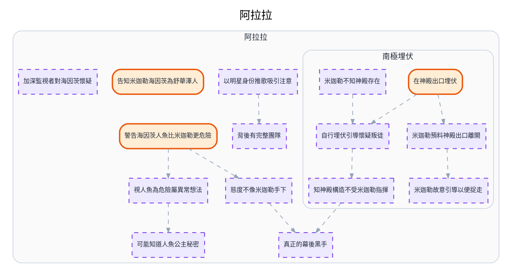

---
tags:
  - investigation
  - clues-dsl
cssclasses:
  - graphviz-large-preview
---

# 阿拉拉

> [!NOTE] 寫法見 [[線索-DSL-寫法]]。圖上只顯示短鍵，細節在 Canvas 卡片裡。
> 結構：「事件／假設」依連線流向推導；群組內用 -支持/推導-> 串起推論。

```clues
標題: 阿拉拉

# 阿拉拉
假設 以明星身份推歌吸引注意 : 成為明星推出人魚公主平常唱的歌吸引人魚公主注意，引導她們懷疑長老
假設 背後有完整團隊
事件 告知米迦勒海因茨為舒華澤人 : 告訴米迦勒海因茨是舒華澤的人，且知道舒華澤的人法力沒有共振特性
事件 警告海因茨人魚比米迦勒更危險 : 警告海因茨人魚公主比米迦勒更危險
假設 態度不像米迦勒手下
假設 真正的幕後黑手
假設 可能知道人魚公主秘密 : 可能知道人魚公主的秘密
假設 視人魚為危險屬異常想法 : 認為人魚公主危險是不尋常的想法
假設 加深監視者對海因茨懷疑 : 使監視者對海因茨懷疑加深

## 南極埋伏
事件 在神殿出口埋伏
假設 米迦勒預料神殿出口離開 : 米迦勒料到人魚公主會到神殿調查並從海底的隱藏出口離開
假設 自行埋伏引導懷疑叛徒 : 自行前往埋伏，引導人魚公主懷疑己方存在叛徒
假設 米迦勒不知神殿存在 : 米迦勒不知道神殿的存在
假設 米迦勒故意引導以便捉走 : 米迦勒故意引導人魚公主調查，好趁人魚公主落單時捉走
假設 知神殿構造不受米迦勒指揮 : 知道神殿構造、不受米迦勒指揮


以明星身份推歌吸引注意 -> 背後有完整團隊
自行埋伏引導懷疑叛徒 -> 知神殿構造不受米迦勒指揮
在神殿出口埋伏 -> 米迦勒預料神殿出口離開
在神殿出口埋伏 -> 自行埋伏引導懷疑叛徒
米迦勒不知神殿存在 -> 自行埋伏引導懷疑叛徒
米迦勒預料神殿出口離開 -> 米迦勒故意引導以便捉走
警告海因茨人魚比米迦勒更危險 -> 態度不像米迦勒手下
警告海因茨人魚比米迦勒更危險 -> 視人魚為危險屬異常想法
態度不像米迦勒手下 -> 真正的幕後黑手
視人魚為危險屬異常想法 -> 可能知道人魚公主秘密
知神殿構造不受米迦勒指揮 -> 真正的幕後黑手
```


