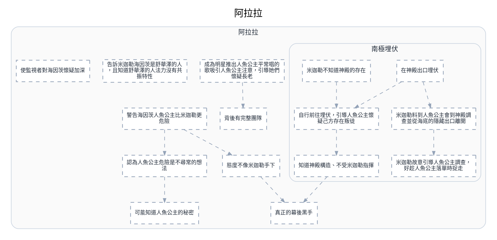

---
tags:
  - investigation
  - clues-dsl
cssclasses:
  - graphviz-large-preview
---

# 阿拉拉

> [!NOTE] 寫法
> 只需維護下方 ```clues 區塊，執行 `python scripts/clues_to_graphviz.py <本檔>` 即重生下方圖。
> - `# 群組`：cluster，`##` 為巢狀。
> - `類型 內容 = 別名 @時點 #狀態`：類型可用 證據／事件／實體／假設／未決／矛盾；別名、時點、狀態皆可省略。
> - `A -支持-> B | C`：關係可用 支持／導致／推導／矛盾／時序／屬於，省略即為「關係未定」的灰虛線。
> - 填色與形狀＝類型；邊框粗細與虛實＝狀態（已確認／預定／推論／補丁）。

```clues
標題: 阿拉拉
// 由 draw.io SVG 匯出；未分類 = 原圖非圖例顏色，請自行改類型

# 阿拉拉
未分類 成為明星推出人魚公主平常唱的歌吸引人魚公主注意，引導她們懷疑長老
未分類 背後有完整團隊
未分類 告訴米迦勒海因茨是舒華澤的人，且知道舒華澤的人法力沒有共振特性
未分類 警告海因茨人魚公主比米迦勒更危險
未分類 態度不像米迦勒手下
未分類 真正的幕後黑手
未分類 可能知道人魚公主的秘密
未分類 認為人魚公主危險是不尋常的想法
未分類 使監視者對海因茨懷疑加深

## 南極埋伏
未分類 在神殿出口埋伏
未分類 米迦勒料到人魚公主會到神殿調查並從海底的隱藏出口離開
未分類 自行前往埋伏，引導人魚公主懷疑己方存在叛徒
未分類 米迦勒不知道神殿的存在
未分類 米迦勒故意引導人魚公主調查，好趁人魚公主落單時捉走
未分類 知道神殿構造、不受米迦勒指揮


成為明星推出人魚公主平常唱的歌吸引人魚公主注意，引導她們懷疑長老 -> 背後有完整團隊
自行前往埋伏，引導人魚公主懷疑己方存在叛徒 -> 知道神殿構造、不受米迦勒指揮
在神殿出口埋伏 -> 米迦勒料到人魚公主會到神殿調查並從海底的隱藏出口離開
在神殿出口埋伏 -> 自行前往埋伏，引導人魚公主懷疑己方存在叛徒
米迦勒不知道神殿的存在 -> 自行前往埋伏，引導人魚公主懷疑己方存在叛徒
米迦勒料到人魚公主會到神殿調查並從海底的隱藏出口離開 -> 米迦勒故意引導人魚公主調查，好趁人魚公主落單時捉走
警告海因茨人魚公主比米迦勒更危險 -> 態度不像米迦勒手下
警告海因茨人魚公主比米迦勒更危險 -> 認為人魚公主危險是不尋常的想法
態度不像米迦勒手下 -> 真正的幕後黑手
認為人魚公主危險是不尋常的想法 -> 可能知道人魚公主的秘密
知道神殿構造、不受米迦勒指揮 -> 真正的幕後黑手
// 原圖連線中另有 289 條因端點缺失或不在本子集而未匯出
```


