---
tags:
  - investigation
  - clues-dsl
cssclasses:
  - graphviz-large-preview
---

# 陸地現場：音樂會與孤兒院

> [!NOTE] 寫法
> 只需維護下方 ```clues 區塊，執行 `python scripts/clues_to_graphviz.py <本檔>` 即重生下方圖。
> - `# 群組`：cluster，`##` 為巢狀。
> - `類型 內容 = 別名 @時點 #狀態`：類型可用 證據／事件／實體／假設／未決／矛盾；別名、時點、狀態皆可省略。
> - `A -支持-> B | C`：關係可用 支持／導致／推導／矛盾／時序／屬於，省略即為「關係未定」的灰虛線。
> - 填色與形狀＝類型；邊框粗細與虛實＝狀態（已確認／預定／推論／補丁）。

```clues
標題: 陸地現場：音樂會與孤兒院
// 由 draw.io SVG 匯出；未分類 = 原圖非圖例顏色，請自行改類型

未分類 塞雷亞清楚人魚公主行蹤
未分類 達姬與尼歌娜都大致理解其他王國的狀況
未分類 尼歌姬會管束公主，達姬則鼓勵公主享受
未分類 尼歌娜和達姬的角色與各自的身份閱歷不符，達姬理應比尼歌娜更清楚犯錯的後果以及帶來的外交問題
未分類 其他王國十分重視規矩，犯規會被嚴懲
未分類 水妖對人魚公主的行蹤有一定掌握，且從來不會在人魚公主忙碌時出現
未分類 有人密切監視人魚公主動向

# 天城理人音樂會現場
未分類 多人監視人魚公主
未分類 保守派監視者
未分類 改革派與保守派矛盾
未分類 彭達拉薩人的存在十分敏感，會激化人魚內部矛盾
未分類 就算不至內戰也會瓦解同盟
未分類 塞雷亞明知而同意合作，且刻意淡化問題
未分類 塞雷亞向VPTS洩密
未分類 與北太平洋立場矛盾
未分類 塞雷亞與長老目標不同
未分類 北太平洋有意挑起爭端
未分類 不利米迦勒復興海之住民
未分類 復興不是米迦勒的真正目的
未分類 長老向VPTS洩密
未分類 有利米迦勒綁架人魚公主
未分類 挑起內部爭端

# 廢棄孤兒院
未分類 選擇孤兒院的理由：暗指人魚公主沒有父母，形同孤兒
未分類 29年前發生火災，案件紀錄3人倖存

## 尼歌娜
未分類 明明只是基層，卻知道監視者的存在
未分類 暗中保護公主，並防止保守派抓到把柄

## Hangman 謎題
未分類 場景含意

## 地下室
未分類 地下室有APCS，導致未能提前發現沙羅
未分類 手套

### 沙羅
未分類 V前往海都城帶走沙羅
未分類 V知道海都城位置

### 第一張門票
未分類 座標、海拔
未分類 時間

### 第二封信件
未分類 以阿奎斯托語寫成
未分類 V懂得阿奎斯托語
未分類 V知道沙羅是前公主
未分類 對象為前公主
未分類 地址、行李保險箱編號、密碼
未分類 4月6日0時0分後至4月7日0時0分前領取

// 以下標籤在原圖重複出現，只保留第一個：時間

地下室有APCS，導致未能提前發現沙羅 -> 手套
多人監視人魚公主 -> 保守派監視者
保守派監視者 -> 改革派與保守派矛盾
暗中保護公主，並防止保守派抓到把柄 -> 改革派與保守派矛盾
改革派與保守派矛盾 -> 彭達拉薩人的存在十分敏感，會激化人魚內部矛盾
彭達拉薩人的存在十分敏感，會激化人魚內部矛盾 -> 就算不至內戰也會瓦解同盟
塞雷亞明知而同意合作，且刻意淡化問題 -> 與北太平洋立場矛盾
與北太平洋立場矛盾 -> 塞雷亞與長老目標不同
與北太平洋立場矛盾 -> 北太平洋有意挑起爭端
塞雷亞與長老目標不同 -> 塞雷亞向VPTS洩密
北太平洋有意挑起爭端 -> 長老向VPTS洩密
不利米迦勒復興海之住民 -> 復興不是米迦勒的真正目的
有利米迦勒綁架人魚公主 -> 復興不是米迦勒的真正目的
彭達拉薩人的存在十分敏感，會激化人魚內部矛盾 -> 塞雷亞明知而同意合作，且刻意淡化問題
就算不至內戰也會瓦解同盟 -> 不利米迦勒復興海之住民
就算不至內戰也會瓦解同盟 -> 有利米迦勒綁架人魚公主
塞雷亞向VPTS洩密 -> 挑起內部爭端
V前往海都城帶走沙羅 -> V知道海都城位置
以阿奎斯托語寫成 -> V懂得阿奎斯托語
對象為前公主 -> V知道沙羅是前公主
塞雷亞清楚人魚公主行蹤 -> 塞雷亞向VPTS洩密
達姬與尼歌娜都大致理解其他王國的狀況 -> 尼歌娜和達姬的角色與各自的身份閱歷不符，達姬理應比尼歌娜更清楚犯錯的後果以及帶來的外交問題
尼歌姬會管束公主，達姬則鼓勵公主享受 -> 尼歌娜和達姬的角色與各自的身份閱歷不符，達姬理應比尼歌娜更清楚犯錯的後果以及帶來的外交問題
其他王國十分重視規矩，犯規會被嚴懲 -> 尼歌娜和達姬的角色與各自的身份閱歷不符，達姬理應比尼歌娜更清楚犯錯的後果以及帶來的外交問題
水妖對人魚公主的行蹤有一定掌握，且從來不會在人魚公主忙碌時出現 -> 有人密切監視人魚公主動向

// 跨主題接口：需要時把對方寫成「未決 XXX（見 [[另一篇]]）」再連線
// 接口: 多人監視人魚公主 -> 尼歌娜　（「尼歌娜」在本主題之外）
// 接口: 座標、海拔 -> 印度洋王國廢墟　（「印度洋王國廢墟」在本主題之外）
// 接口: 29年前發生火災，案件紀錄3人倖存 -> 堂本薰是倖存者之一　（「堂本薰是倖存者之一」在本主題之外）
// 接口: V知道海都城位置 -> V是彭達拉薩人　（「V是彭達拉薩人」在本主題之外）
// 接口: 時間 -> 印度洋公主誕生　（「印度洋公主誕生」在本主題之外）
// 接口: 地址、行李保險箱編號、密碼 -> 第二張門票　（「第二張門票」在本主題之外）
// 接口: 4月6日0時0分後至4月7日0時0分前領取 -> 必須經印度才能在時限內打開保險櫃　（「必須經印度才能在時限內打開保險櫃」在本主題之外）
// 接口: 為游騎士（彭達拉薩人）介入提供契機 -> 彭達拉薩人的存在十分敏感，會激化人魚內部矛盾　（「為游騎士（彭達拉薩人）介入提供契機」在本主題之外）
// 接口: 米迦勒太快擺出對立態度 -> 復興不是米迦勒的真正目的　（「米迦勒太快擺出對立態度」在本主題之外）
// 原圖連線中另有 266 條因端點缺失或不在本子集而未匯出
```

```dot
// clues-auto 由上方 clues 區塊生成，請勿手改；重新執行 scripts/clues_to_graphviz.py
digraph clues {
  graph [
    rankdir="TB", bgcolor="#FFFFFF", newrank="true", compound="true",
    splines="spline", nodesep="0.30", ranksep="0.60", pad="0.15",
    fontname="Microsoft JhengHei, Noto Sans CJK TC, PingFang TC, sans-serif", fontsize="16", labelloc="t",
    label="陸地現場：音樂會與孤兒院"
  ];
  node [fontname="Microsoft JhengHei, Noto Sans CJK TC, PingFang TC, sans-serif", fontsize="9", fontcolor="#1F2937", margin="0.10,0.06"];
  edge [fontname="Microsoft JhengHei, Noto Sans CJK TC, PingFang TC, sans-serif", fontsize="8", fontcolor="#475569", arrowsize="0.65"];

  n001 [label="塞雷亞清楚人魚公主行蹤", shape="box", style="filled,dashed", fillcolor="#FFFFFF", color="#94A3B8", penwidth="1.2"];
  n002 [label="達姬與尼歌娜都大致理解其他王\n國的狀況", shape="box", style="filled,dashed", fillcolor="#FFFFFF", color="#94A3B8", penwidth="1.2"];
  n003 [label="尼歌姬會管束公主，達姬則鼓勵\n公主享受", shape="box", style="filled,dashed", fillcolor="#FFFFFF", color="#94A3B8", penwidth="1.2"];
  n004 [label="尼歌娜和達姬的角色與各自的身\n份閱歷不符，達姬理應比尼歌娜\n更清楚犯錯的後果以及帶來的外\n交問題", shape="box", style="filled,dashed", fillcolor="#FFFFFF", color="#94A3B8", penwidth="1.2"];
  n005 [label="其他王國十分重視規矩，犯規會\n被嚴懲", shape="box", style="filled,dashed", fillcolor="#FFFFFF", color="#94A3B8", penwidth="1.2"];
  n006 [label="水妖對人魚公主的行蹤有一定掌\n握，且從來不會在人魚公主忙碌\n時出現", shape="box", style="filled,dashed", fillcolor="#FFFFFF", color="#94A3B8", penwidth="1.2"];
  n007 [label="有人密切監視人魚公主動向", shape="box", style="filled,dashed", fillcolor="#FFFFFF", color="#94A3B8", penwidth="1.2"];
  subgraph cluster_01 {
    label="天城理人音樂會現場"; color="#CBD5E1"; fillcolor="#FAFAFA";
    fontcolor="#1F2937"; fontsize="11"; style="filled,rounded";
    n008 [label="多人監視人魚公主", shape="box", style="filled,dashed", fillcolor="#FFFFFF", color="#94A3B8", penwidth="1.2"];
    n009 [label="保守派監視者", shape="box", style="filled,dashed", fillcolor="#FFFFFF", color="#94A3B8", penwidth="1.2"];
    n010 [label="改革派與保守派矛盾", shape="box", style="filled,dashed", fillcolor="#FFFFFF", color="#94A3B8", penwidth="1.2"];
    n011 [label="彭達拉薩人的存在十分敏感，會\n激化人魚內部矛盾", shape="box", style="filled,dashed", fillcolor="#FFFFFF", color="#94A3B8", penwidth="1.2"];
    n012 [label="就算不至內戰也會瓦解同盟", shape="box", style="filled,dashed", fillcolor="#FFFFFF", color="#94A3B8", penwidth="1.2"];
    n013 [label="塞雷亞明知而同意合作，且刻意\n淡化問題", shape="box", style="filled,dashed", fillcolor="#FFFFFF", color="#94A3B8", penwidth="1.2"];
    n014 [label="塞雷亞向VPTS洩密", shape="box", style="filled,dashed", fillcolor="#FFFFFF", color="#94A3B8", penwidth="1.2"];
    n015 [label="與北太平洋立場矛盾", shape="box", style="filled,dashed", fillcolor="#FFFFFF", color="#94A3B8", penwidth="1.2"];
    n016 [label="塞雷亞與長老目標不同", shape="box", style="filled,dashed", fillcolor="#FFFFFF", color="#94A3B8", penwidth="1.2"];
    n017 [label="北太平洋有意挑起爭端", shape="box", style="filled,dashed", fillcolor="#FFFFFF", color="#94A3B8", penwidth="1.2"];
    n018 [label="不利米迦勒復興海之住民", shape="box", style="filled,dashed", fillcolor="#FFFFFF", color="#94A3B8", penwidth="1.2"];
    n019 [label="復興不是米迦勒的真正目的", shape="box", style="filled,dashed", fillcolor="#FFFFFF", color="#94A3B8", penwidth="1.2"];
    n020 [label="長老向VPTS洩密", shape="box", style="filled,dashed", fillcolor="#FFFFFF", color="#94A3B8", penwidth="1.2"];
    n021 [label="有利米迦勒綁架人魚公主", shape="box", style="filled,dashed", fillcolor="#FFFFFF", color="#94A3B8", penwidth="1.2"];
    n022 [label="挑起內部爭端", shape="box", style="filled,dashed", fillcolor="#FFFFFF", color="#94A3B8", penwidth="1.2"];
  }
  subgraph cluster_02 {
    label="廢棄孤兒院"; color="#CBD5E1"; fillcolor="#FAFAFA";
    fontcolor="#1F2937"; fontsize="11"; style="filled,rounded";
    n023 [label="選擇孤兒院的理由：暗指人魚公\n主沒有父母，形同孤兒", shape="box", style="filled,dashed", fillcolor="#FFFFFF", color="#94A3B8", penwidth="1.2"];
    n024 [label="29年前發生火災，案件紀錄3\n人倖存", shape="box", style="filled,dashed", fillcolor="#FFFFFF", color="#94A3B8", penwidth="1.2"];
    subgraph cluster_03 {
      label="Hangman 謎題"; color="#CBD5E1"; fillcolor="#FAFAFA";
      fontcolor="#1F2937"; fontsize="11"; style="filled,rounded";
      n027 [label="場景含意", shape="box", style="filled,dashed", fillcolor="#FFFFFF", color="#94A3B8", penwidth="1.2"];
    }
    subgraph cluster_04 {
      label="地下室"; color="#CBD5E1"; fillcolor="#FAFAFA";
      fontcolor="#1F2937"; fontsize="11"; style="filled,rounded";
      n028 [label="地下室有APCS，導致未能提\n前發現沙羅", shape="box", style="filled,dashed", fillcolor="#FFFFFF", color="#94A3B8", penwidth="1.2"];
      n029 [label="手套", shape="box", style="filled,dashed", fillcolor="#FFFFFF", color="#94A3B8", penwidth="1.2"];
      subgraph cluster_05 {
        label="沙羅"; color="#CBD5E1"; fillcolor="#FAFAFA";
        fontcolor="#1F2937"; fontsize="11"; style="filled,rounded";
        n030 [label="V前往海都城帶走沙羅", shape="box", style="filled,dashed", fillcolor="#FFFFFF", color="#94A3B8", penwidth="1.2"];
        n031 [label="V知道海都城位置", shape="box", style="filled,dashed", fillcolor="#FFFFFF", color="#94A3B8", penwidth="1.2"];
      }
      subgraph cluster_06 {
        label="第一張門票"; color="#CBD5E1"; fillcolor="#FAFAFA";
        fontcolor="#1F2937"; fontsize="11"; style="filled,rounded";
        n032 [label="座標、海拔", shape="box", style="filled,dashed", fillcolor="#FFFFFF", color="#94A3B8", penwidth="1.2"];
        n033 [label="時間", shape="box", style="filled,dashed", fillcolor="#FFFFFF", color="#94A3B8", penwidth="1.2"];
      }
      subgraph cluster_07 {
        label="第二封信件"; color="#CBD5E1"; fillcolor="#FAFAFA";
        fontcolor="#1F2937"; fontsize="11"; style="filled,rounded";
        n034 [label="以阿奎斯托語寫成", shape="box", style="filled,dashed", fillcolor="#FFFFFF", color="#94A3B8", penwidth="1.2"];
        n035 [label="V懂得阿奎斯托語", shape="box", style="filled,dashed", fillcolor="#FFFFFF", color="#94A3B8", penwidth="1.2"];
        n036 [label="V知道沙羅是前公主", shape="box", style="filled,dashed", fillcolor="#FFFFFF", color="#94A3B8", penwidth="1.2"];
        n037 [label="對象為前公主", shape="box", style="filled,dashed", fillcolor="#FFFFFF", color="#94A3B8", penwidth="1.2"];
        n038 [label="地址、行李保險箱編號、密碼", shape="box", style="filled,dashed", fillcolor="#FFFFFF", color="#94A3B8", penwidth="1.2"];
        n039 [label="4月6日0時0分後至4月7日\n0時0分前領取", shape="box", style="filled,dashed", fillcolor="#FFFFFF", color="#94A3B8", penwidth="1.2"];
      }
    }
    subgraph cluster_08 {
      label="尼歌娜"; color="#CBD5E1"; fillcolor="#FAFAFA";
      fontcolor="#1F2937"; fontsize="11"; style="filled,rounded";
      n025 [label="明明只是基層，卻知道監視者的\n存在", shape="box", style="filled,dashed", fillcolor="#FFFFFF", color="#94A3B8", penwidth="1.2"];
      n026 [label="暗中保護公主，並防止保守派抓\n到把柄", shape="box", style="filled,dashed", fillcolor="#FFFFFF", color="#94A3B8", penwidth="1.2"];
    }
  }

  n028 -> n029 [color="#94A3B8", style="dashed"];
  n008 -> n009 [color="#94A3B8", style="dashed"];
  n009 -> n010 [color="#94A3B8", style="dashed"];
  n026 -> n010 [color="#94A3B8", style="dashed"];
  n010 -> n011 [color="#94A3B8", style="dashed"];
  n011 -> n012 [color="#94A3B8", style="dashed"];
  n013 -> n015 [color="#94A3B8", style="dashed"];
  n015 -> n016 [color="#94A3B8", style="dashed"];
  n015 -> n017 [color="#94A3B8", style="dashed"];
  n016 -> n014 [color="#94A3B8", style="dashed"];
  n017 -> n020 [color="#94A3B8", style="dashed"];
  n018 -> n019 [color="#94A3B8", style="dashed"];
  n021 -> n019 [color="#94A3B8", style="dashed"];
  n011 -> n013 [color="#94A3B8", style="dashed"];
  n012 -> n018 [color="#94A3B8", style="dashed"];
  n012 -> n021 [color="#94A3B8", style="dashed"];
  n014 -> n022 [color="#94A3B8", style="dashed"];
  n030 -> n031 [color="#94A3B8", style="dashed"];
  n034 -> n035 [color="#94A3B8", style="dashed"];
  n037 -> n036 [color="#94A3B8", style="dashed"];
  n001 -> n014 [color="#94A3B8", style="dashed"];
  n002 -> n004 [color="#94A3B8", style="dashed"];
  n003 -> n004 [color="#94A3B8", style="dashed"];
  n005 -> n004 [color="#94A3B8", style="dashed"];
  n006 -> n007 [color="#94A3B8", style="dashed"];
}
```


