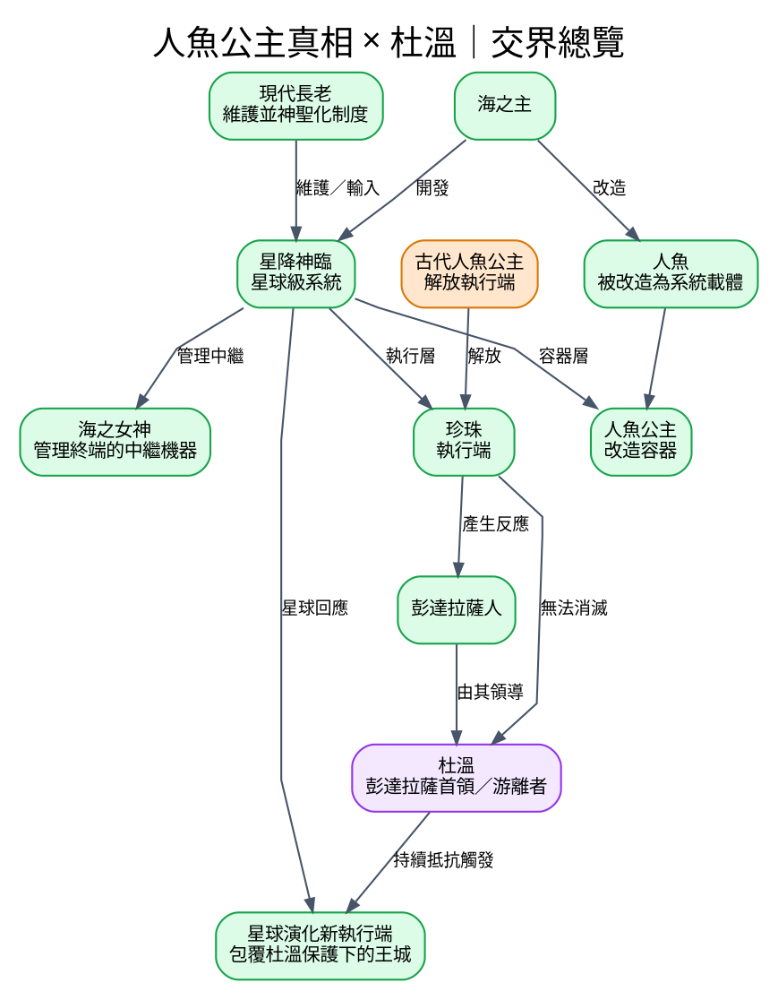

---
tags:
  - investigation
  - graphviz
  - clues
  - mermaid-princess
  - durwin
source:
  - "[[線索-Clues and Investigation.drawio.svg]]"
  - "[[Story/reference/敘詭整理]]"
  - "[[Story/reference/邏輯缺口與補丁]]"
cssclasses:
  - graphviz-large-preview
---

# 人魚公主真相與杜溫

本筆記從總線索圖拆出兩個主題。圖中刻意區分：

- **藍色**：原 SVG 已有的調查節點及連線。
- **綠色**：事件或參考文件明示的全知設定。
- **灰色**：角色所知的制度表象。
- **橙色虛線**：待處理缺口或尚未證實的角色推論。
- **紅色**：不可直接等同的概念。

## 交界總覽

## 人魚公主真相

### 原圖推理與補充設定

```dot
digraph mermaid_truth {
  graph [
    rankdir="TB",
    bgcolor="#FFFFFF",
    compound="true",
    newrank="true",
    splines="polyline",
    nodesep="0.30",
    ranksep="0.55",
    pad="0.15",
    fontname="Microsoft JhengHei",
    label="人魚公主真相｜原圖推理、全知設定與未閉合情報",
    labelloc="t",
    fontsize="18"
  ];
  node [
    shape="box",
    style="filled,rounded",
    fillcolor="#FFFFFF",
    color="#64748B",
    fontname="Microsoft JhengHei",
    fontsize="9",
    margin="0.10,0.06"
  ];
  edge [
    color="#64748B",
    fontname="Microsoft JhengHei",
    fontsize="8",
    arrowsize="0.65"
  ];

  subgraph cluster_surface {
    label="制度表象／角色認知";
    color="#94A3B8";
    fillcolor="#F1F5F9";
    style="filled,rounded";

    surface_birth [label="女神選出天生神使"];
    surface_power [label="公主以歌聲與珍珠\n守護和平"];
    surface_elder [label="長老輔佐並保護公主"];
    surface_disappear [label="公主失蹤是無力追查"];
    surface_punish [label="星盡是違規後的\n神聖處罰"];
  }

  subgraph cluster_original {
    label="原 SVG：未命名藍色容器（人魚公主／珍珠機制推理）";
    color="#2563EB";
    fillcolor="#EFF6FF";
    style="filled,rounded";

    o27 [label="星羅懂得法術基本原理\n但印度洋禁止公主學法術", fillcolor="#DBEAFE", color="#2563EB"];
    o28 [label="存在「成為人魚公主前」的階段", fillcolor="#DBEAFE", color="#2563EB"];
    o29 [label="人魚公主原本是普通人魚", fillcolor="#DBEAFE", color="#2563EB"];
    o30 [label="人魚公主會影響感知", fillcolor="#DBEAFE", color="#2563EB"];
    o31 [label="變身後大量釋放能量", fillcolor="#DBEAFE", color="#2563EB"];
    o32 [label="珍珠能量具指向性\n不受公主主觀認知影響", fillcolor="#DBEAFE", color="#2563EB"];
    o33 [label="人魚公主並非自然產物", fillcolor="#DBEAFE", color="#2563EB"];
    o34 [label="人魚公主經過改造", fillcolor="#DBEAFE", color="#2563EB"];
    o35 [label="人魚公主無法使用法術\n原因不明", fillcolor="#DBEAFE", color="#2563EB"];
    o36 [label="諾愛爾成功強行施法", fillcolor="#DBEAFE", color="#2563EB"];
    o37 [label="人魚公主擁有法力系統", fillcolor="#DBEAFE", color="#2563EB"];
    o38 [label="人魚公主是某種開關", fillcolor="#DBEAFE", color="#2563EB"];
    o39 [label="一般海之住民沒有\n如此龐大的法力量", fillcolor="#DBEAFE", color="#2563EB"];
    o40 [label="星羅誕生時已是兒童\n其他人誕生時是嬰兒", fillcolor="#DBEAFE", color="#2563EB"];
    o41 [label="星羅在里昂身上找到\n「哥哥」的感覺", fillcolor="#DBEAFE", color="#2563EB"];
    o42 [label="判斷指向對象及釋放能量的是珍珠", fillcolor="#DBEAFE", color="#2563EB"];
    o43 [label="人魚公主平常在干擾珍珠判斷", fillcolor="#DBEAFE", color="#2563EB"];
    o44 [label="珍珠離開貝殼時\n自動向特定對象釋能", fillcolor="#DBEAFE", color="#2563EB"];
    o45 [label="星羅熟悉人類語言與社會\n對海底生活印象模糊", fillcolor="#DBEAFE", color="#2563EB"];
    o46 [label="女神「給予」的歌曲中\n存在流行曲", fillcolor="#DBEAFE", color="#2563EB"];
    o47 [label="長老在背後控制", fillcolor="#DBEAFE", color="#2563EB"];
    o48 [label="變身影響能量釋放", fillcolor="#DBEAFE", color="#2563EB"];
    o49 [label="公主所唱歌曲實際由阿拉拉創作", fillcolor="#DBEAFE", color="#2563EB"];
  }

  subgraph cluster_truth {
    label="參考文件明示的全知設定";
    color="#16A34A";
    fillcolor="#F0FDF4";
    style="filled,rounded";

    t_sea_lord [label="海之主開發星降神臨", fillcolor="#DCFCE7", color="#16A34A"];
    t_system [label="星降神臨是星球級系統", fillcolor="#DCFCE7", color="#16A34A"];
    t_carrier [label="人魚是海之主改造的\n執行系統載體", fillcolor="#DCFCE7", color="#16A34A"];
    t_princess [label="公主＝儲存基質＋散播干擾粒子\n＋控制執行端的改造容器", fillcolor="#DCFCE7", color="#16A34A"];
    t_pearl [label="珍珠＝執行端", fillcolor="#DCFCE7", color="#16A34A"];
    t_goddess [label="海之女神＝管理終端的中繼機器", fillcolor="#DCFCE7", color="#16A34A"];
    t_pause [label="公主使用珍珠時\n系統暫停干擾", fillcolor="#DCFCE7", color="#16A34A"];
    t_location [label="系統持續回報公主位置", fillcolor="#DCFCE7", color="#16A34A"];
    t_elder [label="現代長老維護並神聖化制度\n但不是原始設計者", fillcolor="#DCFCE7", color="#16A34A"];
    t_cover [label="身體改造、家庭抹除、無法施法\n被包裝成神使天生特徵", fillcolor="#DCFCE7", color="#16A34A"];
    t_song [label="阿拉拉創作新歌\n長老輸入系統", fillcolor="#DCFCE7", color="#16A34A"];
    t_myth [label="形成「歌聲必勝」與神力表象", fillcolor="#DCFCE7", color="#16A34A"];
    t_star_end [label="星盡＝容器報廢與回收程序", fillcolor="#DCFCE7", color="#16A34A"];
    t_reclaim [label="回收珍珠與身體融合的法術結構", fillcolor="#DCFCE7", color="#16A34A"];
    t_death [label="容器死亡", fillcolor="#DCFCE7", color="#16A34A"];
    t_erase [label="相關記憶可被抹除", fillcolor="#DCFCE7", color="#16A34A"];
    t_successor [label="以繼承者取代", fillcolor="#DCFCE7", color="#16A34A"];
    t_seira [label="星羅在人類社會長大\n人魚公主並非自然誕生", fillcolor="#DCFCE7", color="#16A34A"];
    t_india [label="沙羅情緒崩潰是近因\n系統連接異常把失控放大為滅國", fillcolor="#DCFCE7", color="#16A34A"];
  }

  subgraph cluster_gap {
    label="邏輯缺口與角色受限認知";
    color="#D97706";
    fillcolor="#FFFBEB";
    style="filled,rounded,dashed";

    g_known [label="終端機、弗拉基米爾、米迦勒\n事先知道星羅誕生日期及地點", fillcolor="#FEF3C7", color="#D97706"];
    g_instance [label="常藍內部實例只能解釋\n既有公主的陸地行蹤", fillcolor="#FEF3C7", color="#D97706"];
    g_ursula [label="烏蘇拉協助綁架星羅並干擾追蹤\n但誕生情報來源未明", fillcolor="#FEF3C7", color="#D97706"];
    g_birth [label="待處理：星羅誕生情報鏈未閉合", fillcolor="#FDE68A", color="#B45309", penwidth="1.5"];
    g_dual [label="待處理：4月5至6日\nVPTS攔截與米迦勒襲擊是否同源", fillcolor="#FDE68A", color="#B45309"];
  }

  // 原 SVG 連線，不附加原圖沒有的關係名稱。
  o43 -> o34 [color="#2563EB"];
  o41 -> o29 [color="#2563EB"];
  o29 -> o33 [color="#2563EB"];
  o28 -> o29 [color="#2563EB"];
  o30 -> o31 [color="#2563EB"];
  o31 -> o32 [color="#2563EB"];
  o31 -> o48 [color="#2563EB"];
  o32 -> o42 [color="#2563EB"];
  o33 -> o34 [color="#2563EB"];
  o35 -> o37 [color="#2563EB"];
  o36 -> o37 [color="#2563EB"];
  o37 -> o29 [color="#2563EB"];
  o27 -> o37 [color="#2563EB"];
  o39 -> o34 [color="#2563EB"];
  o40 -> o28 [color="#2563EB"];
  o42 -> o43 [color="#2563EB"];
  o42 -> o38 [color="#2563EB"];
  o44 -> o42 [color="#2563EB"];
  o44 -> o43 [color="#2563EB"];
  o45 -> o28 [color="#2563EB"];
  o27 -> o28 [color="#2563EB"];
  o46 -> o47 [color="#2563EB"];
  o48 -> o38 [color="#2563EB"];
  o49 -> o47 [color="#2563EB"];

  // 全知設定的明示因果。
  t_sea_lord -> t_system [label="開發", color="#16A34A"];
  t_system -> t_princess [label="容器層", color="#16A34A"];
  t_system -> t_pearl [label="執行層", color="#16A34A"];
  t_system -> t_goddess [label="管理中繼", color="#16A34A"];
  t_sea_lord -> t_carrier [label="改造", color="#16A34A"];
  t_carrier -> t_princess [color="#16A34A"];
  t_princess -> t_pause [label="使用珍珠時", color="#16A34A"];
  t_pearl -> t_pause [color="#16A34A"];
  t_pause -> t_myth [label="強化神力表象", color="#16A34A"];
  t_system -> t_location [color="#16A34A"];
  t_location -> surface_disappear [label="揭穿制度性謊言", color="#16A34A"];
  t_elder -> t_cover [label="包裝", color="#16A34A"];
  t_cover -> surface_birth [label="維持表象", color="#16A34A"];
  t_song -> t_myth [color="#16A34A"];
  t_myth -> surface_power [label="維持表象", color="#16A34A"];
  t_star_end -> t_reclaim [color="#16A34A"];
  t_reclaim -> t_death [color="#16A34A"];
  t_star_end -> t_erase [color="#16A34A"];
  t_star_end -> t_successor [color="#16A34A"];
  t_star_end -> surface_punish [label="被包裝成", color="#16A34A"];

  // 原圖推理與全知設定的對應；虛線表示跨資料層對照。
  o33 -> t_seira [label="設定確認", style="dashed", color="#16A34A"];
  o34 -> t_princess [label="設定確認", style="dashed", color="#16A34A"];
  o42 -> t_pearl [label="設定確認", style="dashed", color="#16A34A"];
  o43 -> t_princess [label="干擾功能", style="dashed", color="#16A34A"];
  o45 -> t_seira [label="回看線索", style="dashed", color="#16A34A"];
  o47 -> t_elder [label="設定確認", style="dashed", color="#16A34A"];
  o49 -> t_song [label="設定確認", style="dashed", color="#16A34A"];

  g_instance -> g_birth [label="不足以解釋", style="dashed", color="#D97706"];
  g_known -> g_birth [style="dashed", color="#D97706"];
  g_ursula -> g_birth [label="可能相關但來源未明", style="dashed", color="#D97706"];
  t_location -> g_birth [label="是否相關未確定", style="dashed", color="#D97706"];
  g_birth -> g_dual [label="影響第一次行動上游判定", style="dashed", color="#D97706"];
}
```

### 判讀

1. 原圖對「人魚公主是改造產物」「珍珠負責判斷及釋能」「長老控制歌曲」的推理，已被 `敘詭整理` 的全知設定直接支持。
2. 星盡不能再只畫成處罰；它是珍珠與容器法術結構的回收／報廢程序。
3. `星降神臨持續回報公主位置` 只能解釋既有公主的位置控制，不能自動補上星羅誕生情報來源。這條線仍是缺口。

## 杜溫

### 原圖推理、古代事件與終局真相

```dot
digraph durwin_truth {
  graph [
    rankdir="TB",
    bgcolor="#FFFFFF",
    compound="true",
    newrank="true",
    splines="polyline",
    nodesep="0.32",
    ranksep="0.58",
    pad="0.15",
    fontname="Microsoft JhengHei",
    label="杜溫｜原圖推理、古代事件與終局全知設定",
    labelloc="t",
    fontsize="18"
  ];
  node [
    shape="box",
    style="filled,rounded",
    fillcolor="#FFFFFF",
    color="#64748B",
    fontname="Microsoft JhengHei",
    fontsize="9",
    margin="0.10,0.06"
  ];
  edge [
    color="#64748B",
    fontname="Microsoft JhengHei",
    fontsize="8",
    arrowsize="0.65"
  ];

  subgraph cluster_original {
    label="原 SVG：杜溫格";
    color="#2563EB";
    fillcolor="#EFF6FF";
    style="filled,rounded";

    o_durwin [label="杜溫", fillcolor="#DBEAFE", color="#2563EB"];
    o_energy [label="持續消耗星球能量", fillcolor="#DBEAFE", color="#2563EB"];
    o_key_birth [label="控制杜溫的執行端（鑰匙）誕生", fillcolor="#DBEAFE", color="#2563EB"];
    o_hippo [label="人魚創造希寶作為執行端容器\n並封印埃爾確", fillcolor="#DBEAFE", color="#2563EB"];
    o_request [label="執行端無法消滅水妖時\n向管理端發送解限請求", fillcolor="#DBEAFE", color="#2563EB"];
    o_manager [label="管理端前來解除限制", fillcolor="#DBEAFE", color="#2563EB"];
    o_resist [label="杜溫持續與星球對抗\n使海都受其保護", fillcolor="#DBEAFE", color="#2563EB"];
    o_mission [label="「配合」人魚公主的使命", fillcolor="#DBEAFE", color="#2563EB"];
    o_goddess [label="海之女神顯現\n在長老操控下執行儀式", fillcolor="#DBEAFE", color="#2563EB"];
    o_fail [label="執行端無法消滅杜溫", fillcolor="#DBEAFE", color="#2563EB"];
    o_water [label="杜溫以法術協助水妖對抗執行端", fillcolor="#DBEAFE", color="#2563EB"];
  }

  subgraph cluster_history {
    label="09_event 明示：古代戰爭";
    color="#16A34A";
    fillcolor="#F0FDF4";
    style="filled,rounded";

    h_leader [label="0001：杜溫成為彭達拉薩人首領", fillcolor="#DCFCE7", color="#16A34A"];
    h_casus [label="海之主以「綁架人魚公主」為名\n討伐彭達拉薩人", fillcolor="#DCFCE7", color="#16A34A"];
    h_recognize [label="杜溫識破海之主意圖\n親自領軍迎擊", fillcolor="#DCFCE7", color="#16A34A"];
    h_princess [label="人魚公主被迫迎戰\n並解放執行端", fillcolor="#DCFCE7", color="#16A34A"];
    h_react [label="執行端對彭達拉薩人有反應", fillcolor="#DCFCE7", color="#16A34A"];
    h_retreat [label="杜溫帶殘部退回王城堅守", fillcolor="#DCFCE7", color="#16A34A"];
    h_fail [label="執行端無法消滅杜溫", fillcolor="#DCFCE7", color="#16A34A"];
    h_evolve [label="星球演化新執行端", fillcolor="#DCFCE7", color="#16A34A"];
    h_wrap [label="新執行端包覆\n杜溫保護下的王城", fillcolor="#DCFCE7", color="#16A34A"];
    h_hippo [label="0005：人魚創造希寶卡波斯", fillcolor="#DCFCE7", color="#16A34A"];
    h_seal [label="人魚封印海都城／埃爾確", fillcolor="#DCFCE7", color="#16A34A"];
    h_stalemate [label="杜溫與星球力量僵持不下", fillcolor="#DCFCE7", color="#16A34A"];
  }

  subgraph cluster_truth {
    label="敘詭整理明示：終局全知真相";
    color="#9333EA";
    fillcolor="#FAF5FF";
    style="filled,rounded";

    t_wanderer [label="杜溫是游離者", fillcolor="#F3E8FF", color="#9333EA"];
    t_survival [label="彭達拉薩人的存續\n依賴杜溫干涉", fillcolor="#F3E8FF", color="#9333EA"];
    t_rewrite [label="若干涉被抹除\n世界可能將族群歷史重寫為早已滅亡", fillcolor="#F3E8FF", color="#9333EA"];
    t_michael [label="米迦勒的領域與實體化\n依賴杜溫力量", fillcolor="#F3E8FF", color="#9333EA"];
  }

  subgraph cluster_later {
    label="09_event 明示：後世介入";
    color="#D97706";
    fillcolor="#FFFBEB";
    style="filled,rounded";

    l_1990 [label="1990：阿拉拉促成弗拉基米爾、烏蘇拉\n前往埃爾確找到杜溫", fillcolor="#FEF3C7", color="#D97706"];
    l_power [label="弗拉基米爾利用杜溫的修正力\n掀起巨浪", fillcolor="#FEF3C7", color="#D97706"];
    l_pearl [label="巨浪促成露芝亞交出珍珠", fillcolor="#FEF3C7", color="#D97706"];
    l_2004 [label="2004-03-04：杜溫傳送米迦勒\n前往日本襲擊露芝亞", fillcolor="#FEF3C7", color="#D97706"];
  }

  subgraph cluster_distinction {
    label="概念不可混同";
    color="#DC2626";
    fillcolor="#FEF2F2";
    style="filled,rounded,dashed";

    x_original_key [label="原圖：控制杜溫的\n執行端（鑰匙）", fillcolor="#FEE2E2", color="#DC2626"];
    x_seal_key [label="1995：沙羅盜取的\n封印之匙", fillcolor="#FEE2E2", color="#DC2626"];
    x_force [label="古代年表：星球力量", fillcolor="#FEE2E2", color="#DC2626"];
    x_system [label="研究所設定：星球防禦系統", fillcolor="#FEE2E2", color="#DC2626"];
    x_note [label="文件未明示兩組名詞完全等同", fillcolor="#FECACA", color="#B91C1C"];
  }

  // 原 SVG 連線。
  o_fail -> o_energy [color="#2563EB"];
  o_fail -> o_key_birth [color="#2563EB"];
  o_key_birth -> o_hippo [color="#2563EB"];
  o_water -> o_mission [color="#2563EB"];
  o_water -> o_request [color="#2563EB"];
  o_request -> o_manager [color="#2563EB"];
  o_manager -> o_goddess [color="#2563EB"];

  // 古代事件明示因果。
  h_leader -> h_recognize [color="#16A34A"];
  h_casus -> h_recognize [label="被識破", color="#16A34A"];
  h_recognize -> h_retreat [label="戰事後期", color="#16A34A"];
  h_princess -> h_react [label="解放執行端", color="#16A34A"];
  h_react -> h_retreat [label="迫使敗退", color="#16A34A"];
  h_retreat -> h_fail [color="#16A34A"];
  h_fail -> h_evolve [label="觸發星球回應", color="#16A34A"];
  h_evolve -> h_wrap [color="#16A34A"];
  h_fail -> h_stalemate [color="#16A34A"];
  h_hippo -> h_seal [color="#16A34A"];

  // 終局真相。
  t_wanderer -> t_survival [color="#9333EA"];
  t_survival -> t_rewrite [label="干涉若被抹除", color="#9333EA"];
  t_wanderer -> t_michael [label="力量來源", color="#9333EA"];
  t_wanderer -> h_fail [label="解釋執行端無法消滅", style="dashed", color="#9333EA"];

  // 後世介入。
  l_1990 -> l_power [label="找到杜溫後", color="#D97706"];
  l_power -> l_pearl [color="#D97706"];
  l_1990 -> l_2004 [label="後續合作／利用", color="#D97706"];
  t_wanderer -> l_power [label="修正力被利用", style="dashed", color="#9333EA"];
  t_michael -> l_2004 [label="使襲擊得以發生", style="dashed", color="#9333EA"];

  // 跨資料層對照。
  o_fail -> h_fail [label="事件設定確認", style="dashed", color="#16A34A"];
  o_resist -> h_stalemate [label="事件設定部分確認", style="dashed", color="#16A34A"];
  o_hippo -> h_hippo [label="創造希寶部分確認", style="dashed", color="#16A34A"];

  x_original_key -> x_seal_key [label="不可直接等同", dir="both", style="dashed", color="#DC2626"];
  x_force -> x_note [color="#DC2626"];
  x_system -> x_note [color="#DC2626"];
  o_key_birth -> x_original_key [style="dashed", color="#DC2626"];
}
```

### 判讀

1. `最後的戰爭` 已明示執行端不能消滅杜溫，並因此觸發星球演化新的執行端；這部分可視為原圖推理得到設定支持。
2. 杜溫不是單純依靠王族血統的古代首領，而是游離者；彭達拉薩族群歷史本身可能由其干涉維持。
3. 原圖的「控制杜溫的執行端（鑰匙）」與 1995 年沙羅盜取的「封印之匙」來源及功能不同，現有文件不足以將兩者合併。
4. `09_event` 沒有「管理端」與「水妖」相關記載。這兩條只能保留為原圖推理，不能標成事件設定已確認。

## 來源索引

### 人魚公主真相

- [[Story/reference/敘詭整理#III-1　海之女神、人魚公主、歌曲與失蹤是同一套制度敘事]]
- [[Story/reference/敘詭整理#III-2　星盡不是處罰，而是報廢與回收]]
- [[Story/reference/敘詭整理#III-3　印度洋滅國不是單純的感情失控]]
- [[Story/reference/敘詭整理#IV-1　人魚不是星降神臨的創造者]]
- [[Story/reference/邏輯缺口與補丁#星羅情報與印度行程的操作者]]
- [[Story/reference/邏輯缺口與補丁#第一次行動中的雙重威脅]]
- [[Setting/IU7/09_event/印度洋王國滅國]]

### 杜溫

- [[Story/reference/敘詭整理#I-4　米迦勒不是古代人類之王]]
- [[Story/reference/敘詭整理#IV-3　彭達拉薩的存續與「虛假現實」]]
- [[Setting/IU7/09_event/最後的戰爭]]
- [[Setting/IU7/09_event/Ancient.mw]]
- [[Setting/IU7/09_event/埃爾確解封]]
- [[Setting/IU7/09_event/太平洋郵輪沉沒事件]]
- [[Setting/IU7/09_event/IU7.mw.mw]]

> [!WARNING]
> 本筆記中的綠色與紫色節點屬全知設定，不代表目前正文角色已經知道。橙色節點仍是未閉合缺口，不應在後續引用時改寫成既定答案。
