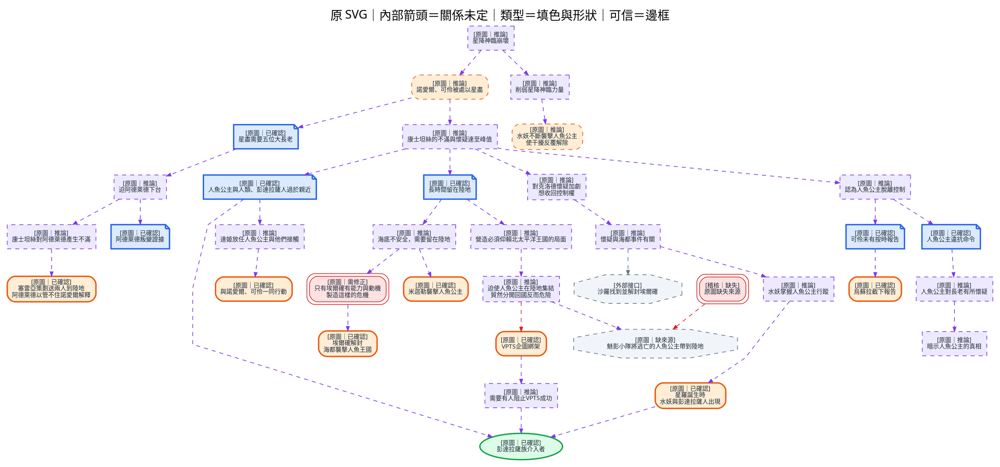

---
tags:
  - investigation
  - graphviz
  - clues
  - reform-faction
  - conservative-faction
source:
  - "[[線索-Clues and Investigation.drawio.svg]]"
  - "[[Setting/IU7/11_faction/改革派]]"
  - "[[Setting/IU7/09_event/Next 計劃]]"
  - "[[Story/reference/敘詭整理]]"
  - "[[Story/reference/邏輯缺口與補丁]]"
cssclasses:
  - graphviz-large-preview
---

# 改革派對付保守派的逆推策略

本筆記從總圖拆出原 SVG 中一組沒有容器、但以座標和連線形成的獨立推理區域，並作為標準化分類與配色的試行圖。

- **第一張圖**是設定層的「目標 → 必要條件 → 策略 → 行動」逆推圖。
- **第二張圖**忠實保留原 SVG 的 34 個節點及 35 條內部連線。
- **填色與形狀只表示節點類型**：證據藍色 `#DBEAFE`／便箋、事件橙色 `#FFEDD5`／圓角框、實體綠色 `#DCFCE7`／橢圓、主張紫色 `#EDE9FE`／直角框、未決灰色 `#F1F5F9`／八角形、澄清紅色 `#FEE2E2`／雙框。
- **邊框表示可信狀態**：粗實線為已確認、細實線為預定、虛線為推論、雙框或紅色虛線為補丁／衝突。
- **來源直接寫在節點首行**，例如 `[設定｜已確認]`、`[預定]`、`[補丁]`、`[原圖｜推論]`，不再借用填色表示來源。
- Cluster 一律使用中性灰色，只代表策略區段。

## 設定層：從目標逆推

箭頭在本圖表示「上層目標需要下層條件」，不是事件發生的時間方向。

```dot
digraph reform_strategy {
  graph [
    rankdir="TB",
    bgcolor="#FFFFFF",
    compound="true",
    newrank="true",
    splines="polyline",
    nodesep="0.34",
    ranksep="0.62",
    pad="0.15",
    fontname="Microsoft JhengHei",
    label="改革派策略｜類型＝填色與形狀｜可信＝邊框｜來源＝[標籤]",
    labelloc="t",
    fontsize="18"
  ];
  node [
    shape="box",
    style="filled,dashed",
    fillcolor="#EDE9FE",
    color="#7C3AED",
    fontcolor="#1F2937",
    fontname="Microsoft JhengHei",
    fontsize="9",
    margin="0.10,0.06"
  ];
  edge [
    color="#475569",
    fontname="Microsoft JhengHei",
    fontsize="8",
    arrowsize="0.65"
  ];

  goal [label="[設定｜已確認]\nNext 最終目標\n破除星降神臨＋北太平洋脫離七國集團", style="filled", penwidth="2"];

  subgraph cluster_system {
    label="技術核心：借保守派之手觸發系統入侵";
    color="#CBD5E1";
    fillcolor="#FAFAFA";
    fontcolor="#1F2937";
    style="filled,rounded";

    system_collapse [label="[設定｜已確認]\n星降神臨崩壞", style="filled", penwidth="2"];
    star_return [label="[設定｜已確認]\n星歸隨星盡回收法力\n入侵中央系統", style="filled", penwidth="2"];
    implant [label="[設定｜已確認]\n艾芙蓮為繼承人植入星歸", shape="box", style="filled,rounded", fillcolor="#FFEDD5", color="#EA580C", penwidth="2"];
    block [label="[設定｜已確認]\n阻斷繼承標記＋持續消耗\n＋修復公主身體", style="filled", penwidth="2"];
    star_end [label="[預定]\n保守派對諾愛爾、可伶執行星盡", shape="box", style="filled,rounded", fillcolor="#FFEDD5", color="#EA580C", penwidth="1"];
    five_elders [label="[設定｜已確認]\n星盡需要五位大長老", shape="note", style="filled", fillcolor="#DBEAFE", color="#2563EB", penwidth="2"];
    conservative_decision [label="[預定]\n康士坦絲認定公主脫離控制\n並推動處決", style="filled", penwidth="1"];
  }

  subgraph cluster_pressure {
    label="誘發條件：讓保守派判定公主已失控";
    color="#CBD5E1";
    fillcolor="#FAFAFA";
    fontcolor="#1F2937";
    style="filled,rounded";

    stay_land [label="[預定]\n公主長期留在陸地", style="filled", penwidth="1"];
    disobey [label="[預定]\n違抗命令／未按時報告", style="filled", penwidth="1"];
    proximity [label="[預定]\n與人類、彭達拉薩人過於親近", style="filled", penwidth="1"];
    daji [label="[設定｜預定行動]\n達姬縱容公主探索陸地\n引導其違抗康士坦絲", shape="box", style="filled,rounded", fillcolor="#FFEDD5", color="#EA580C", penwidth="1"];
    sereia [label="[設定｜預定行動]\n塞雷亞提供陸地身份、住所、資金\n及星歸所需語言環境", shape="box", style="filled,rounded", fillcolor="#FFEDD5", color="#EA580C", penwidth="1"];
    ursula_report [label="[設定｜預定行動]\n烏蘇拉截下可伶報告", shape="box", style="filled,rounded", fillcolor="#FFEDD5", color="#EA580C", penwidth="1"];
    doyle [label="[設定｜預定行動]\n安排彭達拉薩人道爾貼身保護可伶\n刺激保守派但迫使其默認", shape="box", style="filled,rounded", fillcolor="#FFEDD5", color="#EA580C", penwidth="1"];
  }

  subgraph cluster_crisis {
    label="外部危機：製造「海底不安全」與陸地集結";
    color="#CBD5E1";
    fillcolor="#FAFAFA";
    fontcolor="#1F2937";
    style="filled,rounded";

    sea_city [label="[設定｜已確認]\n誘導沙羅解封埃爾確\n推動海都襲擊", shape="box", style="filled,rounded", fillcolor="#FFEDD5", color="#EA580C", penwidth="2"];
    water_demon [label="[設定｜已確認]\n逐步提高水妖力量\n消耗儲備並測試執行端", shape="box", style="filled,rounded", fillcolor="#FFEDD5", color="#EA580C", penwidth="2"];
    michael [label="[預定]\n米迦勒襲擊加深海底危機", shape="box", style="filled,rounded", fillcolor="#FFEDD5", color="#EA580C", penwidth="1"];
    terminal [label="[補丁｜已確認]\n終端機安排 VPTS 威脅\n迫使公主集結並接受 SWI 合作", shape="box", style="filled,rounded", fillcolor="#FFEDD5", color="#EA580C", peripheries="2"];
    land_cluster [label="[設定｜預定]\n公主在陸地集中保護", style="filled", penwidth="1"];
    north_depend [label="[設定｜預定]\n形成依賴北太平洋／常藍保全的局面", style="filled", penwidth="1"];
  }

  subgraph cluster_political {
    label="政治清障：削弱保守派權力與監視能力";
    color="#CBD5E1";
    fillcolor="#FAFAFA";
    fontcolor="#1F2937";
    style="filled,rounded";

    remove_adelaide [label="[預定]\n使阿德萊德離開大長老位置", style="filled", penwidth="1"];
    evidence [label="[預定｜證據]\n洩漏／利用通敵證據\n促成彈劾", shape="note", style="filled", fillcolor="#DBEAFE", color="#2563EB", penwidth="1"];
    successor [label="[預定]\n由范雅接任或代理\n為五長老星盡清障", style="filled", penwidth="1"];
    blindspot [label="[設定｜已確認]\n利用希寶、白的監視前提\n製造錯誤歸因與操作盲點", style="filled", penwidth="2"];
    constance_doubt [label="[預定]\n加深康士坦絲對阿德萊德、\n克洛德與公主的不滿", style="filled", penwidth="1"];
  }

  subgraph cluster_independence {
    label="獨立基礎：即使星降消失也能維持國家";
    color="#CBD5E1";
    fillcolor="#FAFAFA";
    fontcolor="#1F2937";
    style="filled,rounded";

    military [label="[設定｜已確認]\n建立王國衛隊\n防禦改由本國維持", shape="box", style="filled,rounded", fillcolor="#FFEDD5", color="#EA580C", penwidth="2"];
    energy [label="[設定｜已確認]\n勘探基質、建能量轉換站\n研究人工基質", shape="box", style="filled,rounded", fillcolor="#FFEDD5", color="#EA580C", penwidth="2"];
    knowledge [label="[設定｜已確認]\n公開星降神臨\n下放法術知識與研究", shape="box", style="filled,rounded", fillcolor="#FFEDD5", color="#EA580C", penwidth="2"];
    diplomacy [label="[設定｜已確認]\n向北冰洋、北大西洋輸出技術\n並拓展情報網", shape="box", style="filled,rounded", fillcolor="#FFEDD5", color="#EA580C", penwidth="2"];
    religion [label="[設定｜已確認]\n淡化海之女神信仰\n削弱舊制度正當性", shape="box", style="filled,rounded", fillcolor="#FFEDD5", color="#EA580C", penwidth="2"];
  }

  subgraph cluster_boundary {
    label="指揮鏈邊界";
    color="#CBD5E1";
    fillcolor="#FAFAFA";
    fontcolor="#1F2937";
    style="filled,rounded,dashed";

    boundary_vpts [label="[補丁｜澄清]\nVPTS 威脅符合改革派需要\n≠ 克洛德或弗拉基米爾直接指揮 VPTS", shape="box", style="filled,rounded", fillcolor="#FEE2E2", color="#DC2626", peripheries="2"];
    boundary_source [label="[補丁｜澄清]\n終端機安排僱主與情報鏈\n弗拉基米爾不是直接執行者", shape="box", style="filled,rounded", fillcolor="#FEE2E2", color="#DC2626", peripheries="2"];
  }

  goal -> system_collapse [label="核心技術目標"];
  goal -> military [label="獨立後仍須自保"];
  goal -> energy [label="解除能源依賴"];
  goal -> knowledge [label="解除知識壟斷"];
  goal -> diplomacy [label="建立外部影響力"];
  goal -> religion [label="瓦解制度敘事"];

  system_collapse -> star_return [label="需要"];
  star_return -> implant [label="事前植入"];
  star_return -> star_end [label="等待觸發"];
  star_return -> block [label="啟動效果"];
  star_end -> five_elders [label="施術條件"];
  star_end -> conservative_decision [label="需要保守派作出決定"];

  conservative_decision -> stay_land;
  conservative_decision -> disobey;
  conservative_decision -> proximity;
  conservative_decision -> constance_doubt;
  stay_land -> daji;
  stay_land -> sereia;
  stay_land -> land_cluster;
  disobey -> daji;
  disobey -> ursula_report;
  proximity -> doyle;

  land_cluster -> sea_city;
  land_cluster -> water_demon;
  land_cluster -> michael;
  land_cluster -> terminal;
  north_depend -> land_cluster;

  five_elders -> successor;
  successor -> remove_adelaide;
  remove_adelaide -> evidence;
  evidence -> constance_doubt;
  constance_doubt -> blindspot;

  terminal -> boundary_vpts [style="dashed", color="#DC2626"];
  boundary_vpts -> boundary_source [style="dashed", color="#DC2626"];
}
```

## 原 SVG：拆出的逆推子圖

原圖箭頭沒有文字。依圖形結構，其閱讀方式是由上方目標向下尋找前提與操作手段。

## 設定核對

### 原圖缺少的核心環節

原圖的 `星降神臨崩壞 → 削弱力量 → 水妖襲擊` 只涵蓋消耗與解除干擾。設定中的真正破壞鏈是：

1. 艾芙蓮為繼承人植入星歸。
2. 改革派引導保守派對諾愛爾、可伶施行星盡。
3. 星歸隨回收法力進入中央系統。
4. 星歸阻斷繼承標記、持續消耗星降神臨，並修復公主身體。

水妖襲擊是消耗、測試及推進保守派判斷的手段，不足以單獨令星降神臨崩壞。

### 不能沿用為全知答案的原圖推理

- 「只有埃爾確有能力與動機製造危機」是調查階段推論；全知設定另有克洛德、烏蘇拉、終端機、米迦勒等不同上游。
- VPTS 威脅確實促成公主集結，但已確定補丁把僱主及情報鏈放在終端機一方。不能把它簡化為克洛德或弗拉基米爾直接指揮 VPTS。
- 「北太平洋在海都事件沒有大得益」不屬本拆分子圖，而且與克洛德借重建、難民與反應速度擴大影響力的全知設定不符，故仍留在總圖的另一條調查鏈。

## 來源索引

- [[Setting/IU7/11_faction/改革派]]
- [[Setting/IU7/09_event/Next 計劃]]
- [[Setting/IU7/01_character/克洛德]]
- [[Setting/IU7/01_character/達姬]]
- [[Setting/IU7/01_character/塞雷亞．哈洛蘭]]
- [[Setting/IU7/01_character/阿德萊德]]
- [[Setting/IU7/01_character/烏蘇拉]]
- [[Setting/IU7/01_character/康士坦絲]]
- [[Setting/IU7/05_srune/星歸]]
- [[Setting/IU7/05_srune/原初大法術．星降神臨]]
- [[Story/reference/敘詭整理#II-1　善惡功能錯置]]
- [[Story/reference/邏輯缺口與補丁#核心因果]]
- [[Story/reference/邏輯缺口與補丁#弗拉基米爾的執行責任]]

> [!WARNING]
> 設定層逆推圖混合已建立世界觀與預定行動；它不代表目前正文角色已掌握完整策略。原 SVG 子圖則是調查推理，不能反向覆寫較新的設定文件。
