---
tags:
  - technology
  - tech-tree
  - graphviz
cssclasses:
  - graphviz-large-preview
---

# IU7 科技樹（DSL）

> [!NOTE] 維護方式
> 只需修改下方 `tech-tree` 區塊，然後執行：
> `python scripts/tech_tree_to_graphviz.py Setting/IU7/00_overview/IU7_tech_tree.md --check`
>
> - `# 種類`、`## 細項`：每個細項各佔一條橫向分支。
> - `類型 名稱 = 別名 @年份`：類型可用技術、材料、武器、彈藥、工具、機器。
> - `A -> B : 說明`：實線，代表技術繼承或直接派生。
> - `A ~> B : 說明`：虛線，代表採用、配套等關聯。
> - 沒有連線的項目仍會按年份定位；同年項目會在同一年代區間內錯開。
> - 年份未知者省略 `@年份`，統一放到最右側。

```tech-tree
標題: IU7 科技樹
時序: 遠古, 1960s, 1970s, 1980s, 2000s, 年份待補
輸出DOT: IU7_tech_tree.dot
輸出SVG: iu7_tech_tree.svg

# 武器
## 單兵主武器
武器 北冰洋制式弩 = crossbow @數百年前
武器 克洛克斯蒂爾SA 68法力弩 = sa68 @1968
武器 M2法力弩 = m2 @1972
武器 M3狙擊用法力弩 = m3 @1973
武器 克洛克斯蒂爾ULSA 82超輕法力弩 = ulsa @1982

技術 壓縮法力發射 = cspal @1979
武器 M5法力步槍 = m5 @1983
武器 M5A1法力狙擊步槍 = m5a1 @1987
sa68 -> ulsa
crossbow -> m2
sa68 -> m2
m2 -> m3
m2 -> m5
cspal -> m5
m5 -> m5a1

## SSCG複合狙擊步槍
武器 克洛克斯蒂爾SSCG 69複合狙擊步槍 = sscg69 @1969
武器 克洛克斯蒂爾SSCG 04複合狙擊步槍 = sscg04 @2004
武器 克洛克斯蒂爾SSCG 69E複合狙擊步槍 = sscg69e
sscg69 ~> sscg69e
sscg69 -> sscg04

## 壓縮法力砲
技術 壓縮法力發射（共用） = cspal_artillery @1979
武器 M4 60毫米壓縮法力砲 = m4 @1981
武器 M4A 60毫米壓縮法力砲 = m4a @1985
武器 HCSA-1「守護神」超高壓縮法力砲 = hcsa @2002
武器 CSMG-2六聯裝壓縮法力機砲 = csmg
武器 LCSA-4「劍魚」三聯裝壓縮法力砲 = lcsa
cspal_artillery ~> m4
m4 -> m4a
cspal_artillery ~> hcsa
cspal_artillery ~> csmg
cspal_artillery ~> lcsa

## 法力導彈
武器 PSML-5「逐火」單兵法力導彈發射器 = psml

# 彈藥
## 水中及助推彈藥
技術 蝕刻 = etch
彈藥 BM-1水中用子彈 = bm1 @1983
彈藥 BM-2壓縮法力彈 = bm2 @1984
彈藥 60毫米蝕刻彈 = ammo60 @1985
彈藥 BM-3法力助推彈 = bm3 @1987
etch -> ammo60
ammo60 -> bm3
bm1 -> bm3
bm1 ~> bm2

# 工具
## 紀錄裝置
工具 紀錄節點 = record @千萬年前
工具 小型紀錄晶片 = chip @2001
工具 可互動紀錄板 = interactive @1997
record -> chip
record ~> interactive

## 法術媒介
工具 便攜法術媒介 = portable

# 機器
## 法力加密通訊
技術 法力加密通訊協定 = secp
機器 法力加密戰鬥通訊系統 = seccs
secp ~> seccs

## 基質能—物質轉換
機器 基質能—物質轉換器 = smc
機器 CT-1 SMC工程船 = ct1
smc ~> ct1

## 基質能—能量轉換
機器 基質能—能量轉換器 = sec

# 材料
## 法力絕緣材料
材料 艾方合金 = evum

## 法力邏輯元件
材料 可現場編程法力邏輯陣列 = fpsa
fpsa -> psml

# 技術
## 法力處理
技術 去特徵化 = defeature
```

```dot
// tech-tree-auto 由上方 tech-tree 區塊生成，請勿手改
// 以 neato -n2 讀取固定位置；時間由左至右，分支由上至下。
digraph technology_tree {
  graph [
    layout="neato", bgcolor="#10151C", outputorder="edgesfirst",
    overlap="false", splines="ortho", pad="0.20", margin="0.10",
    fontname="Microsoft JhengHei", fontcolor="#F3F4F6", label="IU7 科技樹",
    labelloc="t", fontsize="18"
  ];
  node [fontname="Microsoft JhengHei", fixedsize="true", pin="true", shape="box",
        width="2.25", height="0.82", style="rounded,filled",
        fontsize="10", fontcolor="#FFFFFF", penwidth="2"];
  edge [fontname="Microsoft JhengHei", fontsize="8", fontcolor="#D1D5DB",
        color="#9CA3AF", penwidth="2.0", arrowsize="0.65"];

  // 時間標題
  time_00 [label="遠古", pos="395.0,3272.0!", width="5.000", height="0.55", fillcolor="#252D38", color="#667085", fontsize="12"];
  time_01 [label="1960s", pos="840.0,3272.0!", width="5.000", height="0.55", fillcolor="#252D38", color="#667085", fontsize="12"];
  time_02 [label="1970s", pos="1380.0,3272.0!", width="7.639", height="0.55", fillcolor="#252D38", color="#667085", fontsize="12"];
  time_03 [label="1980s", pos="2300.0,3272.0!", width="15.556", height="0.55", fillcolor="#252D38", color="#667085", fontsize="12"];
  time_04 [label="1990s", pos="3030.0,3272.0!", width="2.361", height="0.55", fillcolor="#252D38", color="#667085", fontsize="12"];
  time_05 [label="2000s", pos="3475.0,3272.0!", width="7.639", height="0.55", fillcolor="#252D38", color="#667085", fontsize="12"];
  time_06 [label="年份待補", pos="4015.0,3272.0!", width="5.000", height="0.55", fillcolor="#252D38", color="#667085", fontsize="12"];

  subgraph cluster_00 {
    label="武器"; color="#374151"; fontcolor="#D1D5DB";
    fontname="Microsoft JhengHei"; fontsize="12"; style="rounded,dashed";
    category_00 [label="武器", pos="95.0,3162.0!", width="1.85", height="0.48", fillcolor="#111827", color="#64748B"];
    branch_00_00 [label="單兵主武器", pos="95.0,2967.0!", width="1.85", height="0.60", fillcolor="#202833", color="#4B5563"];
    n001 [label="北冰洋制式弩\n數百年前", pos="490.0,3090.0!", fillcolor="#7F1D1D", color="#EF4444"];
    n002 [label="克洛克斯蒂爾SA 68法力弩\n1968", pos="745.0,3008.0!", fillcolor="#7F1D1D", color="#EF4444"];
    n003 [label="M2法力弩\n1972", pos="1190.0,3090.0!", fillcolor="#7F1D1D", color="#EF4444"];
    n004 [label="M3狙擊用法力弩\n1973", pos="1380.0,3090.0!", fillcolor="#7F1D1D", color="#EF4444"];
    n005 [label="克洛克斯蒂爾ULSA\n82超輕法力弩\n1982", pos="2015.0,3008.0!", fillcolor="#7F1D1D", color="#EF4444"];
    n006 [label="壓縮法力發射\n1979", pos="1570.0,2926.0!", fillcolor="#1D4ED8", color="#60A5FA"];
    n007 [label="M5法力步槍\n1983", pos="2205.0,2844.0!", fillcolor="#7F1D1D", color="#EF4444"];
    n008 [label="M5A1法力狙擊步槍\n1987", pos="2775.0,2844.0!", fillcolor="#7F1D1D", color="#EF4444"];
    branch_00_01 [label="SSCG複合狙擊步槍", pos="95.0,2663.0!", width="1.85", height="0.60", fillcolor="#202833", color="#4B5563"];
    n009 [label="克洛克斯蒂爾SSCG\n69複合狙擊步槍\n1969", pos="935.0,2704.0!", fillcolor="#7F1D1D", color="#EF4444"];
    n010 [label="克洛克斯蒂爾SSCG\n04複合狙擊步槍\n2004", pos="3665.0,2622.0!", fillcolor="#7F1D1D", color="#EF4444"];
    n011 [label="克洛克斯蒂爾SSCG\n69E複合狙擊步槍\n年份待補", pos="3920.0,2704.0!", fillcolor="#7F1D1D", color="#EF4444"];
    branch_00_02 [label="壓縮法力砲", pos="95.0,2359.0!", width="1.85", height="0.60", fillcolor="#202833", color="#4B5563"];
    n012 [label="壓縮法力發射（共用）\n1979", pos="1570.0,2482.0!", fillcolor="#1D4ED8", color="#60A5FA"];
    n013 [label="M4 60毫米壓縮法力砲\n1981", pos="1825.0,2482.0!", fillcolor="#7F1D1D", color="#EF4444"];
    n014 [label="M4A 60毫米壓縮法力砲\n1985", pos="2585.0,2482.0!", fillcolor="#7F1D1D", color="#EF4444"];
    n015 [label="HCSA-1「守護神」超高壓縮法\n力砲\n2002", pos="3475.0,2400.0!", fillcolor="#7F1D1D", color="#EF4444"];
    n016 [label="CSMG-2六聯裝壓縮法力機砲\n年份待補", pos="3920.0,2318.0!", fillcolor="#7F1D1D", color="#EF4444"];
    n017 [label="LCSA-4「劍魚」三聯裝壓縮法\n力砲\n年份待補", pos="4110.0,2236.0!", fillcolor="#7F1D1D", color="#EF4444"];
    branch_00_03 [label="法力導彈", pos="95.0,2096.0!", width="1.85", height="0.60", fillcolor="#202833", color="#4B5563"];
    n018 [label="PSML-5「逐火」單兵法力導彈\n發射器\n年份待補", pos="3920.0,2096.0!", fillcolor="#7F1D1D", color="#EF4444"];
  }

  subgraph cluster_01 {
    label="彈藥"; color="#374151"; fontcolor="#D1D5DB";
    fontname="Microsoft JhengHei"; fontsize="12"; style="rounded,dashed";
    category_01 [label="彈藥", pos="95.0,1946.0!", width="1.85", height="0.48", fillcolor="#111827", color="#64748B"];
    branch_01_04 [label="水中及助推彈藥", pos="95.0,1792.0!", width="1.85", height="0.60", fillcolor="#202833", color="#4B5563"];
    n019 [label="蝕刻\n年份待補", pos="3920.0,1710.0!", fillcolor="#1D4ED8", color="#60A5FA"];
    n020 [label="BM-1水中用子彈\n1983", pos="2205.0,1874.0!", fillcolor="#5B21B6", color="#A78BFA"];
    n021 [label="BM-2壓縮法力彈\n1984", pos="2395.0,1792.0!", fillcolor="#5B21B6", color="#A78BFA"];
    n022 [label="60毫米蝕刻彈\n1985", pos="2585.0,1710.0!", fillcolor="#5B21B6", color="#A78BFA"];
    n023 [label="BM-3法力助推彈\n1987", pos="2775.0,1710.0!", fillcolor="#5B21B6", color="#A78BFA"];
  }

  subgraph cluster_02 {
    label="工具"; color="#374151"; fontcolor="#D1D5DB";
    fontname="Microsoft JhengHei"; fontsize="12"; style="rounded,dashed";
    category_02 [label="工具", pos="95.0,1560.0!", width="1.85", height="0.48", fillcolor="#111827", color="#64748B"];
    branch_02_05 [label="紀錄裝置", pos="95.0,1447.0!", width="1.85", height="0.60", fillcolor="#202833", color="#4B5563"];
    n024 [label="紀錄節點\n千萬年前", pos="300.0,1488.0!", fillcolor="#065F46", color="#10B981"];
    n025 [label="小型紀錄晶片\n2001", pos="3285.0,1488.0!", fillcolor="#065F46", color="#10B981"];
    n026 [label="可互動紀錄板\n1997", pos="3030.0,1406.0!", fillcolor="#065F46", color="#10B981"];
    branch_02_06 [label="法術媒介", pos="95.0,1266.0!", width="1.85", height="0.60", fillcolor="#202833", color="#4B5563"];
    n027 [label="便攜法術媒介\n年份待補", pos="3920.0,1266.0!", fillcolor="#065F46", color="#10B981"];
  }

  subgraph cluster_03 {
    label="機器"; color="#374151"; fontcolor="#D1D5DB";
    fontname="Microsoft JhengHei"; fontsize="12"; style="rounded,dashed";
    category_03 [label="機器", pos="95.0,1116.0!", width="1.85", height="0.48", fillcolor="#111827", color="#64748B"];
    branch_03_07 [label="法力加密通訊", pos="95.0,1044.0!", width="1.85", height="0.60", fillcolor="#202833", color="#4B5563"];
    n028 [label="法力加密通訊協定\n年份待補", pos="3920.0,1044.0!", fillcolor="#1D4ED8", color="#60A5FA"];
    n029 [label="法力加密戰鬥通訊系統\n年份待補", pos="4110.0,1044.0!", fillcolor="#0E7490", color="#22D3EE"];
    branch_03_08 [label="基質能—物質轉換", pos="95.0,904.0!", width="1.85", height="0.60", fillcolor="#202833", color="#4B5563"];
    n030 [label="基質能—物質轉換器\n年份待補", pos="3920.0,904.0!", fillcolor="#0E7490", color="#22D3EE"];
    n031 [label="CT-1 SMC工程船\n年份待補", pos="4110.0,904.0!", fillcolor="#0E7490", color="#22D3EE"];
    branch_03_09 [label="基質能—能量轉換", pos="95.0,764.0!", width="1.85", height="0.60", fillcolor="#202833", color="#4B5563"];
    n032 [label="基質能—能量轉換器\n年份待補", pos="3920.0,764.0!", fillcolor="#0E7490", color="#22D3EE"];
  }

  subgraph cluster_04 {
    label="材料"; color="#374151"; fontcolor="#D1D5DB";
    fontname="Microsoft JhengHei"; fontsize="12"; style="rounded,dashed";
    category_04 [label="材料", pos="95.0,614.0!", width="1.85", height="0.48", fillcolor="#111827", color="#64748B"];
    branch_04_10 [label="法力絕緣材料", pos="95.0,542.0!", width="1.85", height="0.60", fillcolor="#202833", color="#4B5563"];
    n033 [label="艾方合金\n年份待補", pos="3920.0,542.0!", fillcolor="#92400E", color="#F59E0B"];
    branch_04_11 [label="法力邏輯元件", pos="95.0,402.0!", width="1.85", height="0.60", fillcolor="#202833", color="#4B5563"];
    n034 [label="可現場編程法力邏輯陣列\n年份待補", pos="3920.0,402.0!", fillcolor="#92400E", color="#F59E0B"];
  }

  subgraph cluster_05 {
    label="技術"; color="#374151"; fontcolor="#D1D5DB";
    fontname="Microsoft JhengHei"; fontsize="12"; style="rounded,dashed";
    category_05 [label="技術", pos="95.0,252.0!", width="1.85", height="0.48", fillcolor="#111827", color="#64748B"];
    branch_05_12 [label="法力處理", pos="95.0,180.0!", width="1.85", height="0.60", fillcolor="#202833", color="#4B5563"];
    n035 [label="去特徵化\n年份待補", pos="3920.0,180.0!", fillcolor="#1D4ED8", color="#60A5FA"];
  }

  // 明示連線；位置不由連線推斷。
  n002 -> n005 [style="solid", color="#9CA3AF"];
  n001 -> n003 [style="solid", color="#9CA3AF"];
  n002 -> n003 [style="solid", color="#9CA3AF"];
  n003 -> n004 [style="solid", color="#9CA3AF"];
  n003 -> n007 [style="solid", color="#9CA3AF"];
  n006 -> n007 [style="solid", color="#9CA3AF"];
  n007 -> n008 [style="solid", color="#9CA3AF"];
  n009 -> n011 [style="dashed", color="#C084FC"];
  n009 -> n010 [style="solid", color="#9CA3AF"];
  n012 -> n013 [style="dashed", color="#C084FC"];
  n013 -> n014 [style="solid", color="#9CA3AF"];
  n012 -> n015 [style="dashed", color="#C084FC"];
  n012 -> n016 [style="dashed", color="#C084FC"];
  n012 -> n017 [style="dashed", color="#C084FC"];
  n019 -> n022 [style="solid", color="#9CA3AF"];
  n022 -> n023 [style="solid", color="#9CA3AF"];
  n020 -> n023 [style="solid", color="#9CA3AF"];
  n020 -> n021 [style="dashed", color="#C084FC"];
  n024 -> n025 [style="solid", color="#9CA3AF"];
  n024 -> n026 [style="dashed", color="#C084FC"];
  n028 -> n029 [style="dashed", color="#C084FC"];
  n030 -> n031 [style="dashed", color="#C084FC"];
  n034 -> n018 [style="solid", color="#9CA3AF"];

  // 左下圖例
  legend_title [label="圖例", pos="70.0,70.0!", width="1.10", height="0.45", fillcolor="#202833", color="#4B5563"];
  legend_s1 [shape="point", width="0.05", height="0.05", pos="165.0,85.0!", fillcolor="#9CA3AF", color="#9CA3AF"];
  legend_s2 [shape="point", width="0.05", height="0.05", pos="225.0,85.0!", fillcolor="#9CA3AF", color="#9CA3AF"];
  legend_st [shape="plaintext", label="技術繼承", pos="300.0,85.0!", width="1.20", height="0.30", fontcolor="#D1D5DB"];
  legend_r1 [shape="point", width="0.05", height="0.05", pos="165.0,45.0!", fillcolor="#C084FC", color="#C084FC"];
  legend_r2 [shape="point", width="0.05", height="0.05", pos="225.0,45.0!", fillcolor="#C084FC", color="#C084FC"];
  legend_rt [shape="plaintext", label="關聯項目", pos="300.0,45.0!", width="1.20", height="0.30", fontcolor="#D1D5DB"];
  legend_s1 -> legend_s2 [style="solid", color="#9CA3AF"];
  legend_r1 -> legend_r2 [style="dashed", color="#C084FC"];
}
```


