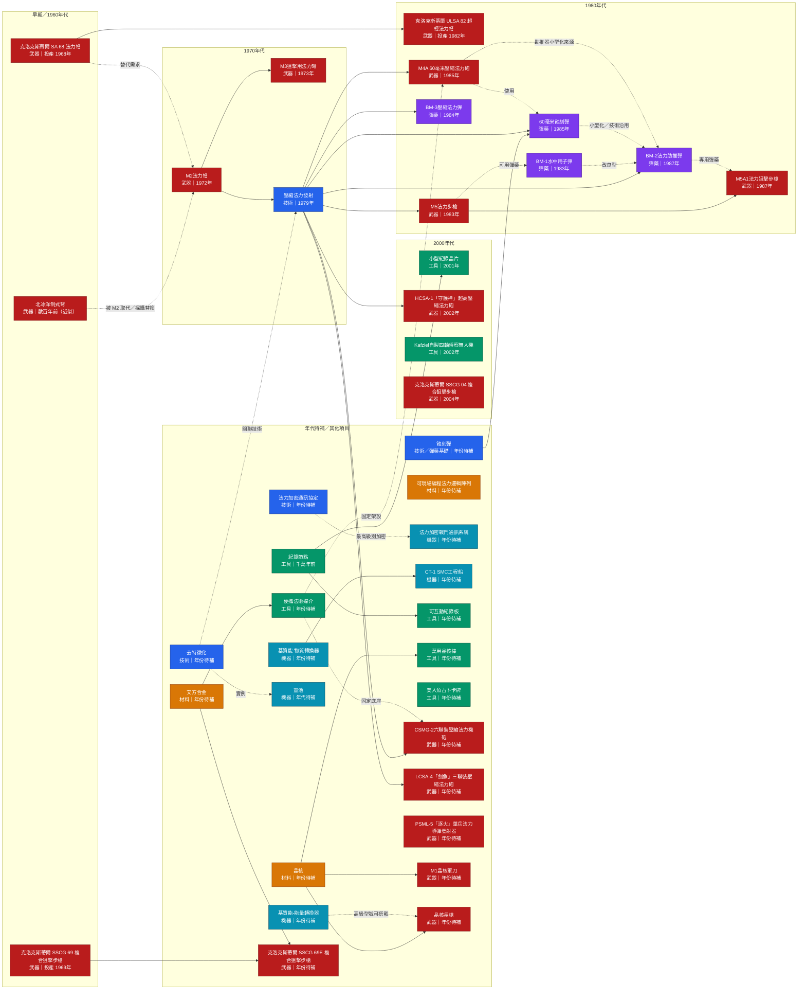

## Outsiders

```dataview
TABLE alive, ranger, military, process_srune
FROM "Setting/IU7/01_character" // full path
WHERE entity_type = "outsider" 
```
## Rangers

```dataview
TABLE entity_type
FROM "Setting/IU7/01_character" // full path
WHERE ranger = true 
```
## Dead

```dataview
TABLE entity_type,alive 
FROM "Setting/IU7/01_character" // full path
WHERE alive = false 
```
## Military

```dataview
TABLE entity_type
FROM "Setting/IU7/01_character" // full path
WHERE military = true 
```
## Srune

```dataview
TABLE entity_type
FROM "Setting/IU7/01_character" // full path
WHERE process_srune = true 
```
## Kingdom

```dataview
TABLE type, subtype
FROM "Setting/IU7/08_organization" // full path
WHERE subtype = "kingdom" 
```

## IU7 科技與物品演進

> 實線代表前置技術或直接派生；虛線代表使用、替代或關聯。年份以各文件現有欄位為準，標示「年份待補」的項目尚未在文件中記載明確年份。




